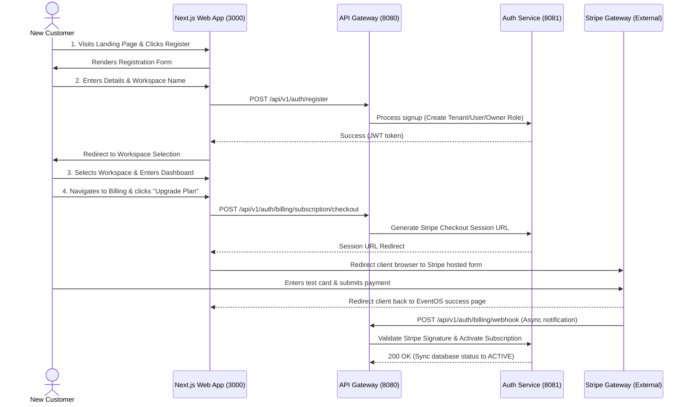

# Client Signup & Subscription User Flow

This guide traces the complete step-by-step user journey of a new client visiting the EventOS SaaS platform, creating a tenant workspace, subscribing to a premium plan via Stripe, and managing their account.

---

## 1. Sequence Overview

---

## 2. Step-by-Step Execution Guide

### Step 1: Landing Page & Pricing Options
* **URL**: `http://localhost:3000/`
* **What happens**: The client explores SaaS features, benefits, and pricing plans. They select a plan (e.g., *Professional* at `$79/month`) and click **Get Started**.

---

### Step 2: Customer Registration & Workspace Creation
* **URL**: `http://localhost:3000/register`
* **What happens**: The client fills out the signup form:
  * First & Last Name
  * Email & Password
  * **Workspace Name** (This represents their tenant organization, e.g., *"Elegant Weddings LLC"*).
* **Technical details**: 
  * The form issues a `POST` request to `/api/v1/auth/register`.
  * The backend creates a new row in the `tenants` table and a corresponding default workspace company.
  * It creates the user account and registers them under the **`OWNER`** role for this tenant workspace.

---

### Step 3: Workspace Onboarding & Dashboard Access
* **URL**: `http://localhost:3000/workspace-select`
* **What happens**: The user logs in and is prompted to choose their active workspace.
* **Technical details**: 
  * The client selects *"Elegant Weddings LLC"*. 
  * The frontend receives the workspace session JWT token, stores it in `sessionStorage` (Zustand `useAuthStore`), and redirects to `http://localhost:3000/dashboard`.
  * The dashboard loads, initializing local workspace CRM databases, event calendars, and galleries.

---

### Step 4: Upgrading to Premium (Stripe Integration)
* **URL**: `http://localhost:3000/settings` (Billing Tab)
* **What happens**: The workspace owner clicks **Upgrade to Professional**.
* **Technical details**:
  * The UI calls the `upgradeSubscription` store action, sending a `POST` request to `/api/v1/auth/billing/subscription/checkout` containing the plan code (`professional`).
  * The backend contacts Stripe's API, creates a Checkout Session containing success/cancel callback redirects, and returns the URL.
  * The client's browser window is automatically redirected to Stripe's payment form (`checkout.stripe.com`).

---

### Step 5: Stripe Payment & Webhook Synchronization
* **URL**: Stripe Hosted Form $\rightarrow$ EventOS success landing redirect.
* **What happens**:
  * The customer enters their billing address and mock payment credentials (e.g., credit card `4242 4242 4242 4242`).
  * Upon validation, Stripe processes the credit card charges and redirects the customer back to the EventOS billing success screen.
  * **Webhook Postback**: Stripe sends a secure event callback containing the checkout session payload to the backend Gateway (`POST /api/v1/auth/billing/webhook`).
  * The backend verifies the signature payload to prevent fraud, identifies the tenant ID associated with the session, and updates the database subscription state to `ACTIVE`.

---

### Step 6: Workspace Team Invites
* **URL**: `http://localhost:3000/settings` (Team Tab)
* **What happens**: Now that the workspace is upgraded, the owner has raised user limits. They enter their staff's emails and select roles (e.g. `STAFF`, `PLANNER`) to invite them to join the workspace.
