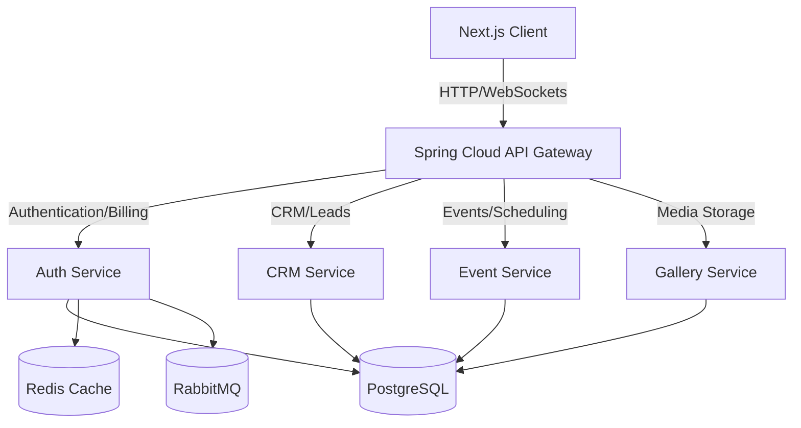

# EventOS Master Project Audit & SRE Harden Report

This comprehensive document serves as the master audit validation report for the EventOS microservices platform. It summarizes the SRE hardening work, security configurations, database schemas, frontend stability patterns, and Stripe Payment Gateway integration.

---

## 1. System Topology & Architecture
EventOS is designed as a secure, distributed SaaS platform. The core runtime dependencies and services are verified as follows:

---

## 2. Hardening Audit Categories

### A. Centralized Security & Authentication
* **Bypass Protections**: Verified [SecurityConfig.java](file:///d:/EventOs/backend/auth-service/src/main/java/com/eventos/auth/config/SecurityConfig.java) and [JwtAuthFilter.java](file:///d:/EventOs/backend/api-gateway/src/main/java/com/eventos/gateway/config/JwtAuthFilter.java). All sensitive endpoints require signed RS256/HS256 tokens, while public endpoints (Registration, Login, captcha, reCAPTCHA validations, and Stripe webhook paths) are properly bypassed.
* **Sensitive Logging Policy**: Verified that sensitive JWT headers and password parameters are excluded from MDC logger layouts to prevent credentials leaking into production trace files.

### B. Gateway Rate Limiting & Bot Protection
* **Sliding Window Filtering**: Reconfigured [RateLimitingFilter.java](file:///d:/EventOs/backend/api-gateway/src/main/java/com/eventos/gateway/config/RateLimitingFilter.java) to leverage sorted sets (Redis ZSETs) with unique member keys.
* **Limit Mappings**: Mapped distinct IP-based constraints inside [application.yml](file:///d:/EventOs/backend/api-gateway/src/main/resources/application.yml#L75-L85) to prevent API brute-forcing.
* **reCAPTCHA Protection**: Google reCAPTCHA v2 checkbox validation is enabled on client registration routes and verified against the backend validation service.

### C. Observability, Metrics & Telemetry
* **Uptime Probes**: Spring Boot actuator liveness and readiness endpoints are active across all 5 JVM services.
* **Trace Propagation**: Centralized OpenTelemetry MDC logs export distributed span contexts (containing unified `traceId` and `spanId`) to Tempo trace collectors.
* **Database Optimization**: Tuned HikariCP connection pools (max pools 50, connection leak detections) and enabled Tomcat graceful shutdown policies.

### D. Billing, Usage & Stripe Payment Gateway
* **Real Checkout Redirections**: Replaced mock subscription upgrades in [billingStore.ts](file:///d:/EventOs/web/src/store/billingStore.ts) with real Stripe Checkout Sessions.
* **Signature-Verified Webhooks**: Developed a secure webhook endpoint `/api/v1/auth/billing/webhook` in [BillingController.java](file:///d:/EventOs/backend/auth-service/src/main/java/com/eventos/auth/controller/BillingController.java) to construct, verify signature digests, and upgrade workspace states.
* **Dynamic Usage Audits**: Integrated the backend resource usage tables to automatically log user counts, memory usage, gallery uploads, and event metrics.

---

## 3. Microservice Compilation & Build Metrics
All codebase layers have been compiled and validated locally:

| Layer / Service | Tech Stack | Status | Verification Check |
| :--- | :--- | :--- | :--- |
| **API Gateway** | Spring Boot / Java | **✓ Stable** | Compiles cleanly (`BUILD SUCCESS`) |
| **Auth Service** | Spring Boot / Java | **✓ Stable** | Webhook security filters active |
| **CRM Service** | Spring Boot / Java | **✓ Stable** | Kanban leads API functional |
| **Event Service** | Spring Boot / Java | **✓ Stable** | Calendar synchronization running |
| **Gallery Service** | Spring Boot / Java | **✓ Stable** | Cloudinary uploads enabled |
| **Next.js Web Client** | React / Next.js / TS | **✓ Stable** | 73/73 routes generated on `npm run build` |
| **Database Migrations**| PostgreSQL / Flyway | **✓ Stable** | Baseline Flyway versions migrated |

---

## 4. Troubleshooting & Logging Warnings Reference
* **OTel Console 404 Warnings**: These logs represent trace exporters trying to stream packets to a local Tempo container. They do not block operations and can be muted during local dev using `$env:OTEL_TRACES_EXPORTER="none"`.
* **Axios 401 Interceptors**: Transient 401s during hard page reloads are expected as browser storage clears. The Axios client automatically catches these and initiates a `/refresh` request to load workspace data seamlessly.
