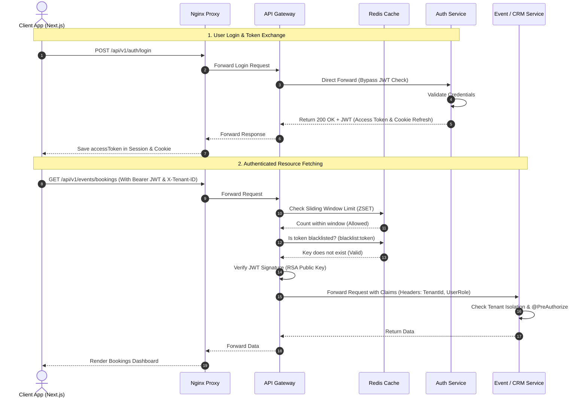
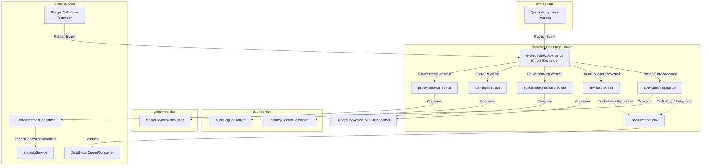
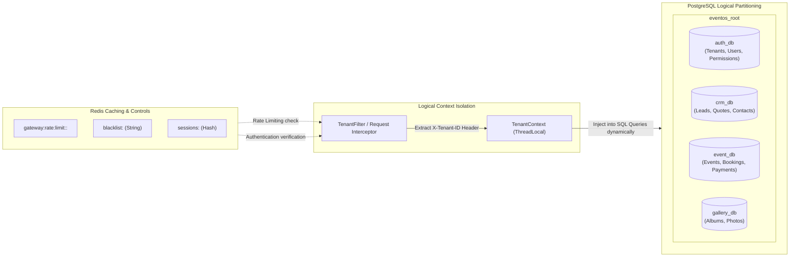

# EventOS — Detailed System Design & Architecture

This document describes the end-to-end system design, operational flows, service topology, and data communications of the **EventOS** platform. It provides high-fidelity architectural flowcharts and detailed component mappings.

---

## 1. High-Level Architecture Topology

The EventOS platform is built as a multi-tenant enterprise microservices system. Client traffic passes through an Nginx proxy to the Next.js Frontend or the Spring Cloud API Gateway. The API Gateway orchestrates security, rate limiting, and request routing to the active Spring Boot microservices.

```mermaid
flowchart TB
    %% Client & Proxy
    Client["Next.js Web Client (Port 3000)"]
    Nginx["Nginx Reverse Proxy (Port 80 / 443)"]

    %% Gateway & Cache
    Gateway["API Gateway (Port 8080)"]
    Redis[("Redis (Port 6379)\n- Sliding Window ZSET Rate Limiting\n- Token Blacklist")]

    %% Services
    subgraph Microservices ["Spring Boot Backend Services"]
        AuthService["Auth Service (Port 8081)\n- Multi-Tenancy & Teams\n- Key Pair Token Issuance\n- Stripe Billing"]
        CRMService["CRM Service (Port 8082)\n- Leads Pipeline\n- Cost Quotes & Proposals"]
        EventService["Event Service (Port 8083)\n- Event Schedules & Bookings\n- Invoices & Payments\n- Calculator Engine"]
        GalleryService["Gallery Service (Port 8084)\n- Client Portals\n- Media Album Uploads"]
    end

    %% Database & Queue
    Postgres[( "PostgreSQL (Port 5433)\n- auth_db\n- crm_db\n- event_db\n- gallery_db" )]
    RabbitMQ[["RabbitMQ Message Broker (Port 5672)\n- Event Distribution Queues"]]

    %% External Systems
    Cloudinary["Cloudinary API\n(Asset Storage)"]
    Stripe["Stripe Payments API\n(Subscriptions & Webhooks)"]
    Mailhog["Mailhog (Port 1025 / 8025)\n(SMTP Testing)"]

    %% Connections
    Client <-->|HTTP / WS| Nginx
    Nginx <-->|Web Routes| Client
    Nginx <-->|/api/v1/auth | Gateway
    Nginx <-->|/api/v1/crm | Gateway
    Nginx <-->|/api/v1/events| Gateway
    Nginx <-->|/api/v1/gallery| Gateway

    Gateway <-->|Check blacklist & rates| Redis
    
    Gateway -->|HTTP Proxy| AuthService
    Gateway -->|HTTP Proxy| CRMService
    Gateway -->|HTTP Proxy| EventService
    Gateway -->|HTTP Proxy| GalleryService

    %% Service DB and Queue interactions
    AuthService <-->|JDBC/JPA| Postgres
    CRMService <-->|JDBC/JPA| Postgres
    EventService <-->|JDBC/JPA| Postgres
    GalleryService <-->|JDBC/JPA| Postgres

    AuthService <-->|AMQP| RabbitMQ
    CRMService <-->|AMQP| RabbitMQ
    EventService <-->|AMQP| RabbitMQ
    GalleryService <-->|AMQP| RabbitMQ

    %% External Connections
    AuthService <-->|Stripe Webhooks & Billing| Stripe
    AuthService -->|SMTP Notifications| Mailhog
    CRMService -->|Upload Images| Cloudinary
    GalleryService -->|Store & Fetch Media| Cloudinary
```

---

## 2. Request Lifecycle & Security Flow

Every request entering the system is evaluated for rate-limiting (using Redis Sliding Window ZSET) and JWT token authenticity (checking signatures using RSA Public Key and validation against a Redis Blacklist).



---

## 3. Asynchronous Event-Driven Architecture

RabbitMQ manages inter-service decoupling. When a service publishes an event (e.g., Quote Accepted, Budget Converted), other microservices ingest it asynchronously to trigger side-effects, keeping the transactional boundary short.



---

## 4. Multi-Tenant Database Partitioning & Cache Structure

Logical multi-tenancy ensures complete segregation of user data between independent companies/accounts using tenant isolation schemes.



---

## 5. Telemetry & SRE Observability Architecture

To capture performance metrics, API latency spikes, and logs across distributed service networks, the monitoring pipeline aggregates telemetry from every container.

```mermaid
flowchart TD
    %% Targets
    subgraph Microservices
        G_SVC["api-gateway"]
        A_SVC["auth-service"]
        C_SVC["crm-service"]
        E_SVC["event-service"]
        GL_SVC["gallery-service"]
    end

    %% Exporters
    NodeExporter["Node Exporter\n(Host OS Metrics)"]
    cAdvisor["cAdvisor\n(Container Metrics)"]

    %% Collectors
    Prometheus["Prometheus Server\n(Metrics database)"]
    Loki["Grafana Loki\n(Log aggregation engine)"]
    Tempo["Grafana Tempo\n(Distributed tracing engine)"]

    %% Visualization & Alerts
    Grafana["Grafana Dashboards\n(UI Portal)"]
    Slack["Slack Webhook\n(SRE Alerts Channel)"]

    %% Streams
    G_SVC & A_SVC & C_SVC & E_SVC & GL_SVC -->|Micrometer /actuator/prometheus| Prometheus
    NodeExporter & cAdvisor -->|Metrics Scrape| Prometheus
    
    G_SVC & A_SVC & C_SVC & E_SVC & GL_SVC -->|Structured JSON Logs| Loki
    G_SVC & A_SVC & C_SVC & E_SVC & GL_SVC -->|W3C OpenTelemetry Traces (OTLP/gRPC)| Tempo

    Prometheus -->|Data Source| Grafana
    Loki -->|Data Source| Grafana
    Tempo -->|Data Source| Grafana

    Grafana -->|Trigger Alerts| Slack
```

---

## 6. Service Matrix & Configuration Mapping

| Service Name | Port | Base Directory / Path | Database | External Integrations / Technologies |
| :--- | :---: | :--- | :---: | :--- |
| **Nginx Proxy** | `80` / `443` | [/docker/nginx/nginx.conf](file:///d:/EventOs/docker/nginx/nginx.conf) | - | SSL/TLS Termination, Proxy-routing |
| **Next.js Web Client** | `3000` | [/web](file:///d:/EventOs/web) | - | React, Tailwind CSS, Zustand, Axios |
| **API Gateway** | `8080` | [/backend/api-gateway](file:///d:/EventOs/backend/api-gateway) | - | Spring Cloud Gateway, Reactive Redis, RSA Public Key Verification |
| **Auth Service** | `8081` | [/backend/auth-service](file:///d:/EventOs/backend/auth-service) | `auth_db` | Spring Security, Hibernate/JPA, JWT Key Pair Gen, Stripe, Mailhog |
| **CRM Service** | `8082` | [/backend/crm-service](file:///d:/EventOs/backend/crm-service) | `crm_db` | Spring Boot CRM Pipeline, Cloudinary Asset Uploads |
| **Event Service** | `8083` | [/backend/event-service](file:///d:/EventOs/backend/event-service) | `event_db` | Booking State Machine, Calculator Engine, Invoicing |
| **Gallery Service** | `8084` | [/backend/gallery-service](file:///d:/EventOs/backend/gallery-service) | `gallery_db` | Cloudinary Storage, Client Media Selection |

---

### Reference Files
- Orchestration Config: [docker-compose.yml](file:///d:/EventOs/docker-compose.yml)
- Environment Settings: [.env.example](file:///d:/EventOs/.env.example)
- Observability Manual: [observability.md](file:///d:/EventOs/backend/observability.md)
- Client-Side State: [authStore.ts](file:///d:/EventOs/web/src/store/authStore.ts)
