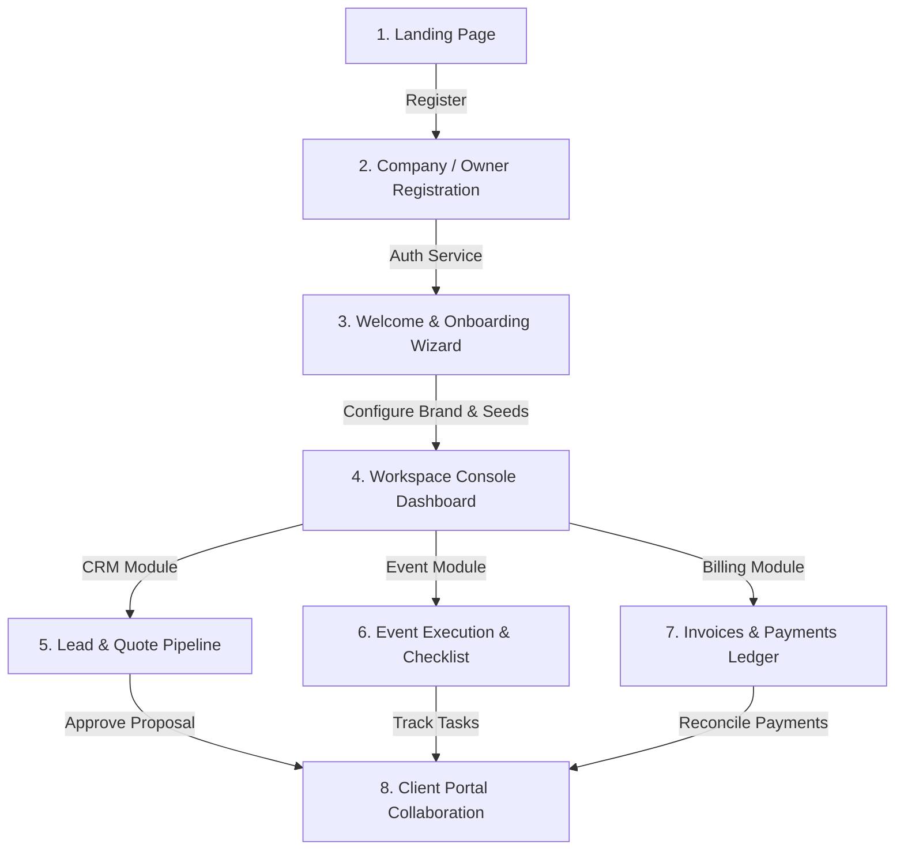
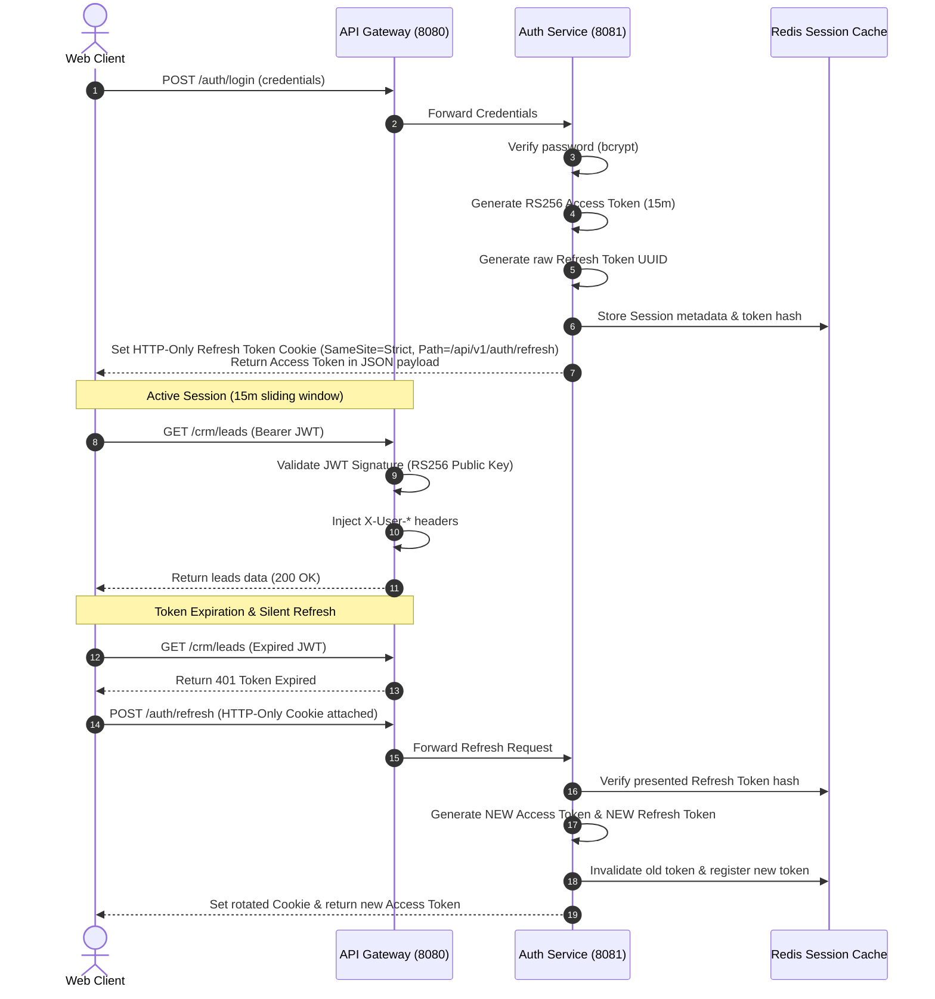
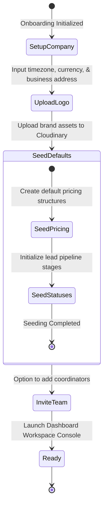
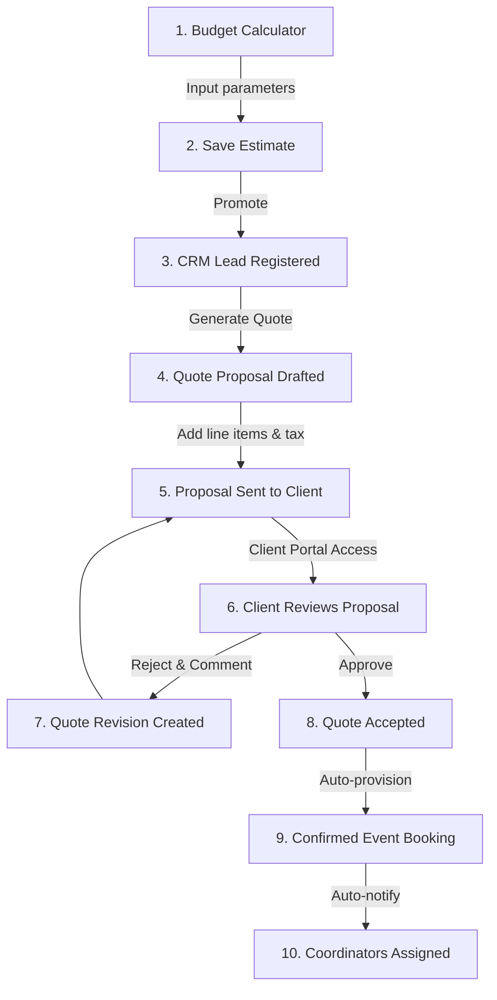
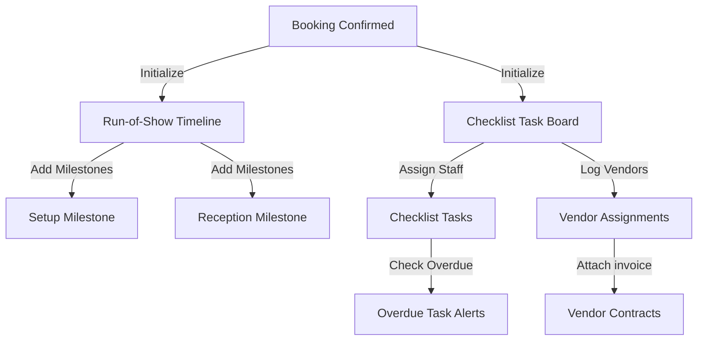
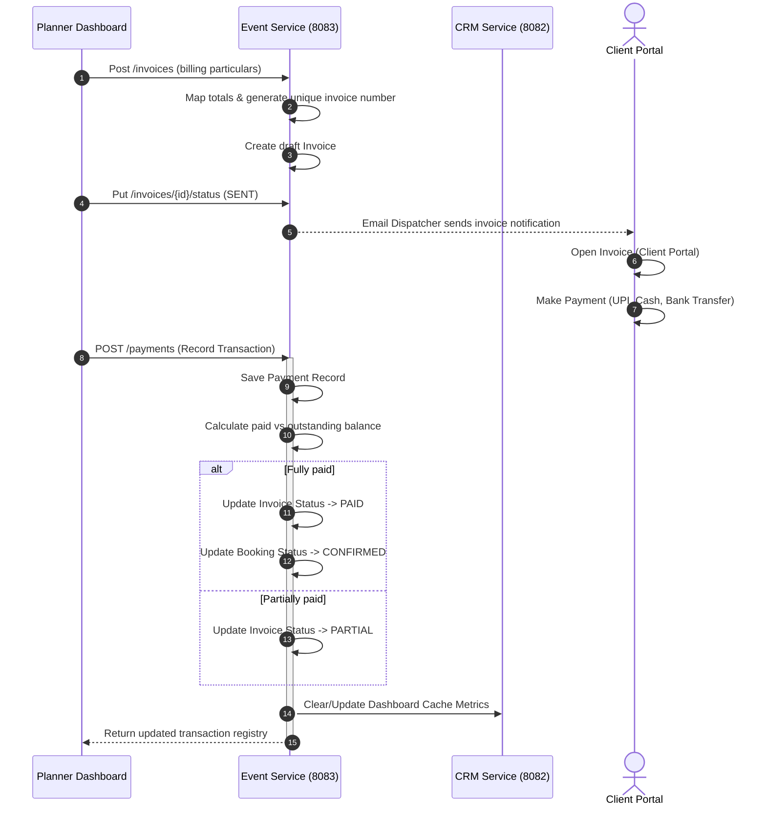
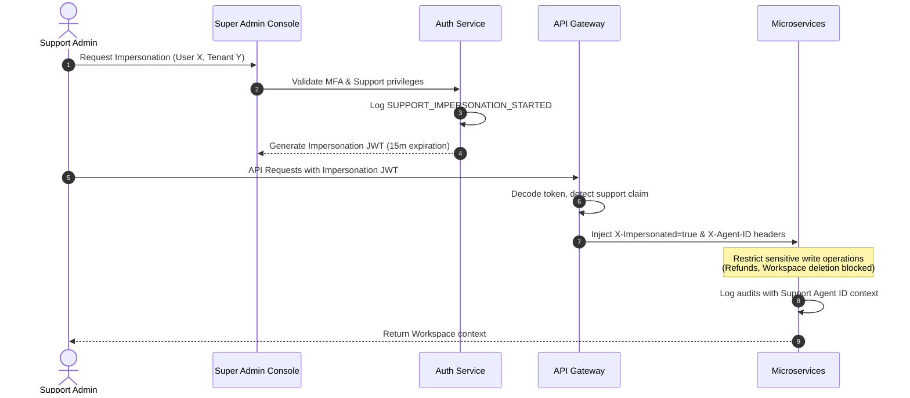
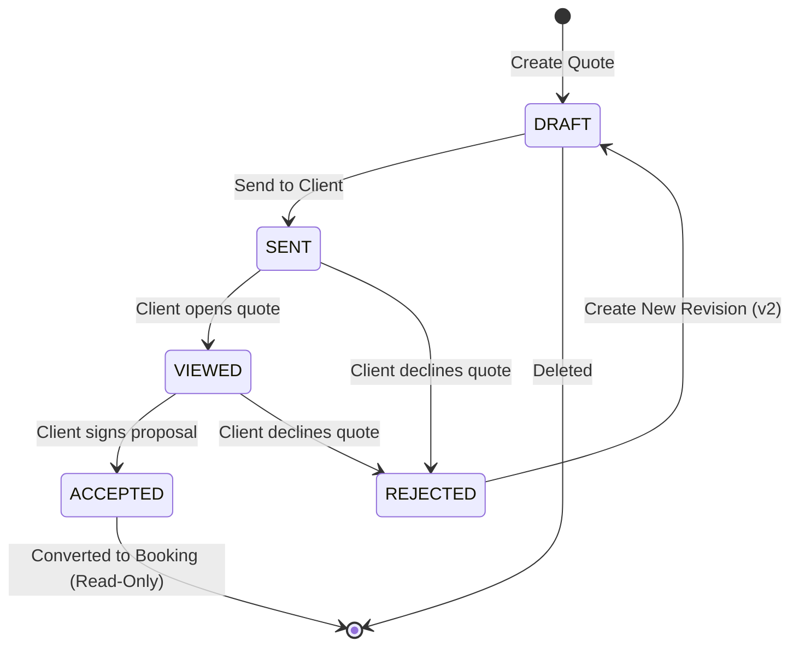
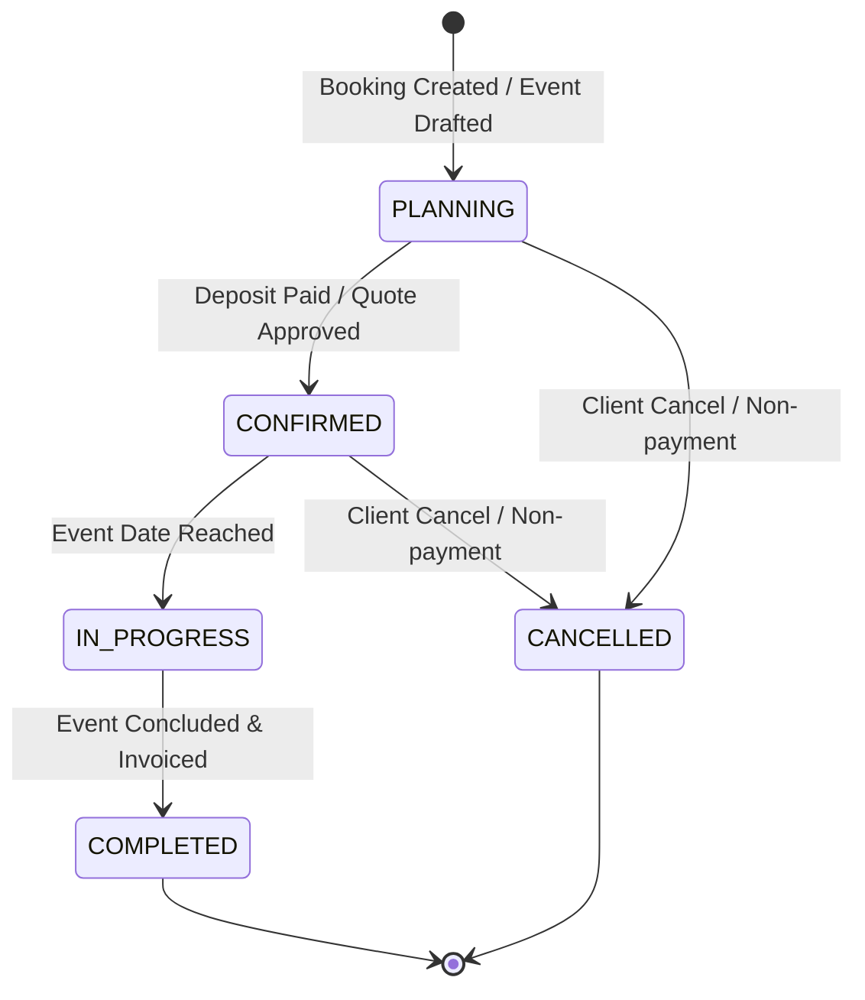

# EventOS — User Flow & Journey Report

This document maps the complete system workflows, user roles, state transitions, and integration points between the Next.js frontend and the Spring Boot microservices.

---

## 1. System Actor Definitions

EventOS supports five core roles across two interface contexts (Workspace Console and Client Portal):

| Role | Interface | Description & Scope of Authority |
| :--- | :--- | :--- |
| **OWNER** | Console | Business creator. Holds full workspace authority, billing, subscription plan management, and deletion controls. |
| **ADMIN** | Console | Workspace administrator. Manages team invitations, system branding, settings, CRM leads, and quote approvals. |
| **MANAGER** | Console | Leads manager. Focuses on sales pipelines, converting leads, drafting quotes, and recording payments. |
| **STAFF** | Console | Operational coordinator. Views events, manages checklist tasks, run-of-show timelines, and logs vendor assignments. |
| **CLIENT** | Portal | Event customer. Views their event timeline, approves quotes, downloads PDF invoices, and reviews media galleries. |

---

## 2. Global Application Lifecycle Flow

The diagram below represents the journey of a user from initial landing through authentication, setup, core operations, and client collaboration:

---

## 3. Core Module Workflows

### A. Authentication & Session Rotation Flow
Enforces secure stateless authorization via RS256 signed JWTs with automatic Refresh Token Rotation (RTR) and device session monitoring.

---

### B. Onboarding & Workspace Configuration Flow
Executed on the first login of a newly registered workspace owner to seed workspace parameters and company settings.

---

### C. Sales Pipeline (Leads to Confirmed Booking)
Tracks the conversion pipeline from a raw budget estimation to a qualified lead, high-fidelity quote proposal, and final confirmed booking.

---

### D. Operational Run-of-Show & Tasks Flow
Controls day-of event execution timelines, coordinator checklists, and vendor management.

---

### E. Financial Ledger (Invoices & Payments)
Manages cash flow, invoice generation, payment logs, and outstanding balance reconciliation.

---

### F. Impersonation Flow (Support Administration)
Allows support engineers to resolve configuration issues directly inside a tenant workspace without password sharing, governed by access audits.

---

## 4. State Machine Diagrams

### A. Quote/Proposal Lifecycle

### B. Event Lifecycle

