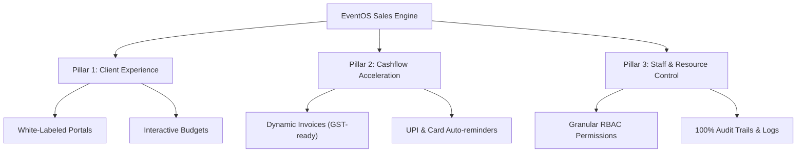

# EventOS: Client Pitch & Onboarding Strategy Guide

This guide outlines the positioning, B2B sales pitch, and customer onboarding roadmap for launching **EventOS** to B2B event agencies, venues, and end-clients.

---

## 1. Core Value Propositions

To pitch successfully, you must shift from selling "features" to selling "outcomes." 

| Feature | The Value Translation (What they buy) |
| :--- | :--- |
| **All-in-One Dashboard** | **Zero Chaos:** No more searching through WhatsApp, SMS, or Excel. Every contract, moodboard, and quote lives in one unified portal. |
| **Premium Client Portals** | **Brand Prestige:** Clients log into a portal branded with your domain and logo, immediately elevating your agency's professional image. |
| **Dynamic Invoices & Online Payments** | **4x Faster Cashflow:** Secure digital payments with automated reminders. Clients pay instantly via UPI or card. |
| **Interactive Event Calculator** | **Insta-Deals:** Clients calculate budgets, adjust plates/decor variables, and sign contracts on the spot. |
| **Enterprise Security & Session Control** | **Data Trust:** Financial records, guest lists, and private contracts are secured with banking-grade authorization. |

---

## 2. B2B Pitch Playbook (Selling to Event Agencies/Venues)

### The Hook (The Pain Point)
> *"How many hours did your team waste this week chasing clients for invoice payments, coordinating decorator moodboards on WhatsApp, and updating Excel sheets? What if you could consolidate all of that into one dashboard and save 35 hours per event?"*

### Pitch Structure: The Three Pillars of EventOS



### Elevator Pitch Script
> "EventOS is the Operating System for event professionals. Instead of managing client briefs on WhatsApp, contracts in PDFs, and payments via Google Pay/bank transfers, EventOS gives your agency a white-labeled client portal. Your clients can log in, view budgets, select catering menus, sign contracts, and pay invoices instantly. It reduces booking friction by 80% and makes your brand look like a million dollars."

---

## 3. Client Onboarding Framework (How to Explain & Get Them to Use It)

A new software is only good if clients actually use it. Use this structured approach to onboard clients:

```
[Phase 1: Invitation] ➔ [Phase 2: The Portal Welcome] ➔ [Phase 3: Interactive Budgeting] ➔ [Phase 4: Auto-Reminders]
```

### Phase 1: The Invite (Setting Expectations)
When onboarding a new client, tell them:
> *"To ensure your event is planned flawlessly without missing details in chat threads, we use **EventOS**—our private client portal. You will receive an email invitation in 2 minutes. Please click it to set a password and access your event dashboard."*

### Phase 2: First Login Experience
On their first login, show them the **3 Key Sections**:
1. **Moodboard & Visuals:** Where they review and approve designs/themes.
2. **Event Calculator:** Where they play with the guest count and watch catering/decor budgets update live.
3. **Invoices:** Where they can download GST receipts and pay milestones.

### Phase 3: The WhatsApp Transition Rules
* **Crucial Rule:** Never accept contract approvals or menu changes via WhatsApp.
* **Response to WhatsApp Requests:** 
  > *"That sounds great! Could you please click approve on that item in your EventOS Portal so our production team gets notified immediately?"* (This trains the client to rely on the software).

---

## 4. Objection Handling (Specifically for the Indian Market)

### Q1. "We are happy using WhatsApp and Excel. Why change?"
* **Pitch Response:** *"WhatsApp is great for chat, but it's where details get lost. If a client requests a change in menu on WhatsApp and you miss it, the event is ruined. Excel doesn't collect payments. EventOS binds your communications, contracts, and payments together so nothing is missed and milestones are paid on time."*

### Q2. "Are my clients' payment details and budgets secure?"
* **Pitch Response:** *"100%. EventOS uses tokenized authentication, secure session tracking (letting you revoke logins from unknown devices), and does not store card numbers. All client data is encrypted and partitioned by tenant."*

### Q3. "What if my clients are not tech-savvy (e.g. older family members)?"
* **Pitch Response:** *"The client portal is designed mobile-first. If they can use WhatsApp, they can use EventOS. Logging in takes one click, and they can approve proposals or pay using standard UPI apps (GPay, PhonePe, Paytm) in two taps."*
