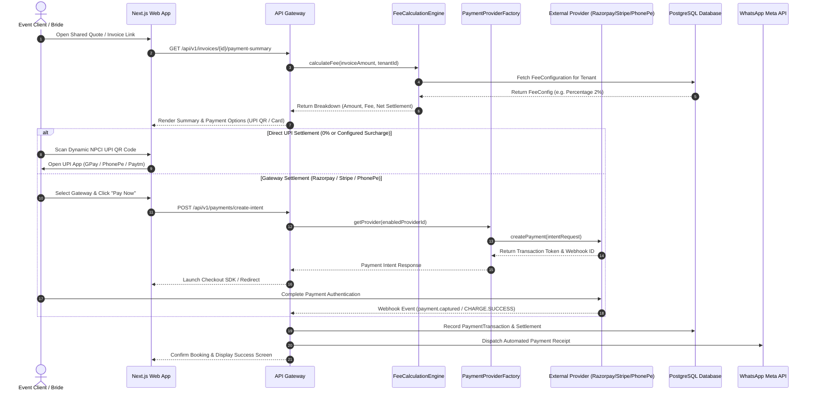
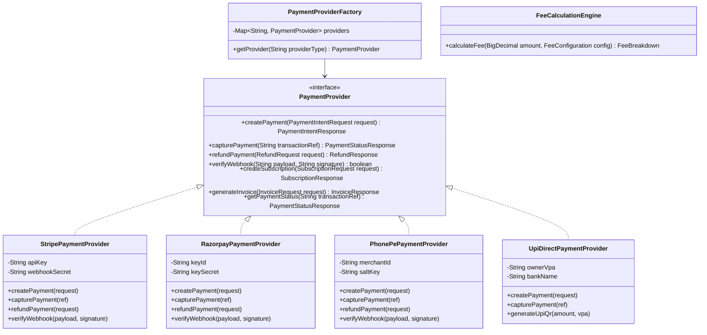

# 🏛️ EventOS v1.2 — Enterprise Payment Engine Architecture & Technical Specification

> **System Version:** `v1.2.0-enterprise`  
> **Document Type:** Production Architecture Specification, Database DDL, REST API Specs & Provider Abstraction Blueprint  
> **Target Audience:** Solution Architects, Backend Engineers, Frontend Developers, DevOps & Security Leads  

---

## Executive Summary

EventOS v1.2 upgrades the core payment infrastructure into a **multi-tenant, enterprise-grade, gateway-agnostic Payment Engine**. It maintains 100% backward compatibility with existing direct NPCI UPI settlement, dynamic QR links, and Stripe subscriptions while introducing an abstract provider layer (**Stripe**, **Razorpay**, **Cashfree**, **PhonePe**), a configurable fee calculation matrix (**No Fee**, **Fixed Fee**, **Percentage Fee**, **Enterprise Custom Fee**), and automated settlement orchestration.

---

## 1. Updated System Architecture Diagram

```
                               ┌─────────────────────────────────────────────────────────┐
                               │                 Next.js 15 Web Client                   │
                               │        (React 19, Dynamic QR Modal, Settings)           │
                               └────────────────────────────┬────────────────────────────┘
                                                            │
                                              REST / JSON API (JWT + Tenant ID)
                                                            │
                               ┌────────────────────────────▼────────────────────────────┐
                               │           EventOS API Gateway (Spring Cloud)            │
                               │    (Tenant Isolation, Rate Limiting, Idempotency)       │
                               └────────────────────────────┬────────────────────────────┘
                                                            │
                        ┌───────────────────────────────────┴───────────────────────────────────┐
                        ▼                                                                       ▼
    ┌───────────────────────────────────────┐                               ┌───────────────────────────────────────┐
    │             auth-service              │                               │             event-service             │
    │  (SaaS Subscription & Tenant Billing) │                               │      (Enterprise Payment Engine)       │
    └───────────────────┬───────────────────┘                               └───────────────────┬───────────────────┘
                        │                                                                       │
                        │                                  ┌────────────────────────────────────┴────────────────────────────────────┐
                        │                                  ▼                                                                         ▼
                        │                      ┌───────────────────────┐                                                 ┌───────────────────────┐
                        │                      │ FeeCalculationEngine  │                                                 │PaymentProvider Factory│
                        │                      │ (No/Fixed/Pcnt/Custom)│                                                 │   (Strategy Pattern)  │
                        │                      └───────────┬───────────┘                                                 └───────────┬───────────┘
                        │                                  │                                                                         │
                        │                                  │                     ┌───────────────────────┬───────────────────────────┼───────────────────────────┐
                        │                                  │                     ▼                       ▼                           ▼                           ▼
                        │                                  │          ┌─────────────────────┐ ┌────────────────────┐ ┌───────────────────┐ ┌──────────────────┐
                        │                                  │          │StripePaymentProvider│ │RazorpayPaymentPrvdr│ │CashfreePaymentPrv │ │PhonePePaymentPrv │
                        │                                  │          └──────────┬──────────┘ └─────────┬──────────┘ └─────────┬─────────┘ └────────┬─────────┘
                        │                                  │                     │                      │                      │                    │
                        ▼                                  ▼                     ▼                      ▼                      ▼                    ▼
     ┌──────────────────────────────────────────────────────────────────────────────────────────────────────────────────────────────────────────────────┐
     │                                                     PostgreSQL Database & Redis Cache Instances                                                  │
     │                 (fee_configurations, payment_providers, payment_transactions, settlements, platform_fees, invoices, refunds, webhook_logs)    │
     └──────────────────────────────────────────────────────────────────────────────────────────────────────────────────────────────────────────────────┘
```

---

## 2. Sequence Diagram: Payment Processing & Settlement Flow



---

## 3. Database Schema Specification (DDL)

```sql
-- 1. Fee Configurations Table
CREATE TABLE fee_configurations (
    id VARCHAR(64) PRIMARY KEY,
    tenant_id VARCHAR(64) NOT NULL,
    fee_type VARCHAR(32) NOT NULL CHECK (fee_type IN ('NO_FEE', 'FIXED', 'PERCENTAGE', 'CUSTOM')),
    fixed_fee_amount DECIMAL(12, 2) DEFAULT 0.00,
    percentage_fee_rate DECIMAL(5, 4) DEFAULT 0.0000,
    custom_rule_script TEXT,
    currency VARCHAR(3) DEFAULT 'INR',
    fee_bearer VARCHAR(32) DEFAULT 'OWNER_DEDUCTION' CHECK (fee_bearer IN ('OWNER_DEDUCTION', 'CLIENT_SURCHARGE')),
    is_active BOOLEAN DEFAULT TRUE,
    created_at TIMESTAMP WITH TIME ZONE DEFAULT CURRENT_TIMESTAMP,
    updated_at TIMESTAMP WITH TIME ZONE DEFAULT CURRENT_TIMESTAMP,
    CONSTRAINT uk_fee_tenant UNIQUE (tenant_id, is_active)
);

-- 2. Payment Providers Configuration Table
CREATE TABLE payment_providers (
    id VARCHAR(64) PRIMARY KEY,
    tenant_id VARCHAR(64) NOT NULL,
    provider_type VARCHAR(32) NOT NULL CHECK (provider_type IN ('STRIPE', 'RAZORPAY', 'CASHFREE', 'PHONEPE', 'UPI_DIRECT')),
    merchant_id VARCHAR(128),
    api_key_encrypted TEXT,
    api_secret_encrypted TEXT,
    webhook_secret_encrypted TEXT,
    is_enabled BOOLEAN DEFAULT FALSE,
    is_test_mode BOOLEAN DEFAULT FALSE,
    settlement_mode VARCHAR(32) DEFAULT 'DIRECT_SETTLEMENT' CHECK (settlement_mode IN ('DIRECT_SETTLEMENT', 'PLATFORM_SETTLEMENT', 'AUTO_SETTLEMENT')),
    created_at TIMESTAMP WITH TIME ZONE DEFAULT CURRENT_TIMESTAMP,
    updated_at TIMESTAMP WITH TIME ZONE DEFAULT CURRENT_TIMESTAMP
);

-- 3. Invoices Table
CREATE TABLE invoices (
    id VARCHAR(64) PRIMARY KEY,
    tenant_id VARCHAR(64) NOT NULL,
    quote_id VARCHAR(64),
    client_id VARCHAR(64) NOT NULL,
    invoice_number VARCHAR(64) NOT NULL UNIQUE,
    subtotal_amount DECIMAL(12, 2) NOT NULL,
    tax_amount DECIMAL(12, 2) DEFAULT 0.00,
    platform_fee_amount DECIMAL(12, 2) DEFAULT 0.00,
    total_amount DECIMAL(12, 2) NOT NULL,
    net_settlement_amount DECIMAL(12, 2) NOT NULL,
    status VARCHAR(32) NOT NULL CHECK (status IN ('DRAFT', 'ISSUED', 'PARTIALLY_PAID', 'PAID', 'CANCELLED', 'REFUNDED')),
    currency VARCHAR(3) DEFAULT 'INR',
    due_date DATE NOT NULL,
    created_at TIMESTAMP WITH TIME ZONE DEFAULT CURRENT_TIMESTAMP
);

-- 4. Payment Transactions Table
CREATE TABLE payment_transactions (
    id VARCHAR(64) PRIMARY KEY,
    tenant_id VARCHAR(64) NOT NULL,
    invoice_id VARCHAR(64) NOT NULL REFERENCES invoices(id),
    provider_id VARCHAR(64) REFERENCES payment_providers(id),
    transaction_reference VARCHAR(128) NOT NULL UNIQUE,
    idempotency_key VARCHAR(128) NOT NULL UNIQUE,
    amount DECIMAL(12, 2) NOT NULL,
    platform_fee_deducted DECIMAL(12, 2) DEFAULT 0.00,
    net_amount DECIMAL(12, 2) NOT NULL,
    currency VARCHAR(3) DEFAULT 'INR',
    payment_method VARCHAR(32) NOT NULL CHECK (payment_method IN ('UPI_QR', 'UPI_DEEP_LINK', 'CREDIT_CARD', 'DEBIT_CARD', 'NET_BANKING', 'WALLET')),
    status VARCHAR(32) NOT NULL CHECK (status IN ('INITIATED', 'PENDING', 'SUCCESS', 'FAILED', 'REFUNDED')),
    gateway_response_json JSONB,
    created_at TIMESTAMP WITH TIME ZONE DEFAULT CURRENT_TIMESTAMP
);

-- 5. Settlements Table
CREATE TABLE settlements (
    id VARCHAR(64) PRIMARY KEY,
    tenant_id VARCHAR(64) NOT NULL,
    transaction_id VARCHAR(64) NOT NULL REFERENCES payment_transactions(id),
    destination_upi_id VARCHAR(128) NOT NULL,
    destination_account_number VARCHAR(64) NOT NULL,
    destination_ifsc VARCHAR(32) NOT NULL,
    destination_bank_name VARCHAR(128) NOT NULL,
    gross_amount DECIMAL(12, 2) NOT NULL,
    fee_deducted DECIMAL(12, 2) NOT NULL,
    net_settled_amount DECIMAL(12, 2) NOT NULL,
    settlement_status VARCHAR(32) NOT NULL CHECK (settlement_status IN ('SETTLED_DIRECT', 'PENDING_PAYOUT', 'PROCESSING', 'FAILED')),
    settled_at TIMESTAMP WITH TIME ZONE DEFAULT CURRENT_TIMESTAMP
);

-- 6. Platform Fees Audit Log
CREATE TABLE platform_fees (
    id VARCHAR(64) PRIMARY KEY,
    tenant_id VARCHAR(64) NOT NULL,
    transaction_id VARCHAR(64) NOT NULL REFERENCES payment_transactions(id),
    fee_type VARCHAR(32) NOT NULL,
    calculated_fee DECIMAL(12, 2) NOT NULL,
    retained_by_platform BOOLEAN DEFAULT TRUE,
    created_at TIMESTAMP WITH TIME ZONE DEFAULT CURRENT_TIMESTAMP
);

-- 7. Webhook Logs Table
CREATE TABLE webhook_logs (
    id VARCHAR(64) PRIMARY KEY,
    provider_name VARCHAR(32) NOT NULL,
    event_type VARCHAR(128) NOT NULL,
    payload_json JSONB NOT NULL,
    signature_header VARCHAR(256),
    verification_status VARCHAR(32) NOT NULL CHECK (verification_status IN ('VERIFIED', 'FAILED', 'REPLAY_ATTEMPT')),
    processed_at TIMESTAMP WITH TIME ZONE DEFAULT CURRENT_TIMESTAMP
);
```

---

## 4. REST API Specifications

### 4.1 Get Payment Breakdown & Fee Summary
- **Endpoint:** `GET /api/v1/invoices/{invoiceId}/payment-summary`
- **Headers:** `Authorization: Bearer <JWT>`, `X-Tenant-ID: <tenantId>`
- **Response (200 OK):**
```json
{
  "success": true,
  "data": {
    "invoiceId": "inv_928174",
    "invoiceNumber": "INV-2026-089",
    "subtotalAmount": 50000.00,
    "taxAmount": 9000.00,
    "totalInvoiceAmount": 59000.00,
    "feeConfiguration": {
      "feeType": "PERCENTAGE",
      "feeRate": 0.02,
      "calculatedFee": 1180.00,
      "feeBearer": "OWNER_DEDUCTION"
    },
    "netSettlementAmount": 57820.00,
    "directUpiDetails": {
      "vpa": "royalweddings@okicici",
      "accountHolder": "Royal Weddings & Events Ltd",
      "qrPayload": "upi://pay?pa=royalweddings@okicici&pn=Royal%20Weddings&am=57820.00&cu=INR"
    }
  }
}
```

### 4.2 Create Payment Transaction Intent
- **Endpoint:** `POST /api/v1/payments/create-intent`
- **Headers:** `Authorization: Bearer <JWT>`, `X-Tenant-ID: <tenantId>`, `X-Idempotency-Key: <unique-uuid>`
- **Request Body:**
```json
{
  "invoiceId": "inv_928174",
  "provider": "RAZORPAY",
  "paymentMethod": "UPI_QR",
  "currency": "INR"
}
```
- **Response (201 Created):**
```json
{
  "success": true,
  "data": {
    "transactionId": "txn_8192837",
    "providerReference": "order_Nz19283719",
    "amount": 59000.00,
    "platformFee": 1180.00,
    "netAmount": 57820.00,
    "clientSecret": "rzp_live_928174_secret",
    "status": "INITIATED"
  }
}
```

### 4.3 Update Workspace Payment & Fee Configuration
- **Endpoint:** `PUT /api/v1/workspace/settings/payment-config`
- **Headers:** `Authorization: Bearer <JWT>`, `X-Tenant-ID: <tenantId>`
- **Request Body:**
```json
{
  "settlementMode": "DIRECT_SETTLEMENT",
  "feeType": "FIXED",
  "fixedFeeAmount": 99.00,
  "percentageFeeRate": 0.00,
  "feeBearer": "OWNER_DEDUCTION",
  "enabledProviders": ["UPI_DIRECT", "RAZORPAY", "STRIPE"]
}
```

---

## 5. Class Diagram & Provider Abstraction (Strategy Pattern)



---

## 6. Project Directory & Component Structure

```
d:\EventOs
├── backend/
│   └── event-service/
│       └── src/main/java/com/eventos/event/payment/
│           ├── config/
│           │   └── PaymentEngineConfig.java
│           ├── controller/
│           │   ├── PaymentController.java
│           │   ├── SettlementController.java
│           │   └── WebhookController.java
│           ├── entity/
│           │   ├── FeeConfiguration.java
│           │   ├── PaymentProviderEntity.java
│           │   ├── PaymentTransaction.java
│           │   ├── Settlement.java
│           │   └── PlatformFee.java
│           ├── provider/
│           │   ├── PaymentProvider.java (Interface)
│           │   ├── PaymentProviderFactory.java
│           │   ├── StripePaymentProvider.java
│           │   ├── RazorpayPaymentProvider.java
│           │   ├── PhonePePaymentProvider.java
│           │   └── UpiDirectPaymentProvider.java
│           └── service/
│               ├── FeeCalculationService.java
│               ├── SettlementService.java
│               └── PaymentOrchestrationService.java
└── web/
    └── src/
        ├── components/
        │   ├── finance/
        │   │   └── DynamicUpiQrModal.tsx (Updated with Fee Breakdown)
        │   └── settings/
        │       └── PaymentEngineSettings.tsx (New Payment Engine Settings)
        └── app/
            └── settings/
                └── page.tsx (Registered Payment Engine in Settings Sidebar)
```

---

## 7. Security, Migration & Enterprise Risk Analysis

1. **Webhook Security & Replay Attack Prevention:**
   - Every incoming webhook verifies HMAC SHA256 signatures (`X-Razorpay-Signature`, `Stripe-Signature`, `X-VERIFY`).
   - Webhook event IDs are logged in `webhook_logs` table; duplicates within a 24-hour window are rejected with `409 Conflict`.
2. **Idempotency & Double-Charge Guard:**
   - Payment intents require `X-Idempotency-Key` header. Consecutive API retries return existing transaction intents without re-executing gateway charges.
3. **Data Encrypt-at-Rest:**
   - Merchant secrets (`api_secret_encrypted`) are stored encrypted in PostgreSQL using AES-256 GCM encryption.
4. **Migration Strategy:**
   - All existing workspaces default to `fee_type = 'NO_FEE'` (0% platform fee), preserving exact existing business logic until workspace owners choose to update their monetization rules.
