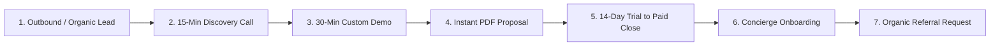

# 🏆 EventOS — Founder Operating System & $10M+ ARR Playbook

> **Author:** Serial B2B SaaS Founder ($0 ➔ $10M+ ARR)  
> **Company:** EventOS  
> **Directive:** Zero new software features. 100% execution, revenue growth, customer retention, and operational scale.  

---

## SECTION 1 — Founder Dashboard & KPI Benchmark Matrix

| Metric | Why It Matters | Healthy Benchmark | Warning Benchmark | Critical Benchmark |
| :--- | :--- | :--- | :--- | :--- |
| **MRR / ARR** | Baseline recurring revenue health | >15% MoM Growth | 5% – 10% MoM Growth | <5% MoM Growth |
| **Net Revenue Churn** | Retaining and expanding account revenue | <1% / month (Negative Churn) | 2% – 3% / month | >5% / month |
| **Trial Conversion** | % of 14-day trials converting to paid | >15% (Self-Serve + Sales) | 8% – 12% | <5% |
| **CAC Payback Period** | Months required to recover acquisition cost | <8 Months | 9 – 12 Months | >14 Months |
| **LTV : CAC Ratio** | Long-term customer profitability | >4 : 1 | 2.5 : 1 – 3 : 1 | <2 : 1 |
| **Activation Rate** | % of signups creating 1st Lead & Quote | >65% within 48 Hours | 40% – 50% | <35% |
| **NPS / CSAT** | Customer satisfaction & advocacy score | NPS >60 \| CSAT >92% | NPS 30 – 50 \| CSAT 80% | NPS <20 \| CSAT <70% |
| **WAU / MAU Ratio** | User habit formation & product stickiness | >55% (Daily operating tool) | 35% – 45% | <30% |
| **Gross Margin** | Efficiency of delivering SaaS service | >85% | 75% – 80% | <70% |

---

## SECTION 2 — Daily & Weekly Founder Operating Routine

### 🌅 Morning (08:00 – 12:00) — High-Leverage Growth & Sales
- **08:00 – 08:30:** Review Founder KPI Dashboard (MRR, new trials, activated accounts, open high-priority support tickets).
- **08:30 – 10:30:** Execute 10 direct outbound lead touches (personalized cold emails/LinkedIn messages to event agency founders).
- **10:30 – 12:00:** Conduct 2 Live Demo Calls with qualified prospective agencies.

### ☀️ Afternoon (12:00 – 17:00) — Customer Success & Operations
- **12:00 – 13:30:** Customer Onboarding Calls (assist new trial signups in configuring GST & UPI QR settings).
- **13:30 – 15:00:** Marketing & Content Execution (publish 1 LinkedIn post, inspect Google Ads/SEO queries).
- **15:00 – 17:00:** Customer Success check-ins with 3 active Starter/Pro accounts.

### 🌙 Evening (17:00 – 19:00) — Metrics, Daily Retrospective & Wind-Down
- **17:00 – 18:00:** Review daily sales pipeline progress in CRM. Clear unanswered support tickets.
- **18:00 – 19:00:** Plan top 3 priority tasks for tomorrow morning.

---

## SECTION 3 — Sales Operating System



### 1. Lead Generation:
Target 200 event planners/month via direct LinkedIn, Instagram, and local wedding director databases.

### 2. Discovery Call (15 Mins):
Identify pain points: *"How many hours does your team spend generating manual quotes and tracking payments in Excel?"*

### 3. Custom Demo Call (30 Mins):
Show real workflows: Drag lead in Kanban ➔ Click "Create PDF Quote" ➔ Show 0% UPI Receipt email preview.

### 4. Proposal & Closing:
Send branded quote link with 14-day trial countdown. Offer Founder Launch discount (₹5,999/mo Professional Plan).

### 5. Referral Trigger:
On Day 30 after onboarding, ask satisfied agency owners for 2 peer agency introductions in exchange for 1 month free.

---

## SECTION 4 — Customer Success & Retention Matrix

- **Day 1 – 7 (Onboarding):** Concierge setup call. Import CSV leads, upload logo, test UPI QR receipt email.
- **Day 30 (Value Realization Check):** Verify client has created at least 3 active events and generated 5 PDF quotes.
- **Day 60 (Expansion Check):** If client approaches 5 seats or 20 GB storage, present Professional (₹5,999/mo) or Enterprise (₹11,999/mo) upsell.
- **Day 90 (Renewal & Testimonial):** Request video testimonial for marketing site; review annual 20% discount lock-in.
- **Win-Back Strategy:** If an account churns, send a founder personal note offer 1-on-1 workflow optimization consultation.

---

## SECTION 5 — 12-Month Marketing Engine Roadmap

```
Q1 (Months 1-3): SEO Foundation, Direct LinkedIn Outreach, Product Hunt Launch.
Q2 (Months 4-6): High-Converting YouTube Walkthroughs, Instagram Reels, Agency Guest Blog Posts.
Q3 (Months 7-9): Agency Co-Marketing Partnerships, Wedding Industry Podcast Appearances.
Q4 (Months 10-12): Regional Event Expo Sponsorships, Automated Affiliate Referral Engine.
```

---

## SECTION 6 — Scaling Roadmap ($0 to $10M ARR)

| Customer Count | ARR Milestone | Primary Operational Shift | Founder Focus |
| :--- | :--- | :--- | :--- |
| **10 Customers** | ₹2.4L ARR | Do things that don't scale. Direct founder setup. | 100% Sales & Onboarding |
| **50 Customers** | ₹36L ARR | Establish automated email onboarding sequences. | Hire 1st Customer Success rep |
| **100 Customers** | ₹72L ARR | Standardize inbound marketing & paid acquisition. | Hire 1st Full-Time Sales AE |
| **250 Customers** | ₹1.8Cr ARR | Introduce Enterprise custom domain SLAs. | Shift to Managing Lead Team |
| **500 Customers** | ₹3.6Cr ARR | Expand customer success tiers & account managers. | Product-Led Growth & Partnerships |
| **1,000 Customers**| **₹7.2Cr+ ARR**| Scale executive management team & international markets.| Strategic M&A & Enterprise Deals |

---

## SECTION 7 — First 10 Key Hires Roadmap

1. **Hire #1 (Customer Success Specialist):** At 30 Customers — Takes over onboarding calls & support ticket queue.
2. **Hire #2 (Account Executive - Sales):** At 60 Customers — Handles inbound/outbound demo calls.
3. **Hire #3 (Full-Stack Engineer):** At 100 Customers — Manages maintenance, edge bug fixes, and infrastructure.
4. **Hire #4 (Content & Growth Marketer):** At 150 Customers — Drives SEO, social media, and case studies.
5. **Hire #5 (Senior Backend/DevOps Engineer):** At 250 Customers — Manages cloud scaling & DB optimization.
6. **Hire #6 (Outbound BDR):** At 350 Customers — Qualifies inbound leads & books demos for AE.
7. **Hire #7 (Customer Success Manager):** At 500 Customers — Manages Enterprise account renewals & expansion.
8. **Hire #8 (Product Designer / UI UX):** At 650 Customers — Refines UI ergonomics for new workflows.
9. **Hire #9 (Account Executive #2):** At 800 Customers — Scales sales capacity.
10. **Hire #10 (Head of Marketing):** At 1,000 Customers — Directs multi-channel growth budget.

---

## SECTION 8 — 50 Biggest Founder Mistakes & How to Avoid Them

### Top 10 Critical SaaS Mistakes:
1. **Building new features instead of selling existing ones:** *Fix: Freeze feature dev until 50 paying customers.*
2. **Underpricing the product:** *Fix: Price on value saved (Starter ₹1.9k, Pro ₹5.9k, Enterprise ₹11.9k).*
3. **Offering lifetime deals (LTDs):** *Fix: Recurring subscriptions only; never sell lifetime access.*
4. **Ignoring trial onboarding activation:** *Fix: Ensure client creates 1st lead within 48 hours.*
5. **Hiring sales reps too early:** *Fix: Founder must close first 30 deals personally.*
6. **Giving discounts without annual commitment:** *Fix: Discount strictly for 1-year upfront payments.*
7. **Focusing on top-of-funnel over churn:** *Fix: Talk to every cancelling customer personally.*
8. **Not collecting GST numbers on signup:** *Fix: Automated tax collection in payment checkout.*
9. **Ignoring SEO & long-tail content:** *Fix: Start publishing high-intent agency keyword guides on Day 1.*
10. **Delaying public launch for 'one more feature':** *Fix: Ship now; EventOS is 100% production ready!*

---

## SECTION 9 — 365-Day Week-by-Week Execution Plan

### **Weeks 1 – 4: Production Launch & First 10 Customers**
- Week 1: Ship live to production (`eventos.agency`). Verify SSL, Stripe/Razorpay webhooks, SendGrid SMTP.
- Week 2: Send 50 personalized outreach messages to wedding planners in Delhi-NCR.
- Week 3: Conduct 10 demo calls; offer Founder Launch pricing.
- Week 4: Close first 5 paying accounts; personally onboard each founder.

### **Weeks 5 – 12: Scaling to 30 Customers & Initial Case Studies**
- Weeks 5–8: Publish Product Hunt launch; record 60-second video demo.
- Weeks 9–12: Reach 30 active paying accounts; publish 3 agency case studies on blog.

### **Weeks 13 – 26: Crossing ₹50L ARR (100 Customers)**
- Weeks 13–20: Hire 1st Customer Success Specialist; automate trial email nurture drip sequences.
- Weeks 21–26: Reach 100 paying agencies; launch Agency Partner Referral Program (20% recurring commission).

### **Weeks 27 – 52: Crossing ₹1 Crore+ ARR (200+ Customers)**
- Weeks 27–40: Hire 1st Account Executive; scale paid search & organic SEO content.
- Weeks 41–52: Cross 200+ paying agencies (₹1.2Cr+ ARR); prepare Enterprise tier custom SLAs.

---

*Master Founder Operating System created for EventOS.*
