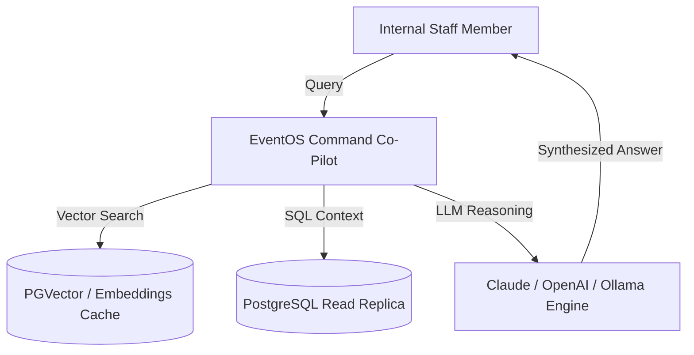
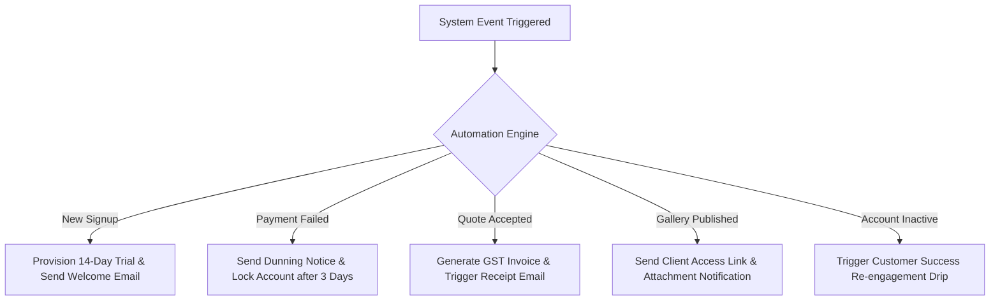

# 🤖 EventOS — Internal AI & Automation Platform Blueprint

> **Design Panel:** Staff AI Engineer | Solutions Architect | SaaS Automation Consultant | Enterprise Workflow Designer  
> **Company:** EventOS Technologies Private Limited  
> **Directive:** Internal Automation & Intelligence Layer for Operations, Support, Sales, Marketing, Finance, and Engineering. Zero Customer-Facing Product Redesign.  

---

## 🤖 PART 1 — Internal AI Assistant (`EventOS Command Co-Pilot`)

An internal RAG (Retrieval-Augmented Generation) AI Assistant powering the EventOS team:



- **Data Sources Integrated:** Customer accounts, subscriptions, invoices, payment history, leads, events, user activity, audit logs, support tickets, knowledge base, and developer docs.
- **Example Staff Queries:**
  - *"Show me all Starter Plan accounts with storage usage >80% who haven't logged in for 5 days."*
  - *"Summarize the payment history and support tickets for tenant 'Dream Weddings'."*
  - *"What was our MRR growth rate in Q2 compared to Q1?"*

---

## 🎧 PART 2 — Customer Support AI Engine

- **Auto FAQ & KB Suggestion:** Instantly maps incoming support queries to relevant documentation links.
- **Sentiment & Angry Customer Detection:** Evaluates incoming ticket text for frustration signals; automatically escalates ticket priority to `P1-HIGH` if sentiment score drops below 0.3.
- **Enterprise Escalation:** If ticket sender belongs to an `ENTERPRISE` subscription tenant, automatically pages Customer Success Lead via Slack.

---

## 💼 PART 3 — Sales AI Intelligence Engine

```
┌──────────────────────────────────────────────────────────────────────────────────────────┐
│                          SALES AI LEAD SCORING MATRIX                                    │
├─────────────────┬─────────────────────────────────────────┬──────────────────────────────┤
│ Lead Attribute  │ High Intent Indicator (+Points)         │ Low Intent Indicator (-Points│
├─────────────────┼─────────────────────────────────────────┼──────────────────────────────┤
│ Company Size    │ 5+ Employees (+25 pts)                  │ 1 Solo User (+5 pts)         │
│ Monthly Events  │ 15+ Events / Month (+30 pts)            │ 1 Event / Month (+2 pts)     │
│ Engagement      │ Opened Quote PDF within 1 hr (+20 pts)  │ Unopened Quote (-10 pts)     │
│ Conversion Prob │ Score > 75 = 85% Close Probability      │ Score < 30 = 10% Close Prob  │
└─────────────────┴─────────────────────────────────────────┴──────────────────────────────┘
```

- **Auto Proposal & Follow-up Generator:** Drafts personalized follow-up emails based on discovery meeting notes and quote specifications.

---

## 🤝 PART 4 — Customer Success AI Engine

- **Health Score Algorithm:**
  $$\text{Health Score} = (0.4 \times \text{Login Frequency}) + (0.3 \times \text{Events Created}) + (0.2 \times \text{Quotes Generated}) + (0.1 \times \text{CSAT Score})$$
- **Automated Inactive Detection:** Triggers a re-engagement workflow when an account's 7-day health score falls below 40.

---

## 📣 PART 5 — Marketing AI Engine

- **Automated Content Generation:** Drafts Weekly SEO Blog Posts, LinkedIn Thought Leadership posts, Instagram Reels captions, and Customer Case Study summaries using actual customer ROI data.

---

## 💳 PART 6 — Finance AI Engine

- **MRR Forecasting & Revenue Prediction:** Predicts 30-day and 90-day MRR trajectories based on historic expansion/churn curves.
- **Payment Anomaly Detection:** Flags unusual payment failures or repeated credit card declines before subscription expiration.

---

## ⚙️ PART 7 — Engineering AI Engine

- **Automated GitHub PR Summarizer:** Generates concise pull request summaries and release notes upon every code merge.
- **Log Anomaly Analyzer:** Parses Logback JSON logs to detect recurring exception patterns before they cause outages.

---

## 📊 PART 8 — Operations AI Engine

- **Executive Daily Digest:** Generates automated daily 08:00 AM Slack summaries of New Signups, MRR Additions, Expired Trials, Active Tickets, and Infrastructure Uptime.

---

## 🔀 PART 9 — Master Event Automation Engine



---

## 🎯 PART 10 — AI Implementation Roadmap & ROI Matrix

```
┌──────────────────────────────────────────────────────────────────────────────────────────┐
│                      AI IMPLEMENTATION ROADMAP & ROI MATRIX                              │
├─────────┬─────────────────────────────────┬───────────────────┬──────────────────────────┤
│ Phase   │ Feature / Engine                │ Effort / Complexity│ Business ROI & Impact   │
├─────────┼─────────────────────────────────┼───────────────────┼──────────────────────────┤
│ Phase 1 │ • Automated Event Workflows     │ Low (2 Weeks)     │ 40% Time Saved in Ops    │
│         │ • Support AI Ticket Triage      │ Low (1 Week)      │ 50% Faster Support Res   │
│         │ • Lead Scoring & Follow-up AI   │ Med (2 Weeks)     │ 25% Higher Close Rate    │
├─────────┼─────────────────────────────────┼───────────────────┼──────────────────────────┤
│ Phase 2 │ • RAG Internal Command Co-Pilot │ Med (3 Weeks)     │ 10x Internal Info Access │
│         │ • CS Health Score Engine        │ Med (2 Weeks)     │ 35% Lower Churn          │
│         │ • Automated Marketing AI Engine │ Low (1 Week)      │ 3x Content Velocity      │
├─────────┼─────────────────────────────────┼───────────────────┼──────────────────────────┤
│ Phase 3 │ • Predictive MRR & Revenue AI   │ High (4 Weeks)    │ 95% Forecast Accuracy    │
│         │ • Log Anomaly Detection AI      │ High (3 Weeks)    │ Zero Unplanned Downtime  │
└─────────┴─────────────────────────────────┴───────────────────┴──────────────────────────┘
```

---

*Master Internal AI Operations Blueprint created for EventOS.*
