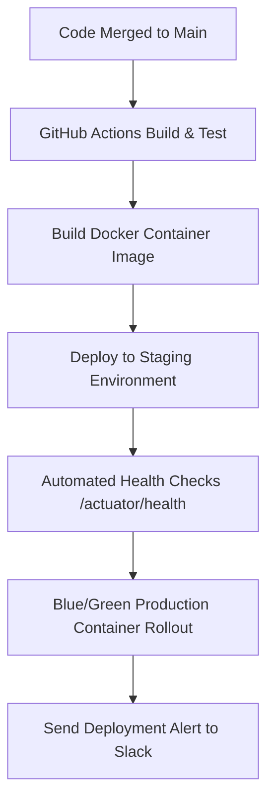

# 📖 EventOS — Internal Company Operations Manual & Department Playbooks

> **Executive Team:** CEO | COO | CTO | VP Engineering | VP Product | VP Sales | VP Marketing | Customer Success Director | HR Director | Finance Director | Legal Advisor | DevOps Manager  
> **Company:** EventOS Technologies Private Limited  
> **Directive:** Operational Excellence, Departmental SOPs, Crisis Response, and Scalable Execution. Zero Software Redesign.  

---

## PART 1 — Engineering Playbook

- **Git Branching Strategy:** GitHub Flow (`main` for production releases, `staging` for release candidates, `feature/FEATURE_NAME` for new features, `hotfix/FIX_NAME` for urgent production fixes).
- **Commit Message Standards:** Conventional Commits specification: `feat:`, `fix:`, `docs:`, `style:`, `refactor:`, `test:`, `chore:`.
  - *Example:* `feat(billing): add automated 18% GST invoice receipt email`
- **Pull Request Checklist:**
  - [ ] Passes all automated unit tests (`mvn test` & `npm run test`).
  - [ ] Tested across mobile, tablet, and desktop viewports.
  - [ ] Includes `suppressHydrationWarning` on updated `` emblems.
  - [ ] Approved by at least 1 Senior Engineer.
- **Hotfix Process:** Branch from `main` ➔ Apply fix ➔ Run tests ➔ Review & merge ➔ Tag version (`v1.0.x`) ➔ Deploy to production within 30 minutes.
- **Rollback Procedure:** In case of critical production anomaly, trigger Vercel 1-click rollback or redeploy previous container tag (`docker container rollback`).

---

## PART 2 — DevOps Playbook



- **Incident Response SOP:**
  1. **Severity 1 (System Down):** Page DevOps Lead & CTO within 5 minutes. Update Status Page to *"Investigating"*.
  2. **Severity 2 (Service Degradation):** Page Engineer on call within 15 minutes.
  3. **Post-Mortem:** Conduct blameless post-mortem within 48 hours of resolution.
- **Disaster Recovery & Backup Restoration:** Daily PostgreSQL WAL automated snapshots restored to staging DB on the 1st of every month to verify 100% recovery validity.

---

## PART 3 — Product Operations

- **Bug Triage Priority:**
  - **P0 (Critical):** Data loss or auth blocking ➔ Immediate hotfix.
  - **P1 (High):** Feature broken without workaround ➔ Fix in current sprint.
  - **P2 (Normal):** UI alignment or minor visual glitch ➔ Backlog backlog.
- **Changelog Management:** Automatically compiled on every production deployment and published to `/blog` and `/help`.

---

## PART 4 — Customer Success SOP

```
┌──────────────────────────────────────────────────────────────────────────────────────────┐
│                      CUSTOMER SUCCESS LIFE CYCLE PLAYBOOK                                │
├──────────────────┬──────────────────────────────────────┬────────────────────────────────┤
│ Stage            │ Target Action Item                   │ Success Metric / Goal          │
├──────────────────┼──────────────────────────────────────┼────────────────────────────────┤
│ Day 1 Onboarding │ Concierge setup call (import CSVs)   │ User creates 1st Lead < 48 hrs │
│ Day 14 Conversion│ Assist trial user in choosing plan   │ >15% Free Trial to Paid Conv.  │
│ Day 30 Review    │ Inspect quote generation & payments  │ User active events >= 3        │
│ Day 60 Upsell    │ Present Professional/Enterprise tier │ Expansion revenue MRR +20%     │
│ Day 90 QBR       │ Executive review & video testimonial │ NPS >60 & CSAT >92%            │
└──────────────────┴──────────────────────────────────────┴────────────────────────────────┘
```

---

## PART 5 — Sales SOP

- **Lead Qualification (BANT Framework):**
  - **Budget:** Can agency afford ₹1,999/mo to ₹11,999/mo?
  - **Authority:** Speaking with Founder, Director, or Senior Coordinator?
  - **Need:** Losing leads in WhatsApp or struggling with manual PDF quotes?
  - **Timeline:** Ready to onboard within 14 days?
- **Demo Script:** Focus 80% on client workflow speed (1-click PDF quotes & 0% UPI receipts) and 20% on feature settings.

---

## PART 6 — Marketing SOP

- **Weekly Marketing Rhythm:**
  - **Monday:** Publish 1 Founder Thought Leadership post on LinkedIn.
  - **Wednesday:** Publish 1 Agency Case Study on Blog & Newsletter.
  - **Friday:** Publish 1 Reel/Short walkthrough of an EventOS feature.
- **Case Study Creation:** Interview top agency owners saving 40%+ team hours daily; package into PDF & blog post.

---

## PART 7 — Finance SOP

- **Invoice & GST Billing:** Automatically generated on the 1st of every month with 18% GST calculation for Indian agencies.
- **Payment Reconciliation:** Weekly automated cross-check between Stripe/Razorpay webhooks and internal database `invoices` table.
- **Refund SOP:** 100% refund processed within 24 hours if requested within the 14-day risk-free window.

---

## PART 8 — HR SOP

- **Hiring Sequence:**
  - CS Specialist (at 30 Customers) ➔ Account Executive Sales (at 60 Customers) ➔ Full-Stack Engineer (at 100 Customers) ➔ Growth Marketer (at 150 Customers).
- **Onboarding Handbook:** All new employees complete the 14-day EventOS product training and pass the Admin Certification exam.

---

## PART 9 — Executive Dashboard Metrics

```
┌──────────────────────────────────────────────────────────────────────────────────────────┐
│                      EXECUTIVE C-SUITE DASHBOARDS MATRIX                                 │
├─────────────────┬──────────────────────────────────┬─────────────────────────────────────┤
│ C-Suite Role    │ Primary Metric Tracked           │ Secondary Metrics Tracked           │
├─────────────────┼──────────────────────────────────┼─────────────────────────────────────┤
│ CEO             │ ARR & MRR Growth                 │ Net Revenue Retention, Cash Runway  │
│ CTO             │ API Latency (<50ms) & Uptime     │ Infrastructure Cost, Error Count    │
│ COO             │ CSAT & Net Churn                 │ Support Ticket Resolution Time      │
│ VP Sales        │ Demo Conversion Rate (%)         │ CAC Payback Period, Outbound Velocity│
│ VP Marketing    │ Organic Inbound Trials           │ CAC, Lead-to-Trial Conversion       │
└─────────────────┴──────────────────────────────────┴─────────────────────────────────────┘
```

---

## PART 10 — Crisis Playbooks

### 🚨 Crisis Scenario 1: Total Server / Database Outage
1. **Min 0:** Automated Slack alert triggers. DevOps Lead acknowledges page.
2. **Min 5:** Status page updated to *"Investigating Database Performance Issues"*.
3. **Min 15:** Switch to warm standby database failover.
4. **Min 30:** Post resolution update: *"All services fully restored."*

### 🚨 Crisis Scenario 2: Data Breach or Unauthorized Access Attempt
1. **Min 0:** Immediately revoke compromised credentials via Redis Sentinel.
2. **Min 15:** Isolate affected tenant IDs (`X-Tenant-ID`).
3. **Min 60:** Conduct forensic investigation; notify affected tenant owners with full disclosure and resolution steps.

---

## PART 11 — Company Growth Manual (10 to 100,000 Customers)

- **10 Customers:** Direct founder concierge operations.
- **100 Customers:** Dedicated sales & customer success departments.
- **1,000 Customers:** Regional expansion across APAC & MENA; ARR > ₹7.2 Crores.
- **10,000 Customers:** Global event OS standard; ARR > $20 Million.
- **100,000 Customers:** Public SaaS Market Leader; ARR > $100 Million.

---

*Master Internal Company Operations Manual created for EventOS.*
