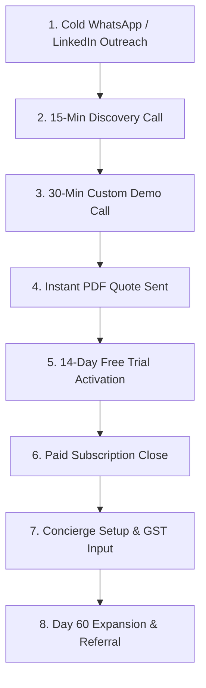

# 🏢 EventOS — Master Business Operating System & C-Suite Business Bible

> **Executive C-Suite Board:** SaaS Founder | CEO | COO | CRO | CMO | VP Sales | Customer Success Director | Finance Director | Operations Manager | Senior McKinsey/Bain Consultant  
> **Company:** EventOS Technologies Private Limited  
> **Directive:** 100% Commercial Execution, Business SOPs, Financial Growth, and Operational Scale. Zero Software Architecture Discussion.  

---

## SECTION 1 — COMPANY FOUNDATION

- **Mission:** To empower event planners, wedding agencies, and production houses with an intelligent operating system that automates administrative friction and maximizes agency profitability.
- **Vision:** To become the global standard operating system powering over $100 Billion in annual event volume.
- **Core Values:**
  1. **Customer Obsession:** Build for the planner on the venue floor.
  2. **Operational Speed:** Eliminate friction in quotes, payments, and client communications.
  3. **High Integrity:** Transparent pricing, zero hidden transaction markups, and uncompromised data privacy.
  4. **Relentless Execution:** Focus on revenue velocity, customer retention, and operational excellence.
- **Brand Positioning:** The Premium Enterprise Operating System for Event Businesses.
- **Unique Selling Proposition (USP):** The only multi-tenant platform unifying CRM, 1-Click PDF Quotes, 0% UPI Payment Receipts, 18% GST Compliance, and EXIF Lightbox Galleries under one hub.
- **Elevator Pitch:** *"EventOS is the all-in-one operating system that helps event agencies turn client inquiries into paid bookings 3x faster while saving over 40% of their team's time daily."*

---

## SECTION 2 — IDEAL CUSTOMER PROFILE (ICP)

```
┌──────────────────────────────────────────────────────────────────────────────────────────┐
│                             IDEAL CUSTOMER PROFILE (ICP)                                 │
├─────────────────┬──────────────────────────────────┬─────────────────────────────────────┤
│ Dimension       │ Primary ICP                      │ Secondary ICP                       │
├─────────────────┼──────────────────────────────────┼─────────────────────────────────────┤
│ Business Type   │ Wedding Agencies & Event Planners│ Production Houses & Scenographers   │
│ Annual Revenue  │ ₹50 Lakhs to ₹10 Crores          │ ₹1 Crore to ₹25 Crores              │
│ Team Size       │ 3 to 25 Employees                │ 15 to 75 Employees                  │
│ Active Events   │ 10 to 60 Events / Year           │ 20 to 150 Events / Year             │
│ Primary Pain    │ Scattered WhatsApp chats & Excel │ Delayed client payment installments │
│ Tech Maturity   │ Moderate (Uses WhatsApp, Excel)  │ High (Uses Cloud drives & Adobe)    │
│ Buying Triggers │ Lost lead, delayed client payment│ Scaled team needing role permissions│
└─────────────────┴──────────────────────────────────┴─────────────────────────────────────┘
```

---

## SECTION 3 — CUSTOMER PERSONAS

1. **Vikram Mehta (Wedding Planner & Founder):** Manages 15 luxury weddings/year. Needs instant PDF proposals and 0% UPI payment receipts.
2. **Sneha Kapoor (Event Agency Director):** Runs 30 corporate events/year. Needs staff workload assignment and 18% GST tax invoices.
3. **Amit Verma (Production House Head):** Coordinates sound, staging & lighting. Needs EXIF photo galleries and venue milestone trackers.
4. **Priya Sharma (Decor Scenographer):** Manages floral & stage setups. Needs client portal approvals for design mockups.
5. **Rajesh Nair (Venue Manager):** Coordinates booking slots, deposit holds, and event calendar dates.

---

## SECTION 4 — SALES SYSTEM & WORKFLOW



- **Cold Outreach Script (WhatsApp):** *"Hi [Name], saw your stunning decor setup for the Gurgaon wedding! Quick question — how many hours does your team spend generating manual quotes and tracking payments in Excel each week?"*
- **Closing Ratio Target:** 25% of Live Demos converted to Paid Subscriptions.

---

## SECTION 5 — MARKETING SYSTEM & 12-MONTH ROADMAP

- **SEO & Blog Strategy:** Target high-intent agency keywords (*"wedding planner quotation software"*, *"event management CRM India"*).
- **LinkedIn & Social:** Daily founder posts showcasing agency ROI, client case studies, and feature shorts.
- **YouTube Strategy:** Publish 10-minute video walkthroughs (*"How to Run a 7-Figure Event Agency"*).
- **Partnerships:** Partner with regional Wedding Planner Associations & Event Management Institutes.

---

## SECTION 6 — PRICING & SUBSCRIPTION STRATEGY

```
┌──────────────────────────────────────────────────────────────────────────────────────────┐
│                      EVENTOS SYNCHRONIZED PRICING STRUCTURE                              │
├─────────────────┬───────────────────┬───────────────────┬────────────────────────────────┤
│ Plan Tier       │ Monthly Price     │ Annual Price      │ Limits & Included Quotas       │
├─────────────────┼───────────────────┼───────────────────┼────────────────────────────────┤
│ 🆓 Free Trial   │ ₹0.00 / $0        │ ₹0.00 / $0        │ 3 Users | 5 Events | 5 GB      │
│ 🚀 Starter      │ ₹1,999 / $29      │ ₹1,599 / $23      │ 5 Users | 15 Events | 20 GB    │
│ ⭐ Professional │ ₹5,999 / $79      │ ₹4,799 / $63      │ 15 Users | 50 Events | 100 GB  │
│ 💎 Enterprise   │ ₹11,999 / $149    │ ₹9,599 / $119     │ 100 Users | 500 Events | 500 GB│
└─────────────────┴───────────────────┴───────────────────┴────────────────────────────────┘
```
- **Discount Rules:** 20% flat discount on Annual Billing upfront.
- **Refund Policy:** 14-Day money-back guarantee on paid plans; zero hassle.

---

## SECTION 7 — CUSTOMER SUCCESS & RETENTION

- **Day 1 – 7 Onboarding:** Concierge setup call (import CSV leads, upload logo, configure 0% UPI receiving ID).
- **Day 30 Health Check:** Verify account has generated at least 5 quotes and created 3 active events.
- **Day 60 Expansion Trigger:** Present Professional or Enterprise upsell when user seat count reaches 4/5 or storage hits 80%.
- **Churn Prevention:** Automated alert triggered if user has zero logins in 7 consecutive days.

---

## SECTION 8 — SUPPORT OPERATIONS & SLAs

| Priority Level | First Response SLA | Resolution SLA | Escalation Target |
| :--- | :--- | :--- | :--- |
| **P1 - Critical System Outage** | < 15 Minutes | < 2 Hours | VP Operations & CTO |
| **P2 - High (Payment / PDF Issue)** | < 1 Hour | < 4 Hours | Customer Success Lead |
| **P3 - Normal (General Inquiry)** | < 4 Hours | < 24 Hours | Support Specialist |
| **P4 - Low (Feature Feedback)** | < 12 Hours | < 48 Hours | Product Operations |

---

## SECTION 9 — FINANCIAL OPERATIONS & BENCHMARKS

- **Target Target Metrics:** Gross Margin >85%, Monthly Net Churn <1%, CAC Payback <8 Months, LTV:CAC >4:1.
- **Year 1 Target MRR:** ₹12 Lakhs ($14,000+) MRR (ARR ₹1.4 Crore+).
- **Year 2 Target MRR:** ₹40 Lakhs ($48,000+) MRR (ARR ₹4.8 Crore+).
- **Year 3 Target MRR:** ₹1 Crore ($120,000+) MRR (ARR ₹12 Crore+).

---

## SECTION 10 — STANDARD OPERATING PROCEDURES (SOPs)

### SOP-01: Sales Lead Qualification & Demo Booking
1. Inspect inbound lead industry, team size, and location.
2. If team size >= 3, schedule 30-min Google Meet Demo.
3. Send calendar invite with Zoom/Meet link & 14-day trial link.

### SOP-02: Customer Refund & Downgrade Processing
1. Review refund request within 24 hours of submission.
2. If within 14 days of purchase, issue 100% full refund via Stripe/Razorpay portal.
3. Send personal founder note requesting feedback.

---

## SECTION 11 — SCALING ROADMAP ($0 to 5,000 Customers)

- **10 Customers:** Direct founder sales & manual concierge onboarding.
- **50 Customers:** Hire 1st CS Specialist; automate drip emails.
- **100 Customers:** Hire 1st AE Sales Rep; establish SEO & paid ads.
- **500 Customers:** Expand to Enterprise SLAs & regional event associations.
- **1,000 Customers:** Cross ₹7.2 Crore+ ARR; expand international APAC/MENA sales.
- **5,000 Customers:** Cross $10 Million+ ARR; establish corporate enterprise business units.

---

## SECTION 12 — FIRST 3 YEARS QUARTER-BY-QUARTER ROADMAP

```
YEAR 1 (Launch & Product-Market Fit):
Q1: Deploy Production ➔ 50 Paying Agencies (₹3L MRR)
Q2: Product Hunt Launch ➔ 100 Paying Agencies (₹6L MRR)
Q3: SEO Content Engine ➔ 150 Paying Agencies (₹9L MRR)
Q4: Partner Referrals ➔ 200 Paying Agencies (₹12L MRR / ₹1.4Cr ARR)

YEAR 2 (Scale & Team Expansion):
Q1-Q4: Hire AE & Marketing team ➔ Scale to 500 Agencies (₹35L MRR / ₹4.2Cr ARR)

YEAR 3 (Market Leadership & International Expansion):
Q1-Q4: Expand APAC/MENA Markets ➔ Scale to 1,200+ Agencies (₹1 Crore+ MRR / ₹12Cr+ ARR)
```

---

*Master Business Operating System Document created for EventOS.*
