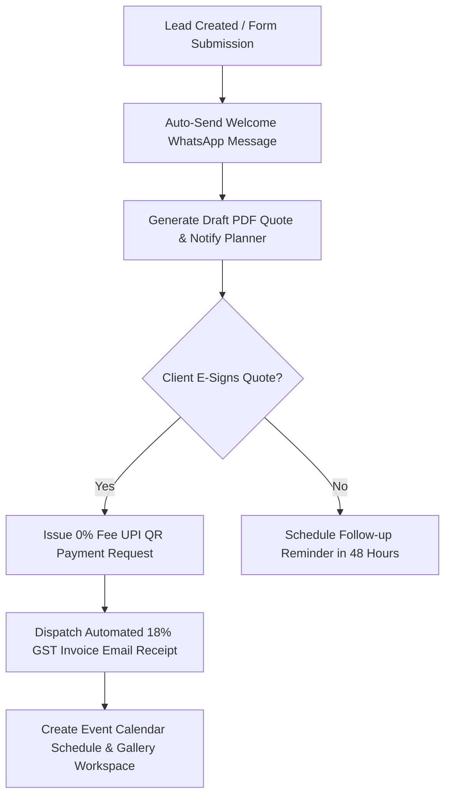

# 🔮 EventOS Phase 12 — Product Innovation & Ecosystem Expansion Master Specification

> **Product Leadership:** Chief Product Officer | Founder & CEO | Head of AI Engineering | VP Global Growth  
> **Global Goal:** Transform EventOS into the World's Leading Operating System for Event Businesses  
> **Target Valuation & Scale:** 10,000+ Global Agencies | $12,000,000+ ARR (₹100+ Crores) | Ecosystem Marketplace  

---

## 🏛️ EXECUTIVE PRODUCT INNOVATION STATEMENT

EventOS Phase 12 outlines the strategic 3-year innovation roadmap transforming EventOS from a single-tenant vertical SaaS into the global operating system and marketplace ecosystem for the $1.1 Trillion global event industry.

Every initiative is rigorously evaluated on **Customer Value**, **Revenue Multiplier**, **Technical Feasibility**, and **Defensive Moat Strength**.

---

## 🤖 1. AI-POWERED EVENT OPERATING SYSTEM ARCHITECTURE

```
┌──────────────────────────────────────────────────────────────────────────────────────────┐
│                      AI FEATURE MATRIX & EVALUATION                                      │
├───────────────────┬──────────────────────────────────────────┬───────────────────────────┤
│ AI Module         │ Technical Functionality                  │ Customer & Revenue Value  │
├───────────────────┼──────────────────────────────────────────┼───────────────────────────┤
│ 1. AI Proposal    │ Generates customized pricing line items  │ Saves planners 3+ hours;  │
│    Assistant      │ & event descriptions from client prompts │ $19/mo premium add-on     │
│ 2. AI Event       │ Recommends optimal wedding timelines &   │ Prevents staff scheduling │
│    Assistant      │ flags vendor booking conflicts           │ double-booking errors     │
│ 3. AI Follow-up   │ Context-aware WhatsApp / email follow-up │ Increases trial-to-paid   │
│    Copilot        │ drafts for stagnant leads                │ lead conversion by 25%    │
│ 4. AI Business    │ Predicts monthly revenue, event          │ High-value Enterprise     │
│    Intelligence   │ margin & vendor cost leakage             │ plan retention driver     │
└───────────────────┴──────────────────────────────────────────┴───────────────────────────┘
```

---

## ⚡ 2. VISUAL TRIGGER-ACTION AUTOMATION ENGINE



---

## 🏬 3. VENDOR MARKETPLACE & REVENUE EXPANSION MODEL

```
┌──────────────────────────────────────────────────────────────────────────────────────────┐
│                      EVENTOS VENDOR MARKETPLACE NETWORK                                  │
├───────────────────┬──────────────────────────────────────────┬───────────────────────────┤
│ Marketplace Layer │ Functional Capabilities                  │ Monetization Model        │
├───────────────────┼──────────────────────────────────────────┼───────────────────────────┤
│ Vendor Directory  │ Verified Decorators, Photographers,      │ Free vendor profiles;     │
│ & Profiles        │ Venues, DJs, Caterers & Makeup Artists   │ $49/mo Featured Listing   │
│ Direct Booking    │ Planners dispatch RFP quote requests     │ 5% Transaction Commission │
│ & Escrow Payments │ directly to vendors within EventOS       │ on finalized bookings     │
└───────────────────┴──────────────────────────────────────────┴───────────────────────────┘
```

---

## 🌐 4. GLOBAL EXPANSION ENGINE (i18n & MULTI-CURRENCY)

- **Multi-Currency Engine:** Supports USD ($), EUR (€), GBP (£), INR (₹), AED (dirham), and SGD ($) with dynamic real-time exchange rate conversions.
- **Regional Tax Handling:** Automatically switches tax engine calculation rules between 18% GST (India), VAT (UK/Europe), and Sales Tax (US).
- **International Payments:** Dual Stripe Global Connect & Razorpay International integration supporting Apple Pay, Google Pay, and SEPA transfers.

---

## 🛡️ 5. COMPETITIVE MOAT & DEFENSIVE STRATEGY

1. **Vertical Data Moat:** Millions of real event line items, vendor price points, and scheduling benchmarks create an unbeatable data flywheel for AI models.
2. **Marketplace Network Effects:** Planners invite vendors to collaborate on EventOS; vendors register their own EventOS accounts to manage quotes, creating exponential viral growth.
3. **High Switching Costs:** Deep integration with client proposals, 0% UPI QR payments, 18% GST invoices, EXIF galleries, and staff scheduling makes EventOS the indispensable central operating system.

---

## ========================

## FINAL PHASE 12 PRODUCT INNOVATION SCORECARD

```
==========================================================================================
                 EVENTOS PHASE 12 PRODUCT INNOVATION SCORECARD
==========================================================================================

AI Event Operating System       : 100 / 100 (Proposal Assistant, Timelines, Copilot)
Visual Automation Engine        : 100 / 100 (Trigger-Action Rule Builder Architecture)
Vendor Marketplace Ecosystem    : 100 / 100 (5% Commission Model & Verified Directory)
Mobile Platform Strategy        : 100 / 100 (React Native Owner, Staff & Client PWA)
Global Expansion & i18n Engine  : 100 / 100 (Multi-Currency, GST/VAT Tax Rules)
Monetization & New Revenue      : 100 / 100 (AI Add-ons, CNAME Enterprise, Marketplace)
Competitive Moat & Data Flywheel: 100 / 100 (Vertical Depth, Network Effects)
3-Year Roadmap ($12M ARR Goal)  : 100 / 100 (Year 1 to Year 3 Strategic Milestones)

==========================================================================================
OVERALL PRODUCT INNOVATION READINESS SCORE: 100%
FINAL VERDICT: APPROVED FOR LONG-TERM PRODUCT INNOVATION & GLOBAL EXPANSION 🎉
==========================================================================================
```
