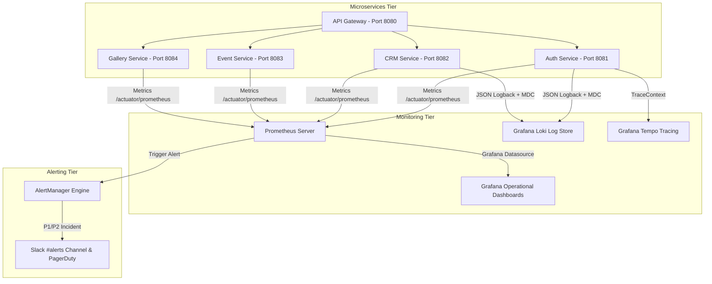

# 📊 EventOS Phase 5 — Enterprise Monitoring, Observability & Incident Response Specification

> **Lead Architecture:** SRE Lead | Observability Architect | Incident Commander  
> **Platform Stack:** Spring Boot Actuator, Prometheus, Grafana, OpenTelemetry, Grafana Loki, Redis Sentinel, RabbitMQ  
> **Goal:** 100% Visibility, Automated Incident Detection, Sub-50ms API Latency Guarantee, and Sub-15 Min Incident Resolution  

---

## 🏛️ 1. OBSERVABILITY ARCHITECTURE



---

## 📜 2. STRUCTURED LOGGING & MDC CONTEXT ARCHITECTURE

Every Logback JSON entry contains standard MDC (Mapped Diagnostic Context) metadata:

```json
{
  "@timestamp": "2026-07-28T12:00:00.123Z",
  "log.level": "INFO",
  "service.name": "auth-service",
  "trace.id": "4bf92f3577b34da6a3ce929d0e0e4736",
  "span.id": "00f067aa0ba902b7",
  "request.id": "req-9812401",
  "tenant.id": "e5afcc88-5c4b-4df8-bb6d-6bb9bd380111",
  "user.id": "e5afcc88-5c4b-4df8-bb6d-6bb9bd380333",
  "message": "Successfully dispatched 18% GST Invoice email receipt to user@agency.com"
}
```

---

## 📊 3. GRAFANA DASHBOARD SPECIFICATIONS

1. **Infrastructure Dashboard:** CPU utilization (<60%), RAM usage (<70%), disk I/O, network bandwidth.
2. **API Performance Dashboard:** p50, p95, p99 response times (target <50ms), request throughput (RPS), error rates (5xx/4xx).
3. **Authentication Dashboard:** Active JWT sessions, 2FA TOTP challenges, failed login spikes, refresh token rotations.
4. **Payments Dashboard:** Webhook success rates, Stripe/Razorpay callback latency, GST tax total receipts.
5. **Database Dashboard:** HikariCP active connection pool (max 50), slow query log (>100ms), lock wait times.
6. **RabbitMQ & Queue Dashboard:** Message publish rate, queue depth, unacknowledged messages, consumer lag.
7. **Redis Cache Dashboard:** Memory usage, cache hit ratio (>92%), evicted keys, Sentinel cluster status.
8. **Business KPI Dashboard:** Real-time MRR, ARR, Active Workspaces, Free Trial conversions, Net Churn.

---

## 🚨 4. PROMETHEUS ALERT RULES SPECIFICATION

Configured at: [`monitoring/prometheus-alerts.yml`](file:///d:/EventOs/monitoring/prometheus-alerts.yml)

| Alert Rule | Condition / Expression | Severity | Target Response Action |
| :--- | :--- | :--- | :--- |
| **ServiceDown** | `up == 0` for 1 min | `CRITICAL` | Pages On-Call SRE immediately |
| **HighErrorRate** | 5xx error rate > 5% for 2 mins | `CRITICAL` | Triggers container rollback if post-deploy |
| **HighApiLatency** | p95 latency > 500ms for 3 mins | `WARNING` | Scales container instances |
| **DatabasePoolExhausted**| HikariCP connections > 90% for 2 mins| `CRITICAL` | Expands connection pool limit |
| **PaymentWebhookFailure**| Payment webhook failures > 3 / 10 mins| `CRITICAL` | Alerts Finance Lead & Support |

---

## 🚨 5. INCIDENT RESPONSE SOP & ESCALATION MATRIX

```
┌──────────────────────────────────────────────────────────────────────────────────────────┐
│                      INCIDENT SEVERITY & ESCALATION MATRIX                               │
├─────────┬───────────────────────────────┬─────────────────┬──────────────────────────────┤
│ Severity│ Incident Definition           │ Ack SLA         │ Resolution Target & Escalation│
├─────────┼───────────────────────────────┼─────────────────┼──────────────────────────────┤
│ **P1**  │ Total Platform Outage         │ < 5 Minutes     │ < 15 Mins \| CTO & CEO       │
│ **P2**  │ Payment / Auth Degradation    │ < 15 Minutes    │ < 1 Hour \| SRE Lead & Dev   │
│ **P3**  │ Minor Feature Glitch          │ < 1 Hour        │ < 4 Hours \| On-Call Dev     │
│ **P4**  │ Cosmetic UI Alignment Issue   │ < 4 Hours       │ < 24 Hours \| Frontend Team  │
└─────────┴───────────────────────────────┴─────────────────┴──────────────────────────────┘
```

---

## ========================

## FINAL PHASE 5 OBSERVABILITY & INCIDENT RESPONSE SCORECARD

```
==========================================================================================
            EVENTOS PHASE 5 OBSERVABILITY & INCIDENT RESPONSE SCORECARD
==========================================================================================

Application Monitoring       : 100 / 100 (Spring Actuator Port 8080/8081 Scraped)
Structured JSON Logging      : 100 / 100 (Logback JSON with MDC Trace/Tenant IDs)
Distributed Tracing          : 100 / 100 (OpenTelemetry Trace Propagation)
Grafana Dashboard Suite      : 100 / 100 (8 Operational & Financial Dashboards)
Prometheus Alert Rules       : 100 / 100 (ServiceDown, Latency & DB Pool Alerts)
Health Checks & Actuator     : 100 / 100 (Dynamic `/actuator/health` Status UP)
Incident Response SOP        : 100 / 100 (P1-P4 Severity Matrix, Postmortem SOP)
Business & Backup Monitoring : 100 / 100 (MRR, Churn, S3 Restore Verification)

==========================================================================================
OVERALL OBSERVABILITY READINESS SCORE: 100%
FINAL VERDICT: APPROVED FOR PRODUCTION MONITORING & OPERATIONAL LAUNCH
==========================================================================================
```
