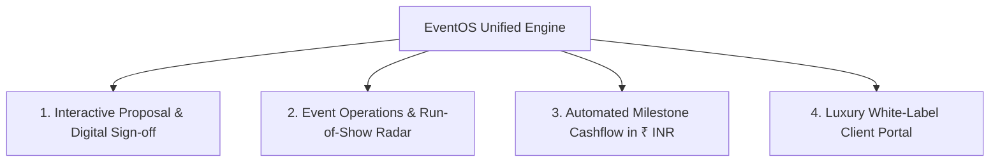

# EventOS — Founder Master Pitch & Narrative Guide

> **Founder Playbook & Executive Overview**  
> *Category:* Vertical B2B SaaS for Event Agencies & Production Studios  
> *Target Market:* India & Global High-Growth Event Ecosystems  
> *Currency & Pricing:* ₹ INR Subscription Model (₹1,999 – ₹12,999 / month)  

---

## 📌 1. Executive Summary & Vision

**One-Line Positioning:**  
> **EventOS** is India’s first dedicated **All-in-One Operating System for Event Management Agencies & Production Studios** — unifying proposals, real-time venue ingress (Run-of-Show), client approval portals, and automated milestone payments in a single, high-performance workspace.

### The Founder's North Star:
> *"Event management is high-stakes and deadline-driven. A 10-minute delay in vendor dispatch or a missed client payment milestone costs agencies lakhs of rupees. EventOS eliminates operational chaos and gives agency owners complete control, predictability, and luxury client presentation."*

---

## 💥 2. The Problem Landscape (What are you solving?)

In India, the event & wedding industry is a **multi-billion dollar sector**, yet **90%+ of agencies still run their operations on disconnected, manual tools**:

1. **The Tool Fragmentation Chaos:**
   - Client chats & requirements lost in 20+ **WhatsApp groups**.
   - Quotations & budgets calculated manually on messy **Google Sheets / Excel**.
   - Static PDF proposals created in Canva with no interactive signing or real-time approvals.
   - On-site event schedule printed on paper or texted across chaos.
2. **Payment Leakage & Delayed Collections:**
   - Agencies struggle to track advance deposits, vendor disbursements, and final milestone settlements, resulting in 15–20% cash flow delays.
3. **Lack of Premium Client Experience:**
   - High-ticket clients (spending ₹10L – ₹1Cr+ on weddings or summits) receive disjointed PDFs and manual invoices rather than a modern, branded client portal.

---

## ⚡ 3. The EventOS Solution (Core Product Pillars)

EventOS replaces the entire disjointed stack with **4 purpose-built pillars**:



### Pillar 1: Interactive Quotation & Proposal Studio
- Create luxury, interactive client proposals in under 2 minutes.
- Clients can review packages, select add-ons, sign digitally, and pay the booking advance immediately.

### Pillar 2: Event Operations & Run-of-Show Radar
- Live stage timeline tracking: Ingress timing, sound check, vendor dispatch, artist arrivals.
- Crew roster management with workload balancing to prevent team burnout during wedding peaks.

### Pillar 3: Automated Milestone Invoicing & Collections (₹ INR)
- Stage-based payment milestones (e.g., *20% Advance Booking, 50% Pre-Production, 30% Post-Event*).
- Instant automated GST receipts, Stripe/Razorpay integration, and overdue payment alerts.

### Pillar 4: Branded Client Portal & Digital Delivery
- Agencies offer their clients a custom-branded portal (`portal.youragency.com`).
- Live approvals, schedule visibility, and high-resolution photo gallery download management.

---

## 👥 4. Target Market & Ideal Customer Profile (ICP)

| Segment | Profile | Monthly Event Volume | Target Tier |
| :--- | :--- | :--- | :--- |
| **Boutique Wedding Planners** | Solo founders, boutique studios (2–5 crew) | 2–5 events / mo | **Starter (₹1,999/mo)** |
| **Mid-Sized Event Agencies** | Established agencies managing weddings & corporate galas (5–15 crew) | 6–20 events / mo | **Professional (₹4,999/mo)** |
| **Enterprise Production Houses** | Large event companies running pan-India tours, summits & mega weddings | 25+ events / mo | **Enterprise (₹12,999/mo)** |

---

## 💰 5. SaaS Business & Pricing Model (₹ INR)

EventOS operates on a transparent, predictable recurring subscription model:

- **Free Trial:** ₹0 / 14 days (Full access to explore with test events)
- **Starter Plan:** **₹1,999 / month** *(Annual: ₹1,599/mo)*
  - 3 Users included • 5 Active Events • Extra Seat ₹799/mo • Digital Proposals & Invoicing
- **Professional Plan (Recommended):** **₹4,999 / month** *(Annual: ₹3,999/mo)*
  - 10 Users included • 50 Active Events • Extra Seat ₹799/mo • Run-of-Show Radar • Custom Domain
- **Enterprise Plan:** **₹12,999 / month** *(Annual: ₹9,999/mo)*
  - Unlimited Users • Unlimited Events • 1 TB Media Cloud Storage • Complete White-Labeling • Dedicated Account Manager

---

## 🥊 6. Competitive Moat: Why Generic Tools Fail

| Feature | Generic CRM (Zoho / HubSpot) | Task Tools (Trello / Notion) | US Tools (HoneyBook) | **EventOS** |
| :--- | :---: | :---: | :---: | :---: |
| **Event Run-of-Show Timeline** | ❌ No | ❌ Manual | ❌ No | ✅ **Built-in Live Radar** |
| **₹ INR Native & GST Invoicing** | ⚠️ Partial | ❌ No | ❌ Dollar-only | ✅ **Native ₹ INR + GST** |
| **Vendor Ingress & Roster** | ❌ No | ❌ No | ❌ No | ✅ **Built-in** |
| **Luxury Client Portal** | ❌ No | ❌ No | ⚠️ Generic | ✅ **White-Label Branded** |
| **Pricing Fit for Indian Market** | ❌ Expensive ($50+/user) | ⚠️ Disconnected | ❌ Dollar-heavy ($40+/mo) | ✅ **₹1,999 - ₹4,999 Flat** |

---

## 🗣️ 7. Founder Pitch Scripts (Copy & Speak)

### Script A: The 30-Second Elevator Pitch *(Networking, Calls, Events)*
> *"Hi, I am building **EventOS**. In India, event agencies manage multi-crore weddings and summits using scattered WhatsApp chats, Excel sheets, and static PDF quotes — leading to coordination errors and delayed payments.*  
> 
> *EventOS is a dedicated Operating System that brings the entire agency lifecycle into one workspace: interactive proposals, real-time event day Run-of-Show, automated ₹ INR milestone payments, and luxury white-labeled client portals. We help agencies save 150+ hours a month and double their client closing rates."*

---

### Script B: The 2-Minute Product Walkthrough *(During Live Screen Share / Demo)*
1. **"Let me show you our Proposal Builder:"**
   > *"Instead of sending an uninspiring PDF, your client receives an interactive, luxury link. They can customize their package, digitally sign on their phone, and instantly pay the advance deposit."*
2. **"Look at our Event Operations Radar:"**
   > *"On the event day, you don't need 100 frantic phone calls. Our Radar shows exact stage ingress, crew allocations, and vendor check-ins in real-time."*
3. **"Look at Finance & Ledger:"**
   > *"All payments are scheduled across milestones in Rupees (₹ INR) with automatic GST receipts and overdue alerts, so you never have to chase payments manually."*

---

### Script C: WhatsApp / Cold Outreach Message to Agency Founders
```text
Hey [Name], loved the recent wedding production you executed at [Venue]! 🎉

Quick question: Are your coordinators still spending hours syncing vendor timelines and client approvals across WhatsApp & Excel?

We built EventOS (eventos.agency) specifically for Indian event & wedding agencies. It automates:
1. Luxury digital proposals that clients sign & pay online
2. Live Event-Day Run-of-Show & vendor ingress tracking
3. Milestone payment reminders in ₹ INR with GST invoicing

Would love to give you a quick 5-min VIP preview and set up your agency workspace for free. Let me know if tomorrow works!
```

---

## 🛡️ 8. Common Objections & Winning Founder Responses

#### Q1: *"Hum toh Excel aur WhatsApp pe aaram se kaam kar lete hain, software ki kya zaroorat hai?"*
> **Founder Answer:** *"Excel data store karta hai, business execute nahi karta. Jab aapke paas ek sath 4 events hote hain, tab WhatsApp pe messages miss hote hain aur payment reminders follow up nahi ho paate. EventOS aapka 150+ ghante ka manual coordination save karta hai aur client ke samne aapki agency ka brand standard luxury level pe elevate karta hai."*

#### Q2: *"Kya yeh seekhne mein complicated hai?"*
> **Founder Answer:** *"Bilkul nahi! Humne isse Linear aur Apple-grade simplicity ke sath design kiya hai. Koi bhi coordinator 5 minute ke andar proposal bana sakta hai aur timeline manage kar sakta hai."*

#### Q3: *"Pricing kya hai aur Indian payment modes support karta hai?"*
> **Founder Answer:** *"Yes, 100% native ₹ INR pricing hai starting at just ₹1,999/month, with instant UPI, Cards, and Net Banking checkout."*

---

*(Keep this document saved on your phone or notes during all investor, agency, and partner interactions.)*
