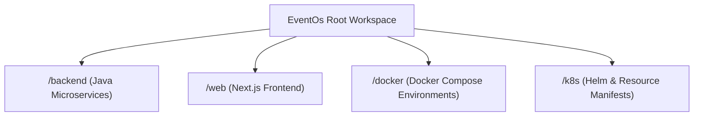
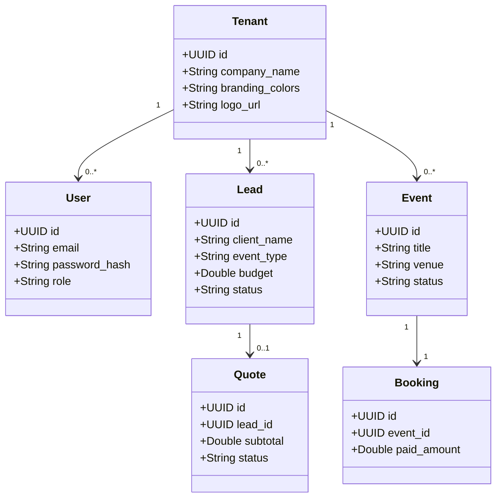

# EventOS — Codebase Scan & Audit Report

This report summarizes the structure, technologies, data schemas, design patterns, and codebase health of the **EventOS** platform based on a complete codebase audit.

---

## 1. Project Layout & Scope

EventOS is organized as a decoupled polyglot monorepo containing a Java Spring Boot microservices backend and a Next.js frontend application.

---

## 2. Technology Stack & Dependencies

### 2.1 Backend Layer (Spring Boot / Maven)
All backend modules are structured under a parent Maven project.

* **Core Framework**: Spring Boot 3.x, Spring Cloud Gateway (API gateway proxying).
* **Database & Persistence**: Spring Data JPA, Hibernate, PostgreSQL, Flyway (DB migrations).
* **Caching & Controls**: Spring Data Redis Reactive, Lettuce (for low-latency rate limiting and blacklist caching).
* **Message Broker**: Spring AMQP (RabbitMQ) for asynchronous events.
* **Observability & SRE**: Spring Boot Actuator, Micrometer (Prometheus scrapers), OpenTelemetry (Tempo distributed traces).

### 2.2 Frontend Layer (Next.js 15 / React 19)
The client-side dashboard is built with:

* **Core Engine**: Next.js 15 App Router, React 19, TypeScript.
* **State Management**: Zustand (lightweight stores for auth, onboarding state, help logs).
* **Data Fetching**: TanStack React Query (server-state caching and synchronization).
* **Styling & UI**: Tailwind CSS, Shadcn UI, Radix UI Primitives, Lucide Icons.
* **Animations**: Framer Motion, GSAP, Lenis (smooth scroll).
* **API Client**: Axios (configured with request interceptors for token attachment and error logging).

---

## 3. Database Schema Inventory

Each backend microservice targets a logical PostgreSQL partition managed via Flyway migration scripts.

### 3.1 auth_db (`auth-service`)
* **Tables**: `tenants`, `users`, `memberships`, `auth_sessions`, `invitations`, `audit_logs`, `security_policies`.
* **Roles**: Owner, Admin, Manager, Staff, Client.

### 3.2 crm_db (`crm-service`)
* **Tables**: `leads`, `quotes`, `quote_items`, `contacts`, `activities`.
* **States**: `NEW`, `QUALIFIED`, `PROPOSAL_SENT`, `NEGOTIATION`, `WON`, `LOST`.

### 3.3 event_db (`event-service`)
* **Tables**: `events`, `bookings`, `invoices`, `payments`, `budget_estimates`, `pricing_rules`, `timeline_tasks`, `timeline_milestones`, `vendors`, `billing_settings`, `ledger_entries`.

### 3.4 gallery_db (`gallery-service`)
* **Tables**: `albums`, `gallery_items`, `share_links`, `selection_logs`.

---

## 4. Key Architectural Patterns

### 4.1 Request Interception & Multi-Tenancy
* Backend services use an interceptor/filter that parses the `X-Tenant-ID` header.
* The extracted ID is set in a `ThreadLocal` context (`TenantContext`).
* During DB calls, queries are appended with tenant filters dynamically, preventing cross-tenant data leaks.

### 4.2 Decoupled Token Security
* The API Gateway performs stateless verification of Bearer JWTs using the public key (`jwt_public.pem`).
* Downstream services receive validated claims (User, Tenant ID, Roles) inside request headers, removing the need for internal HTTP calls to `auth-service`.

### 4.3 Redis-based Gateway Protections
* **Rate Limiting**: Configured inside `RateLimitingFilter.java` using a sliding window algorithm implemented via Redis Sorted Sets (`ZSET`).
* **Session Termination**: Logged-out tokens are stored in Redis under the `blacklist:<token>` prefix with standard TTL policies.

### 4.4 Async Message Flows (RabbitMQ)
* Critical operations trigger async events distributed through `eventos.direct.exchange`.
* Queues are bound with retry configurations and route failures to the `dead.letter.queue` (DLQ) to ensure operational reliability.

---

## 5. Summary Findings

1. **System Resiliency**: The microservices architecture is decoupled effectively using RabbitMQ for async updates, and uses Redis to safeguard the gateway from resource spikes.
2. **Schema Control**: The database schema is fully managed via Flyway versioned migrations. The structure covers complex operations (e.g. quote versioning, payment ledgers, vendor categories).
3. **Observability Readiness**: The backend contains instrumentation for Prometheus metrics collection, OpenTelemetry traces, and Loki logging.
4. **Local Port Integrity**: Scripts like `load_env.ps1` and port killers allow quick environment boots without OS terminal locks.
