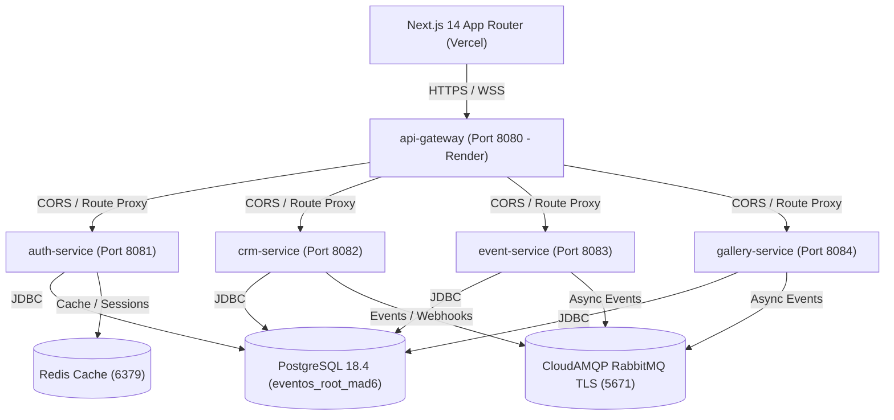

# 🏛️ EventOS — Complete Technical Architecture & Pre-Launch Master Blueprint

---

## 1. Executive Product Vision & Domain Overview

**EventOS** is an enterprise-grade multi-tenant B2B SaaS operating system built specifically for:
- 💍 **Boutique & Luxury Wedding Agencies** (India & International)
- 🏢 **Corporate Event Coordinators & Summit Organizers**
- 📸 **Studio Photography & Media Delivery Firms**
- 🎪 **Production Houses & Staging Logistics Providers**

### Key Core Modules & Capabilities
1. **Interactive Itemized Quotations**: Send live digital proposals with addon toggles, automated tax ledgers, and digital contract signatures.
2. **Run-of-Show Logistics Timeline Engine**: Real-time event scheduling with resource overlap detection (e.g., preventing photographer double-booking).
3. **AWS-Backed Proofing Photo Galleries**: High-res client photo delivery with download permissions tied to invoice clearance.
4. **Superadmin Control Console**: Platform-wide metrics, tenant impersonation, automated WAF IP blacklist management, and system announcement broadcasting.

---

## 2. Platform Technology Stack & Architecture

### Core Technologies
- **Backend Framework**: Spring Boot `3.3.0` running on Java `21` (Temurin JRE).
- **Frontend Framework**: Next.js `14` (App Router), React `18`, TypeScript, Tailwind CSS, Framer Motion.
- **Database & Migration**: PostgreSQL `18.4` with Flyway Schema Migrations (`V1` through `V30`).
- **Caching & Rate Limiting**: Redis (`StringRedisTemplate`) for session storage and sliding-window rate limit counters.
- **Asynchronous Messaging**: CloudAMQP RabbitMQ over AMQPS (`port 5671` with TLS).
- **Media CDN**: Cloudinary REST API & AWS S3/CloudFront signed URLs.

---

## 3. Microservices Deep-Dive Breakdown

### 🛡️ 1. `api-gateway` (Port 8080)
- **Role**: Edge proxy router, rate limiter, CORS controller, and header injector.
- **Security Features**:
  - Global CORS filtering (`CORS_ALLOWED_ORIGINS`).
  - Injects `X-Tenant-Id`, `X-User-Id`, `X-User-Role`, and `X-Gateway-Secret` headers to downstream services.
  - Redis-backed sliding-window rate limiting for auth endpoints (5 req/10s) and standard endpoints (100 req/60s).

### 🔐 2. `auth-service` (Port 8081)
- **Role**: User authentication, multi-tenant workspace management, JWT issuing, Superadmin dashboard REST APIs.
- **Capabilities**:
  - Workspace registration and auto-provisioning.
  - Multi-factor authentication (2FA), Google OAuth2, WhatsApp OTP verification.
  - Token Rotation & Replay Attack Defense using Redis 5-second grace period tracking.
  - Superadmin auto-healing membership fallback for platform accounts (`@eventos.com` / `@eventos.co`).
  - REST Endpoints: `/api/v1/auth/*`, `/api/v1/auth/billing/superadmin/*`.

### 💼 3. `crm-service` (Port 8082)
- **Role**: Lead acquisition funnel, client management, quotation compiler, invoicing, and payment processing.
- **Capabilities**:
  - Itemized quote generator with dynamic discount tax rules.
  - Cloudinary PDF quote compiler.
  - Stripe Payment Gateway & regional UPI payment gateway clearing.
  - REST Endpoints: `/api/v1/crm/*`, `/api/v1/quotes/*`, `/api/v1/payments/*`.

### 📅 4. `event-service` (Port 8083)
- **Role**: Event logistics, vendor run-of-show timelines, staff assignment, and client portal backend.
- **Capabilities**:
  - Real-time resource clash detection engine.
  - Vendor checklist completion tracking.
  - Interactive Client Portal timeline view.
  - REST Endpoints: `/api/v1/events/*`, `/api/v1/bookings/*`, `/api/v1/client/*`.

### 🖼️ 5. `gallery-service` (Port 8084)
- **Role**: Media asset management, photo proofing galleries, and high-res image delivery.
- **Capabilities**:
  - Cloudinary asset upload & transformation.
  - Milestone payment check: restricts high-res RAW/JPEG downloads until invoice is marked `PAID`.
  - REST Endpoints: `/api/v1/gallery/*`.

---

## 4. Database Architecture & Multi-Tenant Isolation

### Schema & Data Model
Every workspace operates within a logically isolated tenant context identified by `tenant_id` (UUID).
Key Database Tables:
- `users`: Core identity, password hashes, email verification tokens.
- `tenants`: Workspace accounts, subscription plans (`STARTER`, `PROFESSIONAL`, `ENTERPRISE`).
- `memberships`: Links `users` to `tenants` with assigned roles (`SUPER_ADMIN`, `ADMIN`, `STAFF`, `CLIENT`).
- `roles`: Role definitions and JSON permissions (`permissions_json`).
- `quotes` / `quote_items`: Interactive client proposals.
- `events` / `timelines`: Run-of-show schedules.
- `galleries` / `gallery_photos`: Media portfolio records.

---

## 5. Security & Role-Based Access Control (RBAC)

| Role | Target Route | System Permissions |
|:---|:---|:---|
| **`SUPER_ADMIN`** | `/superadmin` | Global platform metrics, tenant impersonation, billing plan overrides, WAF IP blacklist, announcement broadcast. |
| **`ADMIN` / `OWNER`** | `/workspace-select` $\rightarrow$ `/dashboard` | Tenant workspace owner. Full access to CRM, events, staff assignments, invoices, settings. |
| **`STAFF` / `MEMBER`** | `/workspace-select` $\rightarrow$ `/dashboard` | Agency coordinator / photographer. Access to assigned event timelines, vendor checklists. |
| **`CLIENT`** | `/portal` | End-client (bride/groom, corporate host). Access to view quotes, sign contracts, pay invoices, proof photo galleries. |

---

## 6. Frontend Design System & Theme Architecture

- **Public Marketing Pages (`/`, `/solutions`, `/pricing`, `/features`, `/security`, `/status`, `/docs`, `/founder-story`)**:
  - **Theme**: Light Alabaster (`#FAF9F6`) with high-contrast slate typography (`text-slate-900 font-heading`), dark liquid glass navigation containers, and subtle alabaster cards (`bg-white/95 border-slate-200/80 shadow-sm`).
- **Superadmin Console (`/superadmin`)**:
  - **Theme**: Dark Liquid Glass Console (`#09090B`), real-time WebSocket notification feeds, interactive Recharts analytics graphs, and inspect drawers.
- **Client Portal (`/portal`)**:
  - **Theme**: White-labeled clean client interface for seamless contract execution and payment processing.

---

## 7. Production Deployment & Cloud Hosting Configuration

| Infrastructure Component | Hosting Provider | Deployment Config & Specifications |
|:---|:---|:---|
| **Frontend Web App** | **Vercel** | `https://event-os-woad.vercel.app` (Next.js 14 build) |
| **Backend Microservices** | **Render (Docker)** | Java 21 Temurin JRE Jammy (`-Xms64m -Xmx192m -XX:+UseSerialGC`) |
| **Primary Database** | **Render PostgreSQL** | PostgreSQL 18.4 (`eventos_root_mad6`) with Flyway migrations |
| **Cache Instance** | **Render Redis** | Redis 6379 (`red-da5b8sajobas73e5qj1g`) |
| **Message Broker** | **CloudAMQP** | AMQPS / TLS on Port 5671 (`armadillo.rmq.cloudamqp.com`) |
| **Media CDN** | **Cloudinary / AWS** | Cloudinary cloud `dqvwl8e13` |
