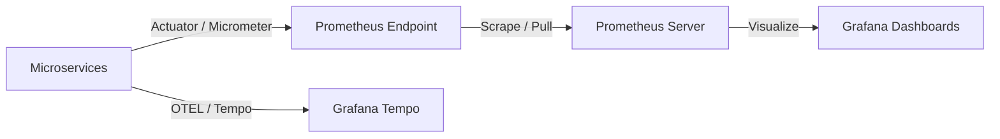

# EventOS Observability & Monitoring Manual

This document details the production SRE configurations, metrics scrapers, and alerting dashboards integrated across the EventOS microservices platform to ensure high uptime, low-latency, and resilient scaling.

---

## 1. Metrics & Instrumentation Architecture

EventOS utilizes Spring Boot Actuator, Micrometer, and Prometheus to expose and scrape JVM, connection pool, and application-specific metrics.



### Exposed Endpoints
All microservices expose the following Actuator endpoints publicly over local ports (port rules PermitAll):
* `/actuator/health`: System, DB, Redis, and RabbitMQ connection state checks.
* `/actuator/prometheus`: Metrics formatted for Prometheus scrapers.
* `/actuator/info`: Git revision, build version, and system metrics.

---

## 2. Scrape Configuration (`prometheus.yml`)

The Prometheus server pulls metrics from individual microservices every 15 seconds. Below is the production scrape job configuration:

```yaml
global:
  scrape_interval: 15s
  evaluation_interval: 15s

scrape_configs:
  - job_name: 'api-gateway'
    metrics_path: '/actuator/prometheus'
    static_configs:
      - targets: ['api-gateway:8080']

  - job_name: 'auth-service'
    metrics_path: '/api/v1/auth/actuator/prometheus'
    static_configs:
      - targets: ['auth-service:8081']

  - job_name: 'crm-service'
    metrics_path: '/api/v1/crm/actuator/prometheus'
    static_configs:
      - targets: ['crm-service:8082']

  - job_name: 'event-service'
    metrics_path: '/api/v1/events/actuator/prometheus'
    static_configs:
      - targets: ['event-service:8083']

  - job_name: 'gallery-service'
    metrics_path: '/api/v1/gallery/actuator/prometheus'
    static_configs:
      - targets: ['gallery-service:8084']
```

---

## 3. Distributed Tracing & Logging (Tempo & Loki)

To trace API calls across microservice boundaries (e.g. Gateway → Auth → CRM), we use OpenTelemetry standards with custom headers.

### Trace Ingestion Config (`application.yml`)
```yaml
management:
  otlp:
    tracing:
      endpoint: ${OTEL_EXPORTER_OTLP_ENDPOINT:http://tempo:4318/v1/traces}
  tracing:
    sampling:
      probability: 1.0 # 100% trace capture in production
```

### Loki Logback JSON Formatter (`logback-spring.xml`)
Services stream trace-correlated logs formatted in structured JSON:
```xml
<configuration>
    <appender name="CONSOLE" class="ch.qos.logback.core.ConsoleAppender">
        <encoder class="net.logstash.logback.encoder.LoggingEventCompositeJsonEncoder">
            <providers>
                <timestamp/>
                <pattern>
                    <pattern>
                        {
                          "severity": "%level",
                          "service": "${spring.application.name}",
                          "traceId": "%X{trace_id}",
                          "spanId": "%X{span_id}",
                          "message": "%message",
                          "exception": "%ex"
                        }
                    </pattern>
                </pattern>
            </providers>
        </encoder>
    </appender>
    <root level="INFO">
        <appender-ref ref="CONSOLE"/>
    </root>
</configuration>
```

---

## 4. Key Performance Metric Queries (PromQL)

SRE dashboards query metrics from Prometheus to build visual widgets in Grafana:

| Monitor Area | PromQL Query Formula | Healthy SLA |
| :--- | :--- | :--- |
| **API Latency** | `histogram_quantile(0.95, sum(rate(http_server_requests_seconds_bucket[5m])) by (le))` | `< 250ms` |
| **API Failure Rate** | `sum(rate(http_server_requests_seconds_count{status=~"5.."}[5m])) / sum(rate(http_server_requests_seconds_count[5m])) * 100` | `< 0.1%` |
| **Hikari Connection Usage** | `hikaricp_connections_active / hikaricp_connections_max` | `< 80%` |
| **Redis Cache Hit Rate** | `sum(rate(cache_gets_total{result="hit"}[5m])) / sum(rate(cache_gets_total[5m]))` | `> 85%` |
| **RabbitMQ Queue Backlog** | `rabbitmq_queue_messages_ready` | `< 500 messages` |

---

## 5. Grafana Alert Rules

Alerts trigger Slack/Email notifications if key metrics violate performance thresholds:

* **Alert: High API Latency (P0)**:
  * *Condition*: P95 latency > 500ms for more than 2 minutes.
  * *Action*: Page SRE on-call rotation.
* **Alert: Database Connection Starvation (P1)**:
  * *Condition*: Active Hikari connections > 90% of pool size for more than 5 minutes.
  * *Action*: Trigger automated scale-out of connection pool sizes.
* **Alert: RabbitMQ Dead-Letter Queue Spills (P1)**:
  * *Condition*: `rabbitmq_queue_messages_ready{queue="dead-letter-queue"}` > 1.
  * *Action*: File Jira ticket for messaging team investigation.
