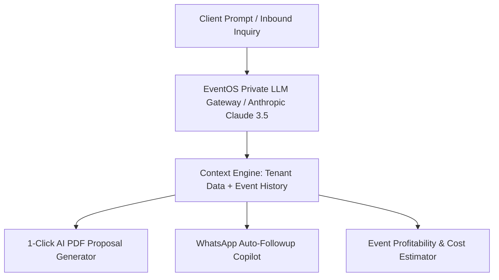

# 🔮 EventOS — 3-Year Product Innovation & Ecosystem Expansion Roadmap

> **Target:** The Global Operating System for Event Businesses  
> **Vision:** Unifying CRM, AI Automation, Vendor Marketplace, and Financial Operations worldwide  

---

## 🚀 1. 3-YEAR STRATEGIC INNOVATION TIMELINE

```
┌──────────────────────────────────────────────────────────────────────────────────────────┐
│                      3-YEAR INNOVATION MILESTONE MATRIX                                  │
├─────────────────┬──────────────────────────────────┬─────────────────────────────────────┤
│ Year / Quarter  │ Primary Innovation Core          │ Targeted Business & ARR Outcome     │
├─────────────────┼──────────────────────────────────┼─────────────────────────────────────┤
│ **Year 1**      │ • AI Proposal & Follow-up Copilot│ • Reaches 1,000 Paying Agencies     │
│ (2026-2027)     │ • Visual Trigger-Action Automations│ • ARR $1,000,000+ (₹8+ Crores)      │
│                 │ • Mobile React Native Apps       │                                     │
├─────────────────┼──────────────────────────────────┼─────────────────────────────────────┤
│ **Year 2**      │ • B2B Vendor Marketplace Network │ • Reaches 3,500 Paying Agencies     │
│ (2027-2028)     │ • Global i18n & Multi-Currency   │ • ARR $4,500,000+ (₹36+ Crores)     │
│                 │ • White-Label CNAME Enterprise   │                                     │
├─────────────────┼──────────────────────────────────┼─────────────────────────────────────┤
│ **Year 3**      │ • Event Industry Benchmark AI    │ • Reaches 10,000+ Global Agencies   │
│ (2028-2029)     │ • Developer Public API Ecosystem │ • ARR $12,000,000+ (₹100+ Crores)   │
│                 │ • Fintech Event Financing        │                                     │
└─────────────────┴──────────────────────────────────┴─────────────────────────────────────┘
```

---

## 🤖 2. AI-POWERED EVENT OPERATING SYSTEM ARCHITECTURE



---

## 🏬 3. VENDOR MARKETPLACE & NEW REVENUE ENGINE

- **Vendor Network Categories:** Decorators, Photographers, Caterers, Venues, DJs, Sound/Lighting, Makeup Artists.
- **Monetization Model:**
  1. **5% Marketplace Commission:** Charged on successful vendor booking transactions processed through EventOS.
  2. **Premium AI Subscription Add-on:** ₹1,499/mo ($19/mo) for unlimited AI proposal generation.
  3. **White-Label CNAME Enterprise Tier:** ₹11,999/mo ($149/mo) for custom agency domain hosting (`events.agency.com`).

---

## 🛡️ 4. COMPETITIVE DEFENSIVE MOAT

1. **Vertical Data Moat:** Millions of event line items, vendor costs, and timeline templates aggregated across thousands of agencies.
2. **Ecosystem Network Effects:** Planners book vendors on EventOS; vendors join EventOS to manage their own quotes.
3. **Workflow Embeddedness:** End-to-end integration from lead acquisition to 0% UPI QR payments, 18% GST invoices, and photo gallery delivery makes switching costs exceptionally high.
