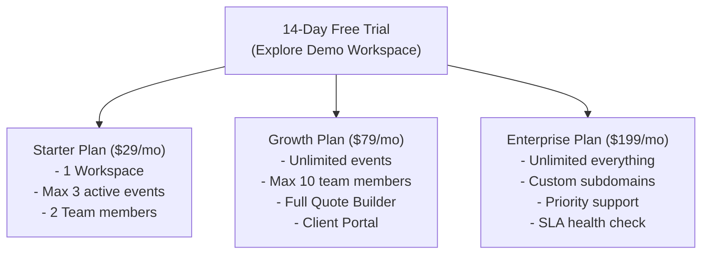

# EventOS — SaaS Monetization & Launch Strategy

This guide outlines the monetization pricing models, target customer profiling, sales outreach strategies, and Stripe billing pipelines required to launch **EventOS** successfully and generate recurring revenue.

---

## 1. Defining Your Pricing Models (Monetization Strategy)

To attract different sizes of event agencies, implement a three-tier subscription model combined with a risk-free trial.

### 1.1 Pricing Tiers Explained

1. **Free Trial (14 Days)**:
   * *Purpose*: User acquisition. No credit card required.
   * *Features*: Full access to the Onboarding Wizard, pre-seeded Demo Workspace (Dream Weddings Studio), and basic modules so they see value within 5 minutes.
2. **Starter Plan ($29 / month or $290 / year)**:
   * *Target*: Solo planners or freelance coordinators.
   * *Caps*: 1 workspace, max 3 active events, 2 team members. Basic CRM and calendar. Excludes custom branding.
3. **Growth Plan ($79 / month or $790 / year - *Recommended*)**:
   * *Target*: Growing event management boutique agencies.
   * *Caps*: Unlimited events, up to 10 team members. Includes Client Portal, interactive Quote Calculator, invoice automation, and Stripe collections.
4. **Enterprise / Agency Plan ($199 / month or $1990 / year)**:
   * *Target*: Large event agencies or venue groups.
   * *Caps*: Unlimited everything, custom branding (logo, tagline, colors), custom domain mapping (e.g. `portal.youragency.com`), and dedicated support.

---

## 2. Implementing the Invoicing Pipeline (Stripe Setup)

To collect payments automatically without manual intervention:

* **Stripe Billing Engine**: Use Stripe Billing to manage recurring subscriptions, grace periods, and dunning (handling failed card payments).
* **Stripe Customer Portal**: Integrate Stripe’s pre-built customer portal redirect. Users can upgrade, downgrade, update credit cards, or download receipts independently from their Settings page.
* **Webhook Listeners**: Configure backend handlers in `auth-service` for Stripe webhooks:
  * `customer.subscription.updated` $\rightarrow$ Update tenant tier and user limits in the database.
  * `invoice.payment_failed` $\rightarrow$ Trigger automatic email alert and set workspace status to "Past Due".
  * `customer.subscription.deleted` $\rightarrow$ Lock the workspace, showing a subscription restoration screen.

---

## 3. Finding Your First 10 Paying Customers (Cold Outreach)

The hardest part of launching a SaaS is getting the first 10 customers. Do not spend money on ads initially; focus on direct relationship-building.

### Step 1: Target Profiling
Search Instagram, Facebook, and local business listings (like Yelp, Google Maps, Justdial) for:
* Boutique Wedding Planners.
* Corporate event coordinators.
* Banquet halls or local venue managers.

### Step 2: The "Founder's Beta" Pitch (Cold Email / DM)
Send a personalized message to the owner. Do not sell the software directly; sell the solution to their chaotic workflows.

> *"Hey [Name], I noticed your beautiful setups on Instagram! Quick question: How are you managing your customer quotes and booking timelines? If you're still using Excel sheets and WhatsApp back-and-forth, things can get pretty chaotic.*
>
> *We just built **EventOS**, a tool specifically designed for wedding and corporate planners to send interactive itemized quotes, manage timelines, and let clients approve proposals digitally.*
>
> *We are looking for 5 local agencies for our **Founder's Beta Group**. We will set up your account, import your logo, and give you **50% off forever** in exchange for your feedback. Can I send you a 2-minute video demo?"*

---

## 4. Marketing Channels (Organic Growth)

Once you have your initial customers, scale using low-cost organic channels:

1. **"Powered by EventOS" Badge**:
   * Place a subtle, beautiful link at the bottom of the Client Portal and Invoice PDFs: *“Powered by EventOS”*. When clients of planners pay their bills, they might be planners themselves or refer the tool to others.
2. **Short-Form Video Marketing**:
   * Create screen-recording videos for TikTok, Instagram Reels, and LinkedIn:
     * *“How I generated a $50k wedding proposal in 30 seconds without Excel”*.
     * *“Stop chasing clients for payments — do this instead”*.
3. **Catering & Vendor Networks**:
   * Planners coordinate with vendors (decorators, florists, DJs). Use EventOS’s **Vendor Management** feature to invite vendors to view milestones, exposing the tool to secondary users.
