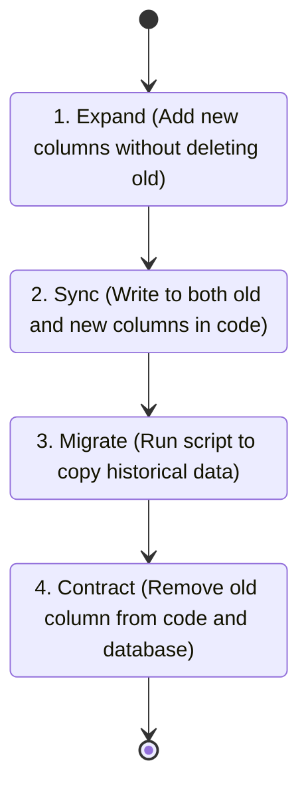

# EventOS — SaaS Operator Manual & Production Gotchas

This document compiles the most critical rules, security practices, database guidelines, and fallback mechanisms you must remember when maintaining and running **EventOS** in a live production environment.

---

## 1. Zero-Downtime Database Migrations (Expand & Contract)

Once you have paying tenants in your database, you can **never** run destructive migrations (like dropping columns or changing types directly). Doing so will crash services that are running on older versions of the code during deployment.

### Rule: Use the Expand & Contract Pattern
To alter or rename a database column (e.g., changing `client_name` to a separate `first_name` and `last_name`):



1. **Expand**: Add the new columns (`first_name`, `last_name`) as nullable fields via Flyway.
2. **Sync**: Update your Java code to write incoming data to both the old and new columns.
3. **Migrate**: Run a background SQL script to copy old data to new columns for existing rows.
4. **Contract**: Update code to read only from new columns, then issue a final Flyway migration to drop the old column.

---

## 2. Preventing Cross-Tenant Data Leaks

The biggest reputation killer for a SaaS product is when Tenant A logs in and accidentally sees Tenant B's leads, quotes, or customer galleries.

### Gotchas & Guardrails
* **Context Leak**: Because Spring Boot uses a thread pool to handle requests, `ThreadLocal` variables are reused. You **must** clear the `TenantContext` in a `finally` block or interceptor:
  ```java
  try {
      TenantContext.setTenantId(extractedId);
      chain.doFilter(request, response);
  } finally {
      TenantContext.clear(); // CRITICAL: Prevent context pollution on thread reuse
  }
  ```
* **ID Guessing Protection**: Never expose auto-incrementing integer IDs (`1, 2, 3...`) in your API endpoints or routing paths. Always use randomly generated **UUIDs** (`v4`) for all public-facing entities (Leads, Events, Quotes) so competitors cannot scrape your data by guessing IDs.

---

## 3. High-Security JWT Cookies

To prevent hackers from stealing user sessions:
* **Access Tokens**: Short expiration (15 minutes). Sent in Authorization header.
* **Refresh Tokens**: Store in cookies with `HttpOnly`, `Secure` (requires HTTPS), and `SameSite=Strict` flags. This blocks Cross-Site Scripting (XSS) and Cross-Site Request Forgery (CSRF) exploits.
* **IP/User-Agent Lock**: Bind the refresh token session to the user's IP and Browser User-Agent inside Redis. If the token is stolen and used from a different country or browser, immediately invalidate it.

---

## 4. Fallback Architecture (When Queues Fail)

If RabbitMQ goes down in production, your REST APIs will throw exceptions if not coded defensively.
* **Graceful Failure**: If the Quote or Event service fails to publish an AMQP message, log the failure and write the event payload to an `outbox_table` inside the service's database.
* **Outbox Pattern**: Run a background scheduler (Spring `@Scheduled` task) every 2 minutes that queries the `outbox_table` for failed events and attempts to republish them once RabbitMQ recovers.

---

## 5. JVM Memory Optimizations & Costs

Spring Boot microservices can consume significant RAM on startup due to heavy JVM classloading.
* **Container Limits**: In production (e.g. AWS, Render, or Kubernetes), configure JVM flags to prevent out-of-memory container crashes:
  ```bash
  java -XX:MaxRAMPercentage=75.0 -XX:+UseG1GC -jar app.jar
  ```
* **Garbage Collection**: For memory-constrained environments, use the `G1` Garbage Collector or `SerialGC` to keep memory footprints low.

---

## 6. Privacy & Legal Compliance

Since you are hosting customer data (emails, budgets, personal contracts, photos), ensure you have:
* **Terms of Service (ToS)**: Stating that you are not liable for planning errors or vendor issues caused by the platform.
* **Privacy Policy**: Mentioning how client contact details are stored, that payments are processed via Stripe (PCI-compliant), and images are hosted via Cloudinary.
* **Log Purging**: Ensure audit logs do not contain raw passwords, credit card numbers, or JWT tokens.
