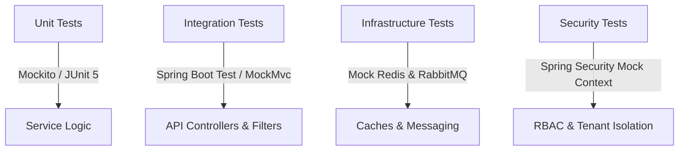

# EventOS Enterprise Testing Strategy

This document outlines the testing strategy, tools, fixtures, and execution scripts for the EventOS microservices platform. The test suite guarantees correctness, multi-tenant isolation, data integrity, and API contract matching across all deployments.

---

## 1. Testing Framework Stack

EventOS adopts a multi-layered testing paradigm utilizing industry-standard Java testing frameworks:



| Type | Frameworks | Target Areas | Focus |
| :--- | :--- | :--- | :--- |
| **Unit Testing** | JUnit 5, Mockito | Services, domain logic, utility classes | Business rules, calculations |
| **Integration** | Spring Boot Test, MockMvc | Controllers, aspects, filters, DB | HTTP responses, JSON bindings |
| **Security** | Spring Security Test | JWT request filters, RBAC permissions | Authorization bypass, tenant boundaries |
| **Mocking** | Mockito, Spring `@MockBean` | Database repositories, external API clients | Boundary conditions, network fallbacks |

---

## 2. Test Fixtures & Entity Factories

To write consistent, clean tests, we standardize our test data factories. The pattern isolates entity creation and properties setup:

### Example: Mock User Factory (`AuthTestUtils.java`)
```java
public class AuthTestUtils {
    public static User createMockUser(UUID id, String email, String role) {
        User user = new User();
        user.setId(id);
        user.setEmail(email);
        user.setRole(role);
        user.setFirstName("John");
        user.setLastName("Doe");
        user.setEnabled(true);
        user.setEmailVerified(true);
        return user;
    }
}
```

### Example: Mock Tenant Context Setup
```java
public class TenantTestUtils {
    public static void runInTenant(UUID tenantId, Runnable action) {
        try {
            TenantContext.setTenantId(tenantId);
            action.run();
        } finally {
            TenantContext.clear();
        }
    }
}
```

---

## 3. Multi-Tenant Leak Verification Tests

A key requirement is asserting that Tenant A cannot read Tenant B's data under any condition. We achieve this by validating mock request filters:

```java
@Test
@WithMockUserPrincipal(tenantId = "11111111-1111-1111-1111-111111111111")
public void testGetBookings_DoesNotLeakOtherTenantData() throws Exception {
    // 1. Arrange: Create mock data for Tenant A and Tenant B
    UUID tenantA = UUID.fromString("11111111-1111-1111-1111-111111111111");
    UUID tenantB = UUID.fromString("22222222-2222-2222-2222-222222222222");

    // 2. Act & Assert: Call API. Spring Security context forces Tenant A.
    mockMvc.perform(get("/api/v1/events/bookings")
            .header("X-Tenant-ID", tenantA.toString())
            .header("X-Gateway-Secret", gatewaySecret))
            .andExpect(status().isOk())
            .andExpect(jsonPath("$.data", hasSize(2)))
            .andExpect(jsonPath("$.data[*].tenantId", everyItem(is(tenantA.toString()))));
}
```

---

## 4. API & Integration Test Contracts

Downstream microservices validate caller identity by checking signature parameters and gateway verification headers. Tests must supply these headers:

```java
@Test
public void testDirectControllerAccess_WithoutGatewaySecret_IsUnauthorized() throws Exception {
    mockMvc.perform(get("/api/v1/crm/leads"))
            .andExpect(status().isUnauthorized());
}

@Test
public void testDirectControllerAccess_WithInvalidSecret_IsUnauthorized() throws Exception {
    mockMvc.perform(get("/api/v1/crm/leads")
            .header("X-Gateway-Secret", "wrong_secret"))
            .andExpect(status().isUnauthorized());
}

---

## 5. CI/CD Command Execution Runner

The multi-module maven structure supports running the entire test suite via single CI/CD runners:

### Run All Tests
```bash
# Run unit and integration tests across Gateway, Auth, CRM, Event, and Gallery services
mvn clean test
```

### Run Specific Service Test Suite
```bash
# Run tests specifically for the auth-service module
mvn -pl auth-service test
```

### Coverage Reports
The JaCoCo plugin builds aggregate HTML reports for visual coverage inspection:
```bash
mvn jacoco:report-aggregate
```
Reports are available locally under `target/site/jacoco-aggregate/index.html`.
