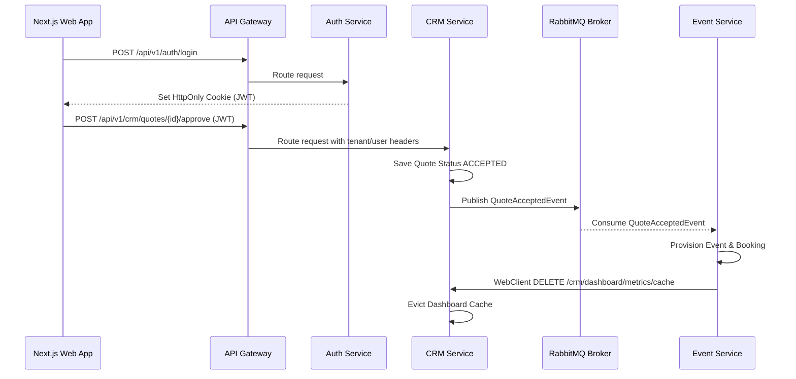

# EventOS User Acceptance Testing (UAT) Plan & Traceability Matrix

This document provides the test plans, integration scenarios, traceability matrix, and QA checklists for validating the production readiness of the EventOS platform.

---

## 1. End-to-End Workflow Test Plans

### Workflow 1: Lead Conversion to Confirmed Booking
* **Objective**: Verify that a prospective customer inquiring via the public Budget Calculator is successfully recorded as a CRM Lead, generates an approved Quote, automatically provisions an active Event and Booking, and establishes the Initial Timeline.
* **Pre-conditions**:
  - The EventOS platform services are fully operational.
  - An administrative user (`admin@eventos.com`) is registered in `auth-service`.
* **Execution Steps**:
  1. Submit a raw calculation proposal via `POST /api/v1/events/calculator` (simulating a guest count of 200, corporate event, premium tier).
  2. Promoted the calculation to a CRM Lead by executing `POST /api/v1/crm/leads/convert-to-lead` with the generated estimate ID.
  3. Validate that a RabbitMQ event (`BudgetConvertedToLeadEvent`) is fired by `event-service` and consumed by `crm-service`.
  4. Verify that a Lead is successfully created in `crm_db` with state `INQUIRY` and a proposal Quote is generated in state `DRAFT`.
  5. Progress the Quote state: `DRAFT` -> `SENT` -> `VIEWED` -> `ACCEPTED` using the status updates API.
  6. Execute `POST /api/v1/crm/quotes/{quoteId}/approve`.
  7. Verify that `QuoteAcceptedEvent` is fired over RabbitMQ, and `event-service` consumes it to automatically create a `Booking` (status `CONFIRMED`) and a corresponding `Event` (status `DRAFT`).

---

### Workflow 2: Financial Ledger and Invoice Lifecycle
* **Objective**: Verify invoicing, payment processing, ledger entries, and soft-void safety checks.
* **Execution Steps**:
  1. Create a new Invoice linked to the booking ID from Workflow 1 via `POST /api/v1/events/bookings/{bookingId}/invoices` with a subtotal and tax.
  2. Apply a 10% discount and verify that the calculated total complies with cent/paisa math constraints.
  3. Process a Payment of 50% of the invoice balance via `POST /api/v1/events/bookings/{bookingId}/payments`.
  4. Verify that:
     - The invoice status updates to `PARTIALLY_PAID`.
     - An append-only record is inserted in the `transactions` table (type `CREDIT`).
  5. Void the payment using the delete endpoint `DELETE /api/v1/events/payments/{paymentId}` with a void reason.
  6. Verify the append-only ledger security constraints:
     - The database row is NOT deleted.
     - The payment status updates to `VOIDED`.
     - A reversing `DEBIT` entry is appended to the `transactions` table.
     - The invoice status is restored back to its previous state (`PENDING` or `UNPAID`).

---

## 2. Cross-Service Integration Scenarios

### Scenario 1: Asynchronous Event Propagation (RabbitMQ)
- **Source**: `crm-service` publishes `QuoteAcceptedEvent` when a quote status transitions to approved.
- **Broker**: RabbitMQ routes message via `eventos.exchange` using routing key `quote.accepted`.
- **Target**: `event-service` consumes the message, locks the database sequence via `TenantSequenceRepository` (using SELECT FOR UPDATE), and provisions a new Booking.
- **Fail-Safe Check**: Stop the `event-service` container, approve a quote, and verify the message sits in the queue. Start the container, and verify the booking is successfully provisioned.

### Scenario 2: Synchronous Backchannel Eviction (WebClient)
- **Trigger**: A payment or milestone modification occurs in `event-service`.
- **Action**: `event-service` invokes a `DELETE` call to `${service.crm.base-url}/crm/dashboard/metrics/cache` using the Spring WebClient.
- **Authentication Propagation**: Verify that the incoming JWT token from the original user session is propagated on the WebClient request headers to prevent unauthorized access.

---

## 3. Traceability Matrix

| Feature Area | Microservice(s) | REST / Event Endpoints | DB Tables Affected | Verification File |
| :--- | :--- | :--- | :--- | :--- |
| **Budget Calculator** | `event-service` | `POST /api/v1/events/calculator` | `budget_estimates` | [BookingService.java](file:///d:/EventOs/backend/event-service/src/main/java/com/eventos/event/service/BookingService.java) |
| **Lead Conversion** | `crm-service` | `POST /api/v1/crm/leads/convert-to-lead` | `leads`, `quotes` | [LeadService.java](file:///d:/EventOs/backend/crm-service/src/main/java/com/eventos/crm/service/LeadService.java) |
| **Booking Engine** | `event-service` | `POST /api/v1/events/bookings` | `bookings`, `events` | [BookingService.java](file:///d:/EventOs/backend/event-service/src/main/java/com/eventos/event/service/BookingService.java) |
| **Invoicing & Fees** | `event-service` | `POST /api/v1/events/invoices` | `invoices` | [InvoiceService.java](file:///d:/EventOs/backend/event-service/src/main/java/com/eventos/event/service/InvoiceService.java) |
| **Ledger Auditing** | `event-service` | `POST /api/v1/events/payments` | `payments`, `transactions` | [PaymentService.java](file:///d:/EventOs/backend/event-service/src/main/java/com/eventos/event/service/PaymentService.java) |
| **Album Sharing** | `gallery-service`| `POST /api/v1/gallery/share` | `share_links` | [ShareLink.java](file:///d:/EventOs/backend/gallery-service/src/main/java/com/eventos/gallery/entity/ShareLink.java) |

---

## 4. Manual QA Verification Checklist

### Security & Access Control:
- [ ] Attempt to access `/api/v1/crm/leads` without an `Authorization` header. Verify response is `401 Unauthorized`.
- [ ] Authenticate as a user with the `CLIENT` role. Attempt to call `POST /api/v1/crm/leads`. Verify response is `403 Forbidden`.
- [ ] Verify that all service endpoints handle CORS and fail closed under illegal cross-origin requests.

### Database Constraint Checks:
- [ ] Try to insert a duplicate invoice number under the same tenant ID. Verify the database unique index catches the conflict and fails cleanly with a `409 Conflict` REST error response.
- [ ] Attempt to delete a processed payment record. Verify that no SQL `DELETE` is issued and the record persists with state `VOIDED`.
- [ ] Check Flyway schema status using `mvn flyway:info` to ensure all migrations are applied.
