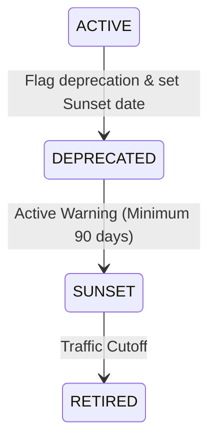
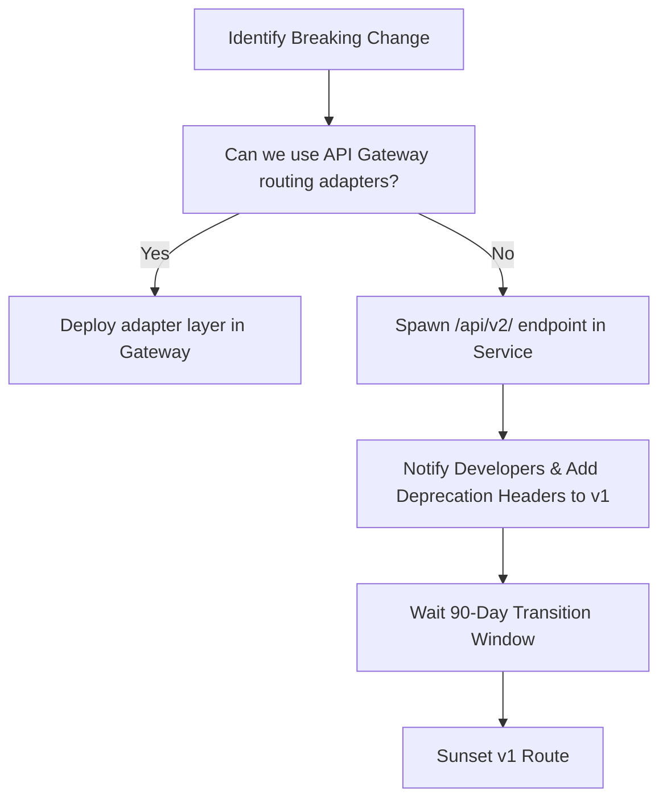

# EventOS API Lifecycle Management Standards

This document establishes the specifications for API design, version control, deprecation timelines, and database-to-gateway migration strategies in the EventOS ecosystem.

---

## 1. API Versioning Strategy

To guarantee platform stability and prevent breaking clients, EventOS enforces **URI Versioning** at the API Gateway:

* **Format**: `/api/v{version}/{service}/{endpoint}`
* **Active Version**: Current production version is `/api/v1` (configured across gateway routes and servlet context paths).
* **Strict Parameter Formatting**: Path variables must use UUIDs or snake_case naming variables, while request parameters use camelCase.

---

## 2. API Deprecation & Sunset Policies

When an endpoint needs to be retired or replaced, it must pass through a two-stage deprecation cycle:



### A. Deprecated Stage (Minimum 90 Days)
The endpoint remains fully functional, but responses append W3C-standard deprecation headers:
- `Deprecation: true` (or timestamp indicating when deprecation started).
- `Sunset: Wed, 16 Sep 2026 23:59:59 GMT` (exact date when endpoint terminates).
- `Link: <https://api.eventos.com/docs/migration-v2>; rel="successor-version"`

### B. Sunset Stage
Once the Sunset date passes, requests to the retired route return `410 Gone` or `404 Not Found` with a structured payload:

```json
{
  "success": false,
  "error": {
    "code": "API_SUNSETTED",
    "message": "The requested API version has been sunset. Please update client to successor-version."
  }
}
```

---

## 3. Breaking Change Process

A change is classified as **breaking** if it deletes an endpoint, removes parameters, modifies data types, or alters default behaviors.



### Protocol for Changes
1. **Adapter-First Mitigation**: Before writing a new version, check if the API Gateway can rewrite or enrich incoming payloads (using Gateway Filters) to maintain backward compatibility.
2. **Coexistence**: The old version (e.g. `/v1/`) and new version (e.g. `/v2/`) must coexist in production for at least 90 days to allow clients (portals, mobile apps) to update.
3. **Audit Trail**: Every API change must update the corresponding OpenAPI / Swagger documentation ([v3/api-docs](file:///d:/EventOs/backend/event-service/src/main/java/com/eventos/event/config/SecurityConfig.java#L35)).

---

## 4. Migration & Schema Release Standards

To execute migrations with zero downtime:

1. **Database Expansion First**:
   - Database migrations (Flyway) must split schema changes into backward-compatible steps.
   - *Never delete/rename columns directly*. Instead, add the new column, write code to sync writes to both columns, migrate existing records, update code to read from the new column, and delete the old column in a subsequent release.
2. **Rolling Deployments**:
   - Backend services are deployed first and verify database validations.
   - API Gateway routing tables are updated to point to the new endpoints.
   - Next.js frontend is rebuilt and deployed to pick up the updated endpoints.
