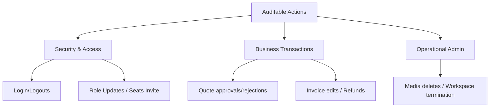
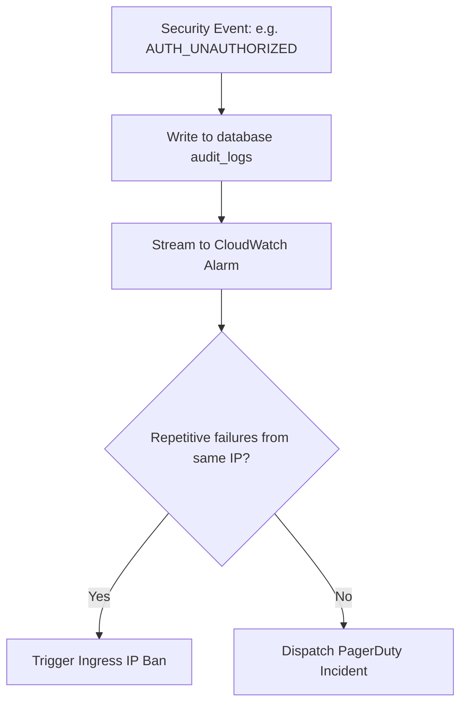

# EventOS Audit Logging & Compliance Specification

This document details the tracking, schema structure, storage requirements, and security controls for all operational audits and user activity log streams inside the EventOS platform.

---

## 1. Auditable Action Categories

To meet compliance requirements (such as SOC2, ISO 27001, and local financial regulations), the platform monitors and logs key events across three primary operational categories:



### Event Registry

| Category | Action Code | Description | Severity |
|---|---|---|---|
| **Security** | `AUTH_LOGIN_SUCCESS` | User logged in successfully | INFO |
| **Security** | `AUTH_LOGIN_FAILURE` | Failed login attempt (bad password) | WARN |
| **Security** | `AUTH_UNAUTHORIZED` | User attempted to access cross-tenant resource | CRITICAL |
| **Transaction**| `QUOTE_APPROVED` | Quote approved by manager or client portal | INFO |
| **Transaction**| `INVOICE_GENERATED` | Invoice created sequentially | INFO |
| **Transaction**| `PAYMENT_RECORDED` | Financial payment received and applied | INFO |
| **Operational**| `TEAM_MEMBER_INVITED`| Admin sent team invite link | INFO |
| **Operational**| `MEDIA_PURGED` | Photos/videos deleted from gallery album | WARN |
| **Operational**| `WORKSPACE_TERMINATED`| Workspace set to deleted state | CRITICAL |

---

## 2. Global Audit Log Schema

Every audit record is structured in JSON and written to an append-only database table (`audit_logs`) or streamed directly to a security information and event management (SIEM) tool:

```sql
CREATE TABLE audit_logs (
    id UUID PRIMARY KEY,
    timestamp TIMESTAMP WITH TIME ZONE NOT NULL,
    tenant_id UUID NOT NULL,
    user_id UUID,                     -- Nullable for anonymous or failed log actions
    user_email VARCHAR(255),
    user_ip VARCHAR(45) NOT NULL,     -- IPv4/IPv6 support
    user_agent VARCHAR(512),
    action_type VARCHAR(100) NOT NULL, -- e.g. QUOTE_APPROVED
    resource_type VARCHAR(100) NOT NULL, -- e.g. Quote
    resource_id VARCHAR(100),
    status VARCHAR(20) NOT NULL,      -- SUCCESS, FAILURE, DENIED
    old_state JSONB,                  -- State pre-mutation
    new_state JSONB                   -- State post-mutation
);

CREATE INDEX idx_audit_tenant_time ON audit_logs(tenant_id, timestamp DESC);
CREATE INDEX idx_audit_action ON audit_logs(action_type);
```

---

## 3. Storage Retention & Lifecycle Policies

Audit logs are separated into retention tiers based on their category:

| Log Tier | Scope | Retention Window | Archive Tier Storage |
|---|---|---|---|
| **Financial / Transactions** | Invoice status modifications, payment logs, quote approvals | 7 Years | AWS S3 Glacier Deep Archive (Locked WORM storage) |
| **Security Events** | Authentication, authorization denials, API rate limits | 3 Years | SIEM Cold Storage |
| **General Activity** | Dashboard views, team invitations, settings adjustments | 1 Year | Hashed Warm Storage |
| **Application Debug Logs**| Standard error/warning printouts | 90 Days | CloudWatch / ELK Logstash |

---

## 4. Security Alerts & Escalations

Certain logs immediately trigger high-priority paging alerts to the Security Operations Center (SOC) team:



- **Authentication Spam**: 5 consecutive `AUTH_LOGIN_FAILURE` attempts from the same IP address triggers temporary IP lockout.
- **Cross-Tenant Access Denial**: A single `AUTH_UNAUTHORIZED` log (where a tenant attempts to request a resource ID belonging to another tenant ID) immediately raises a critical severity PagerDuty alert.

---

## 5. Compliance Export Requirements

Workspaces must have the ability to export their activity logs for external reviews:
1. **Initiator Authorization**: Only the **OWNER** role can trigger audit trail exports.
2. **Audit of the Audit**: The action of exporting audit trails writes a `LOGS_EXPORTED` record to the global ledger.
3. **Format**: Exports are packaged as standard, encrypted JSON or CSV files downloadable via a 15-minute expiring signed URL.
4. **Data Integrity**: Every exported CSV log package is appended with an MD5/SHA-256 digital signature to verify that the audit files were not modified post-export.
