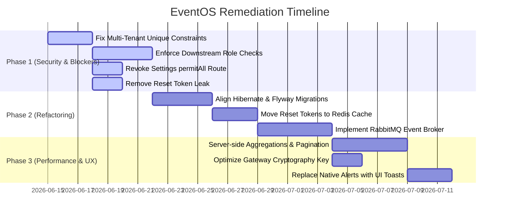

# EventOS Platform Architectural & Security Audit Report

This audit report evaluates the EventOS platform across five dimensions: **Security Risks**, **Scalability Issues**, **Performance Bottlenecks**, **Technical Debt**, and **UX/UI Friction**. It compiles the strategic, architectural, and design findings from the perspectives of the **CTO**, **SaaS Founder**, **Senior Product Designer**, **Senior Next.js Architect**, and **Senior Spring Boot Architect**.

---

## 1. Executive Summary & Personas' Perspectives

### 🛡️ CTO Perspective
> "Our current microservices layout is a 'distributed monolith' in disguise. Service boundaries are loosely defined, and services trust each other implicitly without authorization controls. Our deployment contains unused components (Redis, RabbitMQ) that increase hosting costs and security risk without adding value. Crucially, our database sequence generation code contains bugs that will halt operations the moment a second customer signs up."

### 💼 SaaS Founder Perspective
> "From a SaaS business model standpoint, tenant isolation is our lifeblood. A single tenant data leak can destroy customer trust and invite legal liabilities under GDPR/SOC2. Right now, our tenant boundaries are weak, we have developer fallbacks that expose sandbox data, and we cannot support clients who work with multiple event companies because of rigid email constraints. We need to solve these tenant breakouts immediately."

### 🎨 Senior Product Designer Perspective
> "While the interface utilizes a dark mode slate theme, the UX is let down by technical constraints. Real-time dashboards lag behind because of aggressive frontend caching, error handling relies on archaic browser `alert()` popups, and a single-device login constraint ruins the mobile-and-desktop workflow for event managers on the field."

### ⚡ Senior Next.js Architect Perspective
> "We are using Next.js merely as an SPA hosting environment. By wrapping all routes and pages in `"use client"`, we bypass Next.js Server Components (RSC) and Server-Side Rendering (SSR). This bloats our client bundle sizes, harms page performance, exposes raw API paths, and degrades search engine visibility (SEO) which is critical for the public-facing booking pages."

### ☕ Senior Spring Boot Architect Perspective
> "The backend microservices lack application-level security and rely entirely on gateway routing. Hibernate's schema auto-generator operates in direct conflict with Flyway migrations, leading to database schema drift. Furthermore, our sequential number generation causes race conditions under high concurrency and will trigger database constraint rollbacks."

---

## 2. Security Risks

> [!WARNING]
> Several critical security vulnerabilities have been identified that could lead to authorization bypasses, data exposure, and administrative privilege escalation.

### 🔴 Critical Severity

#### 1. Broken Object & Function Level Authorization (BOLA / BFLA)
* **Finding**: The API Gateway (`api-gateway`) validates JWT tokens but does not enforce role-based access control (RBAC). The downstream services (`crm-service`, `event-service`, `gallery-service`) do not configure Spring Security and accept custom headers `X-Tenant-ID` and `X-User-Roles` blindly from any request.
* **Impact**: An authenticated client (role `CLIENT`) can bypass frontend routing restrictions and query administrative endpoints (e.g., fetching all leads via `GET /api/v1/crm/leads` or editing quote statuses) by making direct API calls using their valid JWT token.
* **Relevant Files**:
  * [JwtAuthFilter.java](file:///d:/EventOs/backend/api-gateway/src/main/java/com/eventos/gateway/config/JwtAuthFilter.java) (extracts claims but does not enforce path-level authority).
  * [QuoteController.java](file:///d:/EventOs/backend/crm-service/src/main/java/com/eventos/crm/controller/QuoteController.java) (trusts headers without role validation).
  * [CrmLeadController.java](file:///d:/EventOs/backend/crm-service/src/main/java/com/eventos/crm/controller/CrmLeadController.java).

#### 2. Settings & Team Management Authorization Bypass
* **Finding**: In the Auth Service [SecurityConfig.java](file:///d:/EventOs/backend/auth-service/src/main/java/com/eventos/auth/config/SecurityConfig.java#L37), the endpoint path `/api/v1/auth/settings/**` is explicitly listed under `.permitAll()`.
* **Impact**: Since Spring Security permits all requests to this path, and the controller does not perform manual token validation or role checks, any client with a valid token can make requests to read/write company profiles, register new team members, assign them the `ADMIN` role, or delete active team members.
* **Relevant Files**:
  * [SecurityConfig.java](file:///d:/EventOs/backend/auth-service/src/main/java/com/eventos/auth/config/SecurityConfig.java#L37) (permits all on `/api/v1/auth/settings/**`).
  * [SettingsController.java](file:///d:/EventOs/backend/auth-service/src/main/java/com/eventos/auth/controller/SettingsController.java) (processes requests without security validation).

#### 3. Password Reset Token Leak
* **Finding**: The `/forgot-password` request handler in [AuthService.java](file:///d:/EventOs/backend/auth-service/src/main/java/com/eventos/auth/service/AuthService.java#L168) generates a reset token and returns it directly in the HTTP JSON response body under the field `debugResetToken`.
* **Impact**: An attacker knowing any administrator or user email can trigger `/forgot-password`, intercept the reset token from the JSON payload response, and immediately call `/reset-password` to hijack the account, completely bypassing email inbox checks.
* **Relevant Files**:
  * [AuthService.java](file:///d:/EventOs/backend/auth-service/src/main/java/com/eventos/auth/service/AuthService.java#L168) (leaks token in response payload).

---

### 🟡 High Severity

#### 4. Shared Tenant Fallback (Dev Sandbox)
* **Finding**: In downstream controllers, the private helper method `getTenantId` returns a hardcoded UUID `00000000-0000-0000-0000-000000000000` if the request header `X-Tenant-ID` is missing or empty.
* **Impact**: If an attacker accesses the microservices directly (bypassing the gateway), they can access or pollute a shared database sandbox partitions without authentication.
* **Relevant Files**:
  * [QuoteController.java](file:///d:/EventOs/backend/crm-service/src/main/java/com/eventos/crm/controller/QuoteController.java#L201)
  * [CrmLeadController.java](file:///d:/EventOs/backend/crm-service/src/main/java/com/eventos/crm/controller/CrmLeadController.java#L172)
  * [EventController.java](file:///d:/EventOs/backend/event-service/src/main/java/com/eventos/event/controller/EventController.java#L297)

#### 5. Plain Text SQL Logging in Production
* **Finding**: Show-SQL is set to `true` and formatted logs are active for the Hibernate engine.
* **Impact**: Sensitive business details, pricing information, and password hashes are written in plain text to standard container outputs, violating compliance frameworks (GDPR, SOC2).

---

## 3. Scalability Issues

### 🔴 Blocker Severity

#### 1. Global Unique Constraints in Multi-Tenant Databases
* **Finding**: Sequential fields like `quote_number` (quotes table), `invoice_number` (invoices table), and `booking_number` (bookings table) have database-wide `UNIQUE` constraints. However, the sequence numbers are generated using tenant-scoped counters (`countByTenantId(tenantId)`).
* **Impact**: If Tenant A creates a quote, it counts 0 existing quotes and gets `QT-0001`. If Tenant B then tries to create their first quote, the application counts 0 quotes for Tenant B and tries to insert another `QT-0001`. The database will reject Tenant B's insert due to the global `UNIQUE` constraint, rendering the SaaS unusable for more than one tenant.
* **Relevant Files**:
  * [Quote.java](file:///d:/EventOs/backend/crm-service/src/main/java/com/eventos/crm/entity/Quote.java#L35) (`unique = true` on `quoteNumber`).
  * [QuoteService.java](file:///d:/EventOs/backend/crm-service/src/main/java/com/eventos/crm/service/QuoteService.java#L89) (generates based on tenant count).
  * [Invoice.java](file:///d:/EventOs/backend/event-service/src/main/java/com/eventos/event/entity/Invoice.java#L33) (`unique = true` on `invoiceNumber`).
  * [Booking.java](file:///d:/EventOs/backend/event-service/src/main/java/com/eventos/event/entity/Booking.java#L38) (`unique = true` on `bookingNumber`).

---

### 🟡 High/Medium Severity

#### 2. Stateful In-Memory Password Reset Tokens
* **Finding**: Password reset tokens are stored in a local `ConcurrentHashMap` inside `AuthService.java`.
* **Impact**: In a multi-instance production deployment, requests to reset a password will fail if the user's browser is routed to a different container than the one that initiated the request.
* **Relevant Files**:
  * [AuthService.java](file:///d:/EventOs/backend/auth-service/src/main/java/com/eventos/auth/service/AuthService.java#L148)

#### 3. Single-Tenant User Accounts
* **Finding**: The `users` database table contains a single foreign key reference `tenant_id` and a global unique constraint on `email`.
* **Impact**: Clients are strictly bound to one tenant. A customer cannot use their email to log in or manage proposals across multiple event planners (different tenants) in the system, forcing them to use different email addresses.
* **Relevant Files**:
  * [V1__init_auth_tables.sql](file:///d:/EventOs/backend/auth-service/src/main/resources/db/migration/V1__init_auth_tables.sql#L61) (`CONSTRAINT UK_users_email UNIQUE (email)`).

---

## 4. Performance Bottlenecks

### 🔴 High Severity

#### 1. Lack of Server-side Pagination & Aggregations
* **Finding**: The Analytics dashboard (`reports/page.tsx`) queries the entire database tables for leads, events, invoices, and payments without pagination parameters (e.g. `page` or `size`). All mathematical aggregations, charts calculations, and conversions are computed in browser memory using client-side JavaScript.
* **Impact**: As the dataset grows, this triggers massive network payloads, slow page loading speeds, high backend database query execution times, and browser interface freezing.
* **Relevant Files**:
  * [reports/page.tsx](file:///d:/EventOs/web/src/app/reports/page.tsx#L65-L95) (pulls entire collections).
  * [LeadRepository.java](file:///d:/EventOs/backend/crm-service/src/main/java/com/eventos/crm/repository/LeadRepository.java) (returns lists instead of `Page`).

---

### 🟡 Medium Severity

#### 2. High Cryptographic Overhead in Gateway Filter
* **Finding**: In [JwtAuthFilter.java](file:///d:/EventOs/backend/api-gateway/src/main/java/com/eventos/gateway/config/JwtAuthFilter.java#L81), `Keys.hmacShaKeyFor(jwtSecret.getBytes(StandardCharsets.UTF_8))` is computed on every single request.
* **Impact**: Rebuilding the HMAC signing key on every API request consumes unnecessary CPU cycles and adds request latency under heavy traffic.

#### 3. Idle Container Footprint
* **Finding**: Production configuration runs `redis` and `rabbitmq` container instances, but backend services do not connect to them.
* **Impact**: Wasted virtual hosting memory and CPU resources.

---

## 5. Technical Debt

* **Hibernate Auto-DDL vs Flyway Conflict**: Hibernate auto-update is active alongside Flyway. Schema edits (such as company profile branding hex code fields) are modified on the fly by Hibernate, resulting in database schema drift and missing migration histories.
* **Mocked Integrations**: The backend contains mocked workflows instead of actual communication patterns. For example, `LeadService.java` prints a console statement: `"Publishing LeadBookedEvent to RabbitMQ broker..."` instead of using an actual AMQP publisher.
* **Missing Database Integrity Constraints**: Key entities like `payments` and `invoices` reference bookings by `booking_id` UUID without real foreign key constraints in the database, risking orphaned data.
* **Hardcoded Credentials**: Properties files contain fallback values for database passwords (`Root123`) and symmetric JWT keys rather than failing fast if variables are missing.

---

## 6. UX/UI Friction

* **Single-Device Session Constraint**: Initiating a new session deletes all previous tokens for that user ID, causing an immediate logout on the user's other devices (e.g. logging in on mobile logs the user out on desktop).
* **Aggressive Query Caching**: React Query uses a global `staleTime` of 5 minutes. Real-time changes, such as proposal approvals or payment transactions, are not immediately reflected on dashboard widgets, confusing users.
* **Intrusive Alert Popups**: Standard browser `alert()` popups are used for actions like quote approvals instead of modern, sleek UI toast elements.

---

## 7. Actionable Architectural Roadmap

### Phase 1: High Priority (Security & Blockers)
1. **Scope Sequential Uniqueness**: Remove the `unique = true` constraint on `quote_number`, `invoice_number`, and `booking_number` database columns, replacing them with composite unique constraints scoped to `(tenant_id, number)`.
2. **Restrict Gateway & Downstream Access**: Remove permitAll on `/settings/**` paths. Implement spring security configuration or filter checks on downstream endpoints to validate the `X-User-Roles` header.
3. **Protect Reset Tokens**: Modify the `/forgot-password` endpoint response payload so it does not return the secret token.
4. **Sanitize Headers**: Ensure the API Gateway strips any incoming headers like `X-Tenant-ID` or `X-User-Roles` before forwarding requests downstream, preventing header spoofing.

### Phase 2: Refactoring & Technical Debt
1. **Clean Database DDL configurations**: Set `spring.jpa.hibernate.ddl-auto` to `validate` in production environments, ensuring all schema modifications are handled through Flyway migrations.
2. **Externalize State**: Connect services to the Redis container to manage temporary cache layers and stateful user password reset tokens.
3. **Unify Integrations**: Replace mock console logging triggers with functional RabbitMQ publishers/listeners.

### Phase 3: Performance & UX Polish
1. **Implement Server-Side Pagination**: Update endpoints and JPA queries to utilize `Pageable` parameters.
2. **Enable Server-side Aggregations**: Query database sums and counts directly rather than fetching raw lists to client browsers.
3. **Cache JWT Keys**: Construct the symmetric HMAC secret key once during Gateway startup and reuse the instance across requests.
4. **Improve UI Alerts**: Refactor the frontend notifications to use toast banners instead of standard browser alerts.
