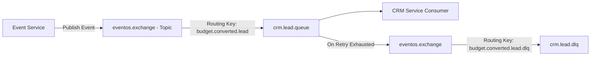
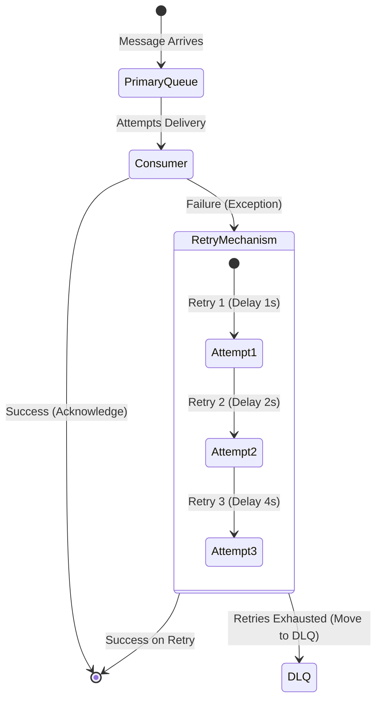

# EventOS Event Catalog & Messaging Standards

This document establishes the message broker topology, naming conventions, schemas, and lifecycle governance policies for asynchronous messaging within the EventOS platform.

---

## 1. RabbitMQ Topology & Infrastructure

EventOS uses **RabbitMQ** as its primary message broker for event-driven microservice orchestration. The architecture is configured for high reliability, durable messaging, and strict ordering.



### Topology Properties
* **Exchange**: A single topic exchange named `eventos.exchange` is shared globally.
* **Queues**: Durable, named according to `<consuming-service>.<entity>.queue` (e.g., [MessagingConfig.java](file:///d:/EventOs/backend/crm-service/src/main/java/com/eventos/crm/config/MessagingConfig.java#L13): `crm.lead.queue`).
* **DLX & DLQ**: Every primary queue has a corresponding dead-letter queue (DLQ) configured via arguments:
  - `x-dead-letter-exchange`: `eventos.exchange`
  - `x-dead-letter-routing-key`: `<consuming-service>.<entity>.dlq`

---

## 2. Event Catalog (Existing & Missing Events)

### Existing Events in the Platform

| Event Name | Routing Key | Source Service | Target Service | Purpose / Action |
|---|---|---|---|---|
| **BudgetConvertedToLeadEvent** | `budget.converted.lead` | `event-service` | `crm-service` | Creates a CRM lead, and optionally generates a Quote when a budget estimate is saved & converted. |
| **QuoteAcceptedEvent** (Future Routing) | `quote.accepted` | `crm-service` | `event-service` | Spawns a booking schedule, locks venue dates, and drafts initial invoice. |

### Identified Gaps (Required Operations Events)

| Proposed Event Name | Routing Key | Source Service | Target Service | Purpose / Action |
|---|---|---|---|---|
| **PaymentRecordedEvent** | `payment.recorded` | `event-service` | `crm-service`, `notification-service` | Triggers lead status promotion (e.g. to "COMPLETED") and registers transaction metrics. Sends payment receipt. |
| **BookingCancelledEvent**| `booking.cancelled` | `event-service` | `crm-service`, `gallery-service` | Marks leads as lost, releases locked calendar slots, and locks album downloads. |
| **AlbumSharedEvent** | `album.shared` | `gallery-service` | `notification-service` | Triggers automated email delivery containing secure link and temporary access PIN to the customer. |
| **TeamMemberInvitedEvent**| `team.member.invited` | `auth-service` | `notification-service` | Delivers invitation emails to register accounts under a tenant workspace. |

---

## 3. Event Naming & Routing Key Standards

To maintain clean message routing as the platform expands, all teams must adhere to the following routing key and event structures:

### A. Routing Key Format
`domain.entity.action`

* **Domain**: The context domain (e.g., `budget`, `quote`, `payment`, `gallery`).
* **Entity**: The resource name (e.g., `lead`, `booking`, `item`).
* **Action**: The past-tense verb showing what happened (e.g., `converted`, `accepted`, `uploaded`, `revoked`).

*Examples*:
- `budget.converted.lead` (Implemented)
- `quote.accepted` (Implemented)
- `payment.recorded` (Proposed)

### B. Message Schema Standards
Every event published to `eventos.exchange` must be formatted in JSON and must inherit from a common base event class containing trace context:

```json
{
  "eventId": "uuid-v4",
  "correlationId": "uuid-v4",
  "tenantId": "uuid-v4",
  "timestamp": "2026-06-17T22:50:00Z",
  "schemaVersion": "1.0",
  "payload": {
    "estimateId": "uuid-v4",
    "leadId": "uuid-v4",
    "clientEmail": "client@example.com"
  }
}
```

---

## 4. Error Handling, Retries & Dead-Letter Strategy



1. **Retry Backoff Configuration**:
   All consumers are configured with **exponential backoff retry policies** using Spring AMQP default properties:
   - `spring.rabbitmq.listener.simple.retry.enabled`: `true`
   - `spring.rabbitmq.listener.simple.retry.max-attempts`: `3`
   - `spring.rabbitmq.listener.simple.retry.initial-interval`: `1000ms`
   - `spring.rabbitmq.listener.simple.retry.multiplier`: `2.0`
2. **DLQ Offloading**: If all 3 attempts fail, the message is auto-routed to the DLQ (e.g., `crm.lead.dlq`).
3. **Alerting on DLQ**: Any message landing in a DLQ must trigger a high-severity alert.

---

## 5. Correlation IDs & Distributed Tracing

To trace asynchronous operations across microservice boundaries, EventOS leverages **W3C Trace Context standards**:

* **Trace Propagation**:
  - The publishing service injects the `traceparent` (Trace ID and Span ID) and `correlation-id` into the RabbitMQ message headers.
  - The consuming service extracts these headers prior to invoking any listener logic and binds them to the local logging `MDC` context.
* **Log Matching**: This ensures that log searches for a specific `correlationId` or `traceId` will display the logs for the initial REST controller call, the message broker publish, the queue consumption, and any resulting DB transaction.

---

## 6. Idempotency Requirements

Because message delivery guarantees in RabbitMQ are **At-Least-Once**, consumers must handle duplicate messages safely without corrupting data:

1. **Idempotency Key Tracking**: Each consumer maintains a local cache or database table (`idempotency_keys`) to log processed `eventId` values.
2. **Database Unique Constraints**: Unique keys are enforced on table columns (e.g., `lead_id` or `quote_id` on the estimates table) to throw database conflicts if a duplicate insertion is attempted, which the transaction manager catches and resolves silently.
