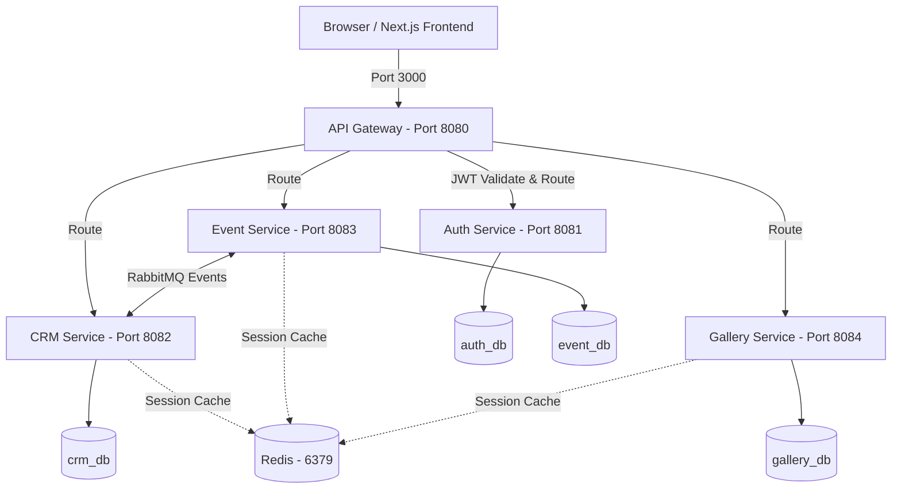

# EventOS — Complete System & Feature Guide

Welcome to the **EventOS** system documentation. EventOS is a premium, multi-tenant B2B SaaS platform specifically designed for event management agencies and wedding planners to centralize leads, budgeting, event schedules, bookings, billing, and client collaboration.

This document provides a comprehensive overview of the current project, including its **architecture**, **core features**, **implemented modules**, and **infrastructure setup**.

---

## 🗺️ System Architecture

EventOS is built using a **decoupled, multi-tenant microservices architecture** that separates services by business domain. All traffic is routed securely via a central gateway.

### 🛰️ Microservices Inventory

| Service | Port | Context Path | Responsibility |
|---|---|---|---|
| **Next.js Frontend** | `3000` | `/` | Responsive React UI, State (Zustand & TanStack Query) |
| **API Gateway** | `8080` | `/api/v1` | Reverse proxy, global CORS, JWT filter, sensitive header stripping |
| **Auth Service** | `8081` | `/api/v1/auth` | User registration, multi-tenant workspaces, login, token refresh |
| **CRM Service** | `8082` | `/api/v1/crm` | Lead pipelines, conversions, quotes generation and calculations |
| **Event Service** | `8083` | `/api/v1/events` | Bookings, event calendar, budgets, invoices, payments |
| **Gallery Service** | `8084` | `/api/v1/gallery` | Photo albums, media uploads (Cloudinary), shareable links |

---

## 🌟 Core Features & Modules

### 1. 🔑 Multi-Tenant Authentication & Workspaces
* **Workspace Membership Model**: Instead of a strict one-to-one mapping, users have a membership relation (`User ➔ Membership ➔ Tenant`). A user can belong to multiple workspaces (tenants) and log in to a specific one.
* **Token Rotation**: Uses an in-memory `accessToken` (validated via Bearer header) and an HTTP-only secure `refreshToken` cookie.
* **Silent Auto-Login**: The frontend automatically intercepts `401 Unauthorized` responses and exchanges the refresh token cookie for a fresh access token without interrupting the user.

### 2. 📊 Bento Grid Command Center (Dashboard)
* **Real-time Overview**: Summarizes core stats (Active Leads, Conversion Ratios, Total Revenue Streams, Upcoming Schedules, Pending Payments, and Operational Tasks).
* **Robust Widget Loading**: Built using local React Error Boundaries, meaning if a single service is down, that specific widget displays a fallback retry button instead of crashing the entire page.

### 3. 🎯 CRM & Lead Management
* **Active Sales Funnel**: Tracks leads from initial contact through booking stages.
* **Detailed Estimations**: Evaluates acquisition channels and funnel leakages.

### 4. 🧮 Budget Calculator & Estimates
* **Custom Calculations**: Dynamically computes plate rates, venue charges, decoration tiers, and special add-on effects (like cold pyro, LED walls, or dry ice).
* **Automatic Seed Data**: Auto-populates standard pricing rules for fresh tenants.
* **Taxes Handling**: Applies local standard tax profiles (GST 18%) to output grand totals.

### 5. 📄 Quotes & Proposals
* **Interactive Stepper**: Modern wizard interface to configure line items, catering packages, and effects.
* **Status Workflows**: Supports review tracking, view counters, and instant approval/rejection commands.
* **Exportable Assets**: Generates secure PDF agreements for client sharing.

### 6. 📅 Event Scheduling & Bookings
* **Chronological Timeline**: Step-by-step progress tracking for venues, vendor assignments, and calendar milestones.
* **Booking Conversion**: Once a quote is approved, it converts to a confirmed booking in one click.

### 7. 💳 Invoicing & Payments
* **Invoice Generation**: Auto-creates sequential invoices matching the final quote items.
* **Payment Ledger**: Records advances, partial payments, and overdue balances.

### 8. 🖼️ Shared Media Galleries
* **Cloud Storage**: Integrates with Cloudinary to store and optimize high-resolution event media.
* **Shareable Links**: Allows planners to generate public, expiration-capped share links for clients to view and download photos.

### 9. 🤝 Client Portal
* **Dedicated Area**: Clients get their own restricted view (`/portal`) where they can view event timelines, review/approve quotes, verify invoices, make record payments, and download gallery photos.

---

## 🛠️ What Has Been Implemented & Generated

Below is the list of technical features and hardening measures implemented across the ecosystem:

### 1. 🔒 Security & Data Hardening
* **Header Spoofing Prevention**: The [API Gateway JwtAuthFilter](file:///d:/EventOs/backend/api-gateway/src/main/java/com/eventos/gateway/config/JwtAuthFilter.java) strips spoofed client headers (`X-Tenant-ID`, `X-User-ID`, `X-User-Roles`) and replaces them with verified JWT claims.
* **Zero-Trust Backend**: Every microservice locally validates JWT signatures using [JwtRequestFilter](file:///d:/EventOs/backend/event-service/src/main/java/com/eventos/event/config/JwtRequestFilter.java) instead of blindly trusting upstream gateway headers.
* **Pessimistic Row Locking**: Generates sequential invoice and booking numbers safely using PostgreSQL pessimistic writes (`FOR UPDATE`) to prevent race conditions during concurrent operations.
* **Strict Schema Migrations**: All databases run on Flyway migrations with `ddl-auto: validate` enabled, preventing un-audited table changes at runtime.

### 2. ⚡ Performance & Polish
* **Database Aggregations**: Aggregations are calculated in single database roundtrips on the backend (e.g. `averageBookedBudget`) rather than loading unpaginated items to the frontend.
* **Glassmorphism Toast System**: A beautiful, non-blocking notification overlay built with Zustand ([toastStore.ts](file:///d:/EventOs/web/src/lib/toastStore.ts)) and TailwindCSS/animations.
* **Cached States**: Cache lifetimes are managed via TanStack Query client to keep data fresh without overloading microservices.

### 3. 🌐 Asynchronous Event-Driven Flows (RabbitMQ)
Microservices communicate asynchronously using RabbitMQ to decouple domains.
* **Estimate ➔ Lead Conversion**: Converting an estimate publishes `BudgetConvertedToLeadEvent` on `eventos.exchange` with routing key `budget.converted.lead`. The CRM consumer picks it up to instantly register a CRM lead.
* **Quote ➔ Booking Activation**: Approving a quote fires a notification to spawn booking timelines and draft invoices on the event-service.

---

## 🐳 Production Infrastructure Setup

We have packaged a complete, production-ready deployment stack:

1. **Docker Containerization**:
   - Optimized, lightweight multi-stage builds (`eclipse-temurin` and `node:20-alpine`).
   - Run configurations with strict RAM limits and `ExitOnOutOfMemoryError` flags.
2. **Nginx Reverse Proxy**:
   - Manages SSL redirects (HTTP ➔ HTTPS).
   - Handles rate limiting (`10r/s` with burst capacity).
   - Enhances HTTP response security headers (HSTS, CSP, X-Frame-Options: DENY, X-Content-Type-Options: nosniff).
3. **Monitoring & Logs**:
   - Prometheus scrapers hooked to Spring Boot Actuator endpoints.
   - Grafana dashboard automatically wired with the Prometheus datasource.
   - Structured JSON logging configuration outputting to log files.
4. **Automated Backups**:
   - An automated script ([backup.sh](file:///d:/EventOs/docker/backup/backup.sh)) to run PostgreSQL dump operations daily, gzip compress the outputs, maintain an audit log, and rotate out archives older than 7 days.
5. **CI/CD Pipeline**:
   - GitHub Actions pipeline ([deploy.yml](file:///d:/EventOs/.github/workflows/deploy.yml)) that runs Maven builds, verifies Next.js code compilations, constructs Docker images, and pushes them to GitHub Container Registry.
