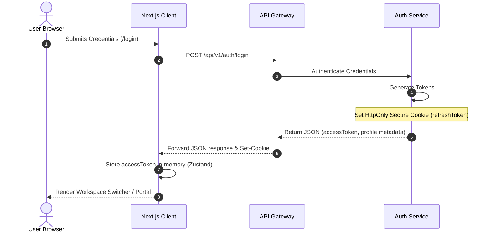

# EventOS Frontend Authentication Implementation Plan

**Version:** 1.0.0  
**Status:** APPROVED (Implementation Ready)  
**Target Environment:** Next.js 16 (App Router), TypeScript, Tailwind CSS, Zustand, TanStack Query  

---

## 1. Authentication Page Architecture

The authentication flows utilize a **decoupled token storage model** to balance UX convenience with enterprise security:
* **Access Token:** Stored strictly in-memory (Zustand state).
* **Refresh Token:** Stored in a secure, HttpOnly, Lax cookie managed by the browser.

```
                  +--------------------------------+
                  |  Next.js 16 App Router UI      |
                  +--------------------------------+
                                  |
            [Bearer Token in Header] | [HttpOnly Cookie automatically sent]
                                  v
                  +--------------------------------+
                  |  API Gateway (Reverse Proxy)   |
                  +--------------------------------+
                                  |
                                  v
                  +--------------------------------+
                  |  Spring Boot Auth Service      |
                  +--------------------------------+
```

### Flow Sequences



---

## 2. Route Structure

All page paths are organized within the Next.js App Router, using route groups to share layouts.

```text
src/app/
├── (auth)/
│   ├── layout.tsx             # Shared branding side-panel layout
│   ├── login/
│   │   └── page.tsx           # Login page
│   ├── register/
│   │   └── page.tsx           # Workspace self-registration page
│   ├── forgot-password/
│   │   └── page.tsx           # Password recovery request page
│   └── reset-password/
│       └── page.tsx           # Password update form page
├── onboarding/
│   └── page.tsx               # OWNER workspace configuration wizard
├── workspace-switcher/
│   └── page.tsx               # Workspace choice and selection page
├── portal/
│   ├── layout.tsx             # Protected Client Portal root layout
│   └── page.tsx               # Client landing dashboard
├── settings/
│   ├── layout.tsx             # Dashboard configuration menu layout
│   ├── team/
│   │   └── page.tsx           # Member invitations & role listings
│   └── security/
│       └── page.tsx           # Session tracking and revocation panel
```

---

## 3. Folder Structure & Organization

```text
src/
├── app/
│   └── (auth)/...
├── components/
│   ├── ui/                    # shadcn/ui components (Button, Input, Form)
│   ├── auth/
│   │   ├── AuthCard.tsx       # Standard card border & animation wrapper
│   │   ├── BrandPanel.tsx     # Animated GSAP/Framer brand panel
│   │   └── SessionList.tsx    # List active user sessions
│   └── layouts/
│       └── OnboardingWizard.tsx # Multi-step onboarding setup forms
├── hooks/
│   ├── useAuth.ts             # Convenience hook for login/logout calls
│   └── useSessions.ts         # Query hook for session management
├── lib/
│   ├── api-client.ts          # Axios configuration with refresh interceptors
│   └── schemas.ts             # Zod form validation structures
└── store/
    └── authStore.ts           # Zustand store for in-memory token & profile
```

---

## 4. Zustand Auth Store Design

The Zustand store holds volatile security contexts in memory. Persisted user and tenant contexts are saved in `sessionStorage` (never the access token) to survive page reloads.

```typescript
// src/store/authStore.ts
import { create } from 'zustand';

interface UserProfile {
  id: string;
  email: string;
  firstName: string;
  role: string;
}

interface WorkspaceMembership {
  tenantId: string;
  companyId: string;
  companyName: string;
  role: string;
  status: string;
}

interface AuthState {
  accessToken: string | null;
  user: UserProfile | null;
  activeTenantId: string | null;
  memberships: WorkspaceMembership[];
  isAuthenticated: boolean;
  
  setAuth: (accessToken: string, user: UserProfile, activeTenantId: string, memberships: WorkspaceMembership[]) => void;
  updateActiveTenant: (tenantId: string, accessToken: string, role: string) => void;
  clearAuth: () => void;
}

export const useAuthStore = create<AuthState>((set) => ({
  accessToken: null,
  user: null,
  activeTenantId: null,
  memberships: [],
  isAuthenticated: false,

  setAuth: (accessToken, user, activeTenantId, memberships) => {
    set({
      accessToken,
      user,
      activeTenantId,
      memberships,
      isAuthenticated: true,
    });
    if (typeof window !== 'undefined') {
      sessionStorage.setItem('activeTenantId', activeTenantId);
      sessionStorage.setItem('user', JSON.stringify(user));
      sessionStorage.setItem('memberships', JSON.stringify(memberships));
    }
  },

  updateActiveTenant: (tenantId, accessToken, role) => {
    set((state) => {
      const updatedUser = state.user ? { ...state.user, role } : null;
      if (typeof window !== 'undefined' && updatedUser) {
        sessionStorage.setItem('activeTenantId', tenantId);
        sessionStorage.setItem('user', JSON.stringify(updatedUser));
      }
      return {
        accessToken,
        activeTenantId: tenantId,
        user: updatedUser,
      };
    });
  },

  clearAuth: () => {
    set({
      accessToken: null,
      user: null,
      activeTenantId: null,
      memberships: [],
      isAuthenticated: false,
    });
    if (typeof window !== 'undefined') {
      sessionStorage.clear();
      // Write secure cookie deletion trigger for Next.js middleware
      document.cookie = "hasSession=; Path=/; Max-Age=0; SameSite=Lax";
    }
  },
}));
```

---

## 5. API Client & Token Refresh Interceptor

The Axios client includes an interceptor queue. If requests fail with `401 Unauthorized`, they are paused while a refresh request is executed.

```typescript
// src/lib/api-client.ts
import axios, { AxiosError, InternalAxiosRequestConfig } from 'axios';
import { useAuthStore } from '../store/authStore';

export const apiClient = axios.create({
  baseURL: process.env.NEXT_PUBLIC_API_BASE_URL || '/api/v1',
  withCredentials: true, // Attaches refresh cookie automatically
});

let isRefreshing = false;
let failedQueue: Array<{
  resolve: (token: string) => void;
  reject: (error: any) => void;
}> = [];

const processQueue = (error: any, token: string | null = null) => {
  failedQueue.forEach((prom) => {
    if (token) {
      prom.resolve(token);
    } else {
      prom.reject(error);
    }
  });
  failedQueue = [];
};

// 1. Ingress Header Interceptor
apiClient.interceptors.request.use(
  (config: InternalAxiosRequestConfig) => {
    const token = useAuthStore.getState().accessToken;
    const activeTenantId = useAuthStore.getState().activeTenantId;
    
    if (token) {
      config.headers.Authorization = `Bearer ${token}`;
    }
    if (activeTenantId) {
      config.headers['X-Tenant-ID'] = activeTenantId;
    }
    return config;
  },
  (error) => Promise.reject(error)
);

// 2. Egress Response Refresh Interceptor
apiClient.interceptors.response.use(
  (response) => response,
  async (error: AxiosError) => {
    const originalRequest = error.config as InternalAxiosRequestConfig & { _retry?: boolean };
    
    if (error.response?.status === 401 && !originalRequest._retry) {
      if (isRefreshing) {
        return new Promise((resolve, reject) => {
          failedQueue.push({
            resolve: (token: string) => {
              originalRequest.headers.Authorization = `Bearer ${token}`;
              resolve(apiClient(originalRequest));
            },
            reject: (err: any) => reject(err),
          });
        });
      }

      originalRequest._retry = true;
      isRefreshing = true;

      try {
        const refreshResponse = await axios.post(
          `${apiClient.defaults.baseURL}/auth/refresh`,
          {},
          { withCredentials: true }
        );
        
        const newAccessToken = refreshResponse.data.data.accessToken;
        const authStore = useAuthStore.getState();
        
        // Update in-memory token
        useAuthStore.setState({ accessToken: newAccessToken });
        
        processQueue(null, newAccessToken);
        isRefreshing = false;
        
        originalRequest.headers.Authorization = `Bearer ${newAccessToken}`;
        return apiClient(originalRequest);
      } catch (refreshError) {
        processQueue(refreshError, null);
        isRefreshing = false;
        
        // Refresh token expired or revoked -> clear state & redirect to login
        useAuthStore.getState().clearAuth();
        if (typeof window !== 'undefined') {
          window.location.href = '/login?expired=true';
        }
        return Promise.reject(refreshError);
      }
    }
    return Promise.reject(error);
  }
);
```

---

## 6. Next.js Middleware Protection Rules

Because access tokens are stored in memory, the server middleware cannot access them. The client sets a lightweight `hasSession=true` cookie alongside the secure refresh token cookie on successful authentication. The middleware reads this cookie to verify routing eligibility.

```typescript
// src/middleware.ts
import { NextResponse } from 'next/server';
import type { NextRequest } from 'next/server';

export function middleware(request: NextRequest) {
  const { pathname } = request.nextUrl;
  const hasSession = request.cookies.get('hasSession')?.value;

  const isAuthRoute = pathname.startsWith('/login') || 
                      pathname.startsWith('/register') || 
                      pathname.startsWith('/forgot-password') || 
                      pathname.startsWith('/reset-password');
                      
  const isProtectedRoute = pathname.startsWith('/portal') || 
                            pathname.startsWith('/onboarding') || 
                            pathname.startsWith('/settings') || 
                            pathname.startsWith('/workspace-switcher');

  if (isProtectedRoute && !hasSession) {
    const loginUrl = new URL('/login', request.url);
    loginUrl.searchParams.set('redirect', pathname);
    return NextResponse.redirect(loginUrl);
  }

  if (isAuthRoute && hasSession) {
    return NextResponse.redirect(new URL('/workspace-switcher', request.url));
  }

  return NextResponse.next();
}

export const config = {
  matcher: [
    '/login',
    '/register',
    '/forgot-password',
    '/reset-password',
    '/portal/:path*',
    '/onboarding',
    '/workspace-switcher',
    '/settings/:path*',
  ],
};
```

---

## 7. Role-Based Navigation & Route Guards

Navigation menus are filtered dynamically based on the current workspace membership role.

```typescript
// src/components/layouts/RoleGuard.tsx
'use client';

import React from 'react';
import { useAuthStore } from '../../store/authStore';
import { redirect } from 'next/navigation';

interface RoleGuardProps {
  children: React.ReactNode;
  allowedRoles: string[];
}

export default function RoleGuard({ children, allowedRoles }: RoleGuardProps) {
  const user = useAuthStore((state) => state.user);
  
  if (!user) {
    redirect('/login');
  }

  if (!allowedRoles.includes(user.role)) {
    redirect('/portal/unauthorized');
  }

  return <>{children}</>;
}
```

---

## 8. Form Validation Schemas (Zod)

All validation schemas are centralized to ensure consistency between client-side errors and backend constraints.

```typescript
import { z } from 'zod';

export const LoginSchema = z.object({
  email: z.string().email('Invalid email address'),
  password: z.string().min(1, 'Password is required'),
});

export const RegisterSchema = z.object({
  firstName: z.string().min(2, 'First name must be at least 2 characters'),
  lastName: z.string().optional(),
  email: z.string().email('Invalid email address'),
  companyName: z.string().min(3, 'Company name must be at least 3 characters'),
  phone: z.string().regex(/^\+?[1-9]\d{1,14}$/, 'Invalid phone number format').optional(),
  password: z.string()
    .min(10, 'Password must be at least 10 characters')
    .regex(/[A-Z]/, 'Must contain at least 1 uppercase letter')
    .regex(/[a-z]/, 'Must contain at least 1 lowercase letter')
    .regex(/[0-9]/, 'Must contain at least 1 number')
    .regex(/[@#$%^&+=!]/, 'Must contain at least 1 special character (@#$%^&+=!)'),
});

export const ResetPasswordSchema = z.object({
  password: z.string()
    .min(10, 'Password must be at least 10 characters')
    .regex(/[A-Z]/, 'Must contain at least 1 uppercase letter')
    .regex(/[a-z]/, 'Must contain at least 1 lowercase letter')
    .regex(/[0-9]/, 'Must contain at least 1 number')
    .regex(/[@#$%^&+=!]/, 'Must contain at least 1 special character'),
  confirmPassword: z.string(),
}).refine((data) => data.password === data.confirmPassword, {
  message: "Passwords do not match",
  path: ["confirmPassword"],
});
```

---

## 9. UI Layouts, Skeletons, & Accessibility (A11y)

* **Responsive Design:** Forms utilize full-width columns on mobile interfaces, scaling to 50/50 split screens on widescreen layouts.
* **Skeleton Loaders:** Content layouts load skeleton elements using `shadcn/ui` while TanStack Query fetches data (e.g. active sessions, team list).
* **Framer Motion Animations:** Smooth transitions guide page switches. Input field warnings slide into place automatically.
* **A11y Compliance:** All interactive elements declare proper ARIA labels, input borders highlight on focus, and forms support full keyboard navigation (Tab-based indexes, Enter-based submissions).

---

## 10. Pages Technical Specifications

### A. Register (`/register`)
* **Objective:** Self-registration form creating a new Tenant, Company, and Owner User.
* **Layout:** Splitted 50/50 UI. Left: Glassmorphic marketing panel. Right: Form.
* **Framer Motion Transition:** Horizontal fade-in slide.
* **Code Outline:**
  ```tsx
  'use client';
  import { useForm } from 'react-hook-form';
  import { zodResolver } from '@hookform/resolvers/zod';
  import { RegisterSchema } from '@/lib/schemas';
  import { apiClient } from '@/lib/api-client';
  import { toast } from '@/hooks/use-toast';
  import { useRouter } from 'next/navigation';

  export default function RegisterPage() {
    const router = useRouter();
    const { register, handleSubmit, formState: { errors, isSubmitting } } = useForm({
      resolver: zodResolver(RegisterSchema)
    });

    const onSubmit = async (data: any) => {
      try {
        await apiClient.post('/auth/register', data);
        toast({ title: 'Registration Successful', description: 'Log in to configure your workspace.' });
        router.push('/login');
      } catch (err: any) {
        toast({ variant: 'destructive', title: 'Error', description: err.response?.data?.error?.message || 'Registration failed' });
      }
    };

    return (
      <form onSubmit={handleSubmit(onSubmit)} className="space-y-4">
        {/* Form Fields & error mappings */}
      </form>
    );
  }
  ```

### B. Login (`/login`)
* **Objective:** Authenticates the user and sets the refresh cookie.
* **Layout:** Centered glass card.
* **Silent Refresh Trigger:** Runs a query on mount to check for existing cookies. If found, logs the user in silently.
* **Code Outline:**
  ```tsx
  'use client';
  import { useForm } from 'react-hook-form';
  import { zodResolver } from '@hookform/resolvers/zod';
  import { LoginSchema } from '@/lib/schemas';
  import { useAuthStore } from '@/store/authStore';
  import { apiClient } from '@/lib/api-client';
  import { useRouter } from 'next/navigation';

  export default function LoginPage() {
    const router = useRouter();
    const setAuth = useAuthStore((state) => state.setAuth);
    const { register, handleSubmit, formState: { errors } } = useForm({
      resolver: zodResolver(LoginSchema)
    });

    const onSubmit = async (data: any) => {
      try {
        const res = await apiClient.post('/auth/login', data);
        const { accessToken, userId, tenantId, role, firstName, memberships } = res.data.data;
        
        // Set hasSession cookie for middleware redirection checks
        document.cookie = "hasSession=true; Path=/; SameSite=Lax";
        
        setAuth(accessToken, { id: userId, email: data.email, firstName, role }, tenantId, memberships);
        router.push('/workspace-switcher');
      } catch (err: any) {
        // Render credentials error message
      }
    };

    return (
      <form onSubmit={handleSubmit(onSubmit)} className="space-y-4">
        {/* Email & Password Input */}
      </form>
    );
  }
  ```

### C. Forgot Password (`/forgot-password`)
* **Objective:** Generates password recovery links.
* **Layout:** Centered card with email field. Sends recovery email and shows success alert.

### D. Reset Password (`/reset-password`)
* **Objective:** Validates the reset token and updates the user's password.
* **URL Format:** `/reset-password?token=invite_or_reset_token`
* **Form Action:** Submits token and new password, then invalidates all active sessions.

### E. Onboarding Wizard (`/onboarding`)
* **Objective:** Initial setup wizard for Owners to configure workspace company branding and details.
* **Steps:**
  1. **Company Details:** Input timezone, currency, and address.
  2. **Branding:** Color pickers for primary/secondary theme colors and logo file upload fields (using secure signed Cloudinary endpoints).
  3. **Defaults:** Select standard templates.

### F. Workspace Switcher (`/workspace-switcher`)
* **Objective:** Renders membership cards for users associated with multiple tenants.
* **Switcher Action:** Switches active workspace ID in the store and requests a new token.

### G. Team Settings (`/settings/team`)
* **Objective:** Manage invitations and view active members.
* **Allowed Roles:** `OWNER`, `ADMIN`.
* **Actions:** View members, click "Invite Member" (generating an invitation link), and deactivate members.

### H. Security Settings (`/settings/security`)
* **Objective:** Manage active device sessions.
* **Actions:** Queries active sessions, displays operating system, IP, and a "Revoke" button to log out other devices.

---

## 11. Engineering Task Lists

Tasks are structured to support concurrent implementation streams:

### A. State Management & API Integration
- [ ] **ST-01:** Build the Zustand Auth Store (`authStore.ts`) with sessionStorage sync.
- [ ] **ST-02:** Build the Axios API Client (`api-client.ts`) with request headers and refresh token interceptors.
- [ ] **ST-03:** Implement the Next.js `middleware.ts` routing rules checking the `hasSession` cookie.

### B. Form & Page Component Implementation
- [ ] **COMP-01:** Build Zod form schemas and export to `@/lib/schemas`.
- [ ] **COMP-02:** Develop shared Auth layouts (side panels, brand panels).
- [ ] **COMP-03:** Implement page routes: `/login`, `/register`, `/forgot-password`, `/reset-password`.
- [ ] **COMP-04:** Implement onboarding page `/onboarding` step-by-step forms.
- [ ] **COMP-05:** Implement page `/workspace-switcher` dashboard.
- [ ] **COMP-06:** Implement settings pages: `/settings/team` (invitations list) and `/settings/security` (active device sessions list).

### C. QA & Verification Checklist
- [ ] **QA-01:** Test the Axios 401 interceptor: verify that concurrent API requests pause during token refreshes.
- [ ] **QA-02:** Test token rotation breach detection: verify that reusing an old refresh token cookie invalidates all active user sessions.
- [ ] **QA-03:** Verify accessibility criteria: check that all fields support keyboard focus indicators and ARIA validations.
