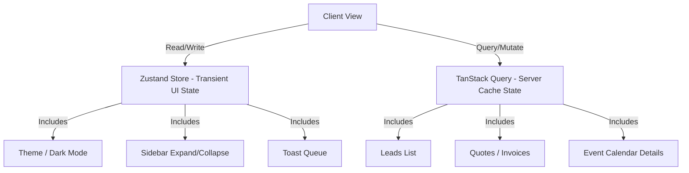
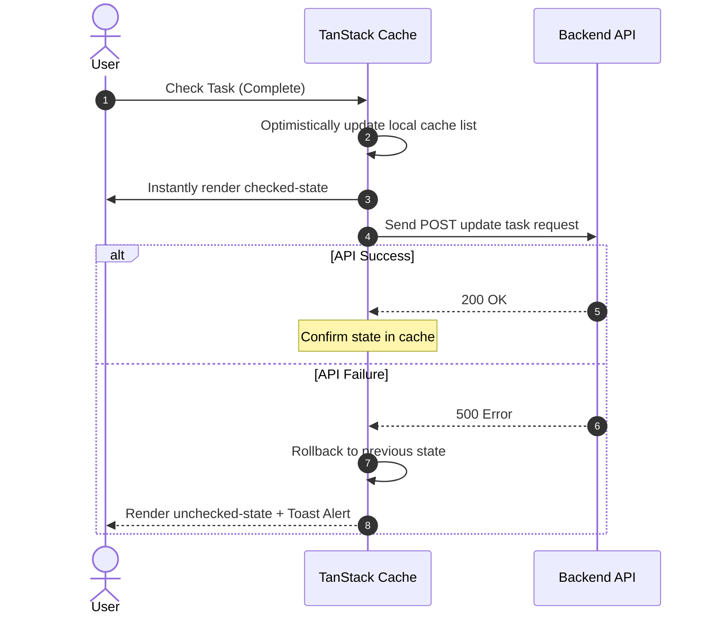

# EventOS Frontend State Management Standards

This document establishes the state management architectural rules, caching policies, and data synchronization patterns for the EventOS React/Next.js frontend.

---

## 1. Separation of Concerns

To avoid bloated render cycles and out-of-sync UI updates, EventOS strictly segregates state into two domains:



### Key Responsibilities

| State Manager | Data Ownership | Lifecycle | Examples |
|---|---|---|---|
| **Zustand** | Transient, local-only client configurations | Session-lifetime / Saved in LocalStorage | Theme options, mobile navigation toggles, active Toast queues ([toastStore.ts](file:///d:/EventOs/web/src/lib/toastStore.ts)), temporary filters. |
| **TanStack Query** | Synced database state retrieved from API gateway | Configurable stale/cache invalidation rules | CRM pipelines, quote line-items, invoices status, team member registries. |

---

## 2. TanStack Query Standards

All server data fetches must utilize `useQuery` hooks. Ad-hoc `useEffect` fetch bindings are forbidden.

### A. Global Default Configurations
Configured inside [providers.tsx](file:///d:/EventOs/web/src/app/providers.tsx#L10-L15):
* `staleTime`: `10 * 1000` (10 seconds - server data is considered fresh for 10 seconds).
* `refetchOnWindowFocus`: `false` (avoids duplicate traffic when user switches tabs).
* `retry`: `1` (prevents long loading indicators on poor network connections).

### B. Query Key Standards
Query keys must be declared as structured arrays to allow targeted cache invalidation:
`[service, resourceType, filterOrId]`
* *Example*: `["crm", "quotes", quoteId]` or `["events", "bookings", "list"]`

---

## 3. Cache Invalidation Patterns

When mutating data on the server via `useMutation`, the corresponding query cache must be invalidated to force a fresh background fetch:

```typescript
const queryClient = useQueryClient();

const deleteInvoiceMutation = useMutation({
  mutationFn: (invoiceId: string) => api.delete(`/events/invoices/${invoiceId}`),
  onSuccess: () => {
    // Invalidate list query cache to trigger background refetch
    queryClient.invalidateQueries({ queryKey: ["events", "invoices", "list"] });
    toast.success("Invoice deleted successfully");
  },
  onError: (error) => {
    toast.error("Failed to delete invoice: " + error.message);
  }
});
```

---

## 4. Optimistic Updates Guidelines

For actions that require instantaneous feedback (e.g. checking off an operational task or changing a lead status), the frontend must perform optimistic updates:



### Optimistic Mutation Hook Template
```typescript
const toggleTaskMutation = useMutation({
  mutationFn: (task) => api.put(`/events/tasks/${task.id}`, { completed: !task.completed }),
  onMutate: async (newTask) => {
    await queryClient.cancelQueries({ queryKey: ["events", "tasks"] });
    const previousTasks = queryClient.getQueryData(["events", "tasks"]);
    
    // Optimistically update the cache
    queryClient.setQueryData(["events", "tasks"], (old) =>
      old.map((t) => (t.id === newTask.id ? { ...t, completed: !t.completed } : t))
    );
    
    return { previousTasks }; // Context for rollback
  },
  onError: (err, newTask, context) => {
    // Rollback to old values on failure
    queryClient.setQueryData(["events", "tasks"], context.previousTasks);
    toast.error("Failed to update task status.");
  }
});
```

---

## 5. Offline & Recovery Behavior

Because event managers frequently coordinate on-site with poor network signals:

1. **Persistent Caches**: React Query is configured with `persistQueryClient` (using IndexedDB or LocalStorage) to keep previously fetched data readable offline.
2. **Offline Interceptor**: The Axios client detects if `navigator.onLine === false` and stops the request, returning a structured error.
3. **Queue Mutates**: Write operations (such as saving estimates or updates) are queued locally if offline and retried sequentially once `navigator.onLine` fires the `online` window event.
