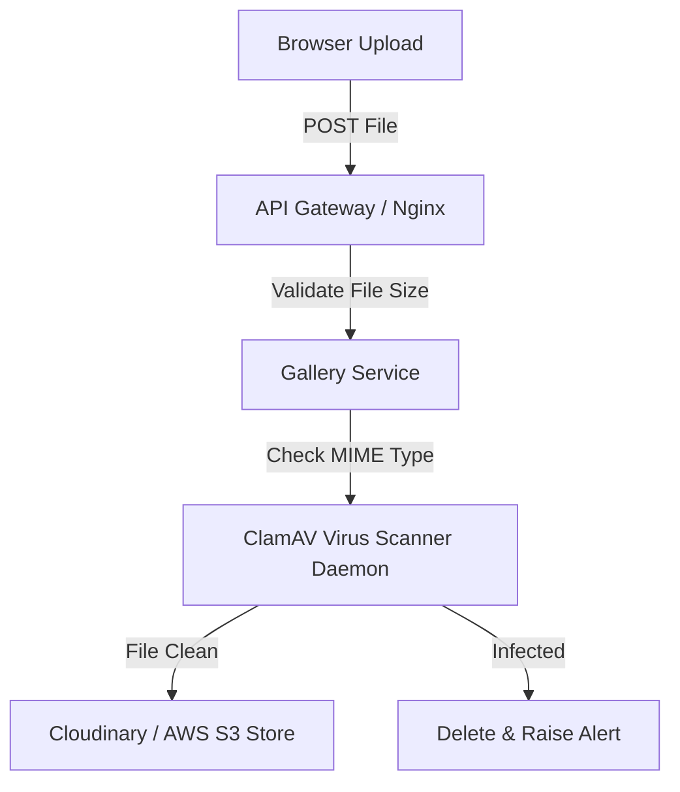
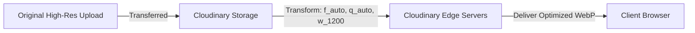
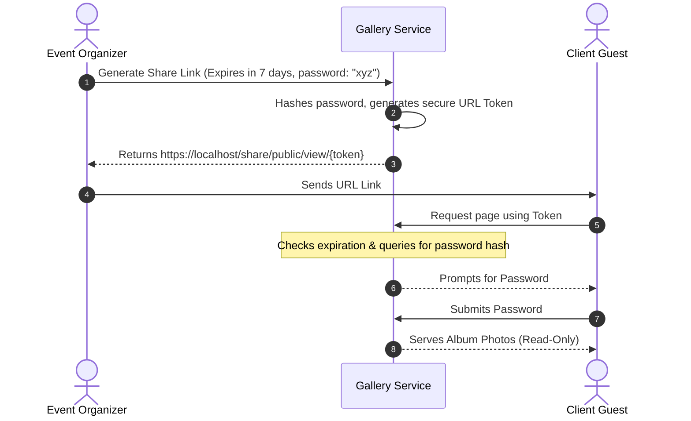

# EventOS Media Governance Specification

This document defines the storage limits, security constraints, optimization standards, and compliance rules for handling digital media (photos, videos, agreements, and PDFs) upload and delivery in the EventOS ecosystem.

---

## 1. Upload & Validation Policies

To protect backend storage from denial-of-service (DoS) attacks and malicious content, every upload request undergoes validation:



### A. Size Limits
* **Images**: Maximum 15 MB per file.
* **Videos**: Maximum 100 MB per file.
* **PDFs / Documents**: Maximum 10 MB per file.
* **Enforcement Location**: Enforced at the Nginx ingress gateway (`client_max_body_size 100M`) and at the spring-boot application level ([gallery-service application.yml](file:///d:/EventOs/backend/gallery-service/src/main/resources/application.yml#L26-L28)):
  ```yaml
  spring:
    servlet:
      multipart:
        max-file-size: 50MB
  ```

### B. Whitelisted MIME Types

| File Category | Allowed MIME Types | Extensions |
|---|---|---|
| **Images** | `image/jpeg`, `image/png`, `image/webp` | `.jpg`, `.jpeg`, `.png`, `.webp` |
| **Videos** | `video/mp4`, `video/quicktime` (MOV) | `.mp4`, `.mov` |
| **Documents** | `application/pdf` | `.pdf` |

*Files with mismatched magic headers are rejected instantly.*

### C. Virus Scanning (ClamAV Integration)
All uploaded multipart files are buffered in memory and scanned asynchronously by a **ClamAV daemon** (using a Unix socket connection) prior to being transferred to Cloudinary or AWS S3. If an infection signature matches, the upload terminates, the file is purged, and a security alert is triggered.

---

## 2. Cloudinary Transformation & CDN Standards

EventOS offloads file compression and delivery to **Cloudinary CDN**. To minimize bandwidth costs and improve page load speeds, the frontend must retrieve media using preset transformation parameters:



* **Auto Format (`f_auto`)**: Automatically converts images to modern formats like WebP or AVIF based on browser compatibility.
* **Auto Quality (`q_auto`)**: Compresses files dynamically without visible loss of fidelity.
* **Resizing & Cropping**:
  - Grid Previews: `c_thumb,w_300,h_300,g_faces` (resizes and centers on detected faces).
  - Lightbox / Fullscreen: `c_limit,w_1920,h_1080` (caps maximum size).
* **Watermarking**: For unpaid client galleries, a watermark overlay is applied via Cloudinary dynamic text overlay paths (e.g., `l_text:Arial_80_bold:Eventos%20Studio/fl_layer_apply`).

---

## 3. Share Link Security & Expiration

Planners frequently share event galleries with clients via public URL links. To prevent leakages, these links must comply with the following security guidelines:



1. **Token Cryptography**: Share tokens are cryptographically generated UUIDs or high-entropy hash strings. The database stores the SHA-256 hash of the token, not the plaintext string.
2. **Password Protection**: Users can optionally lock shared albums with a password. Passwords are encrypted using BCrypt.
3. **Link Expiration**: Every link contains an `expires_at` timestamp. Requests received after this timestamp return `410 Gone`.

---

## 4. Download Authorization & PDF Security

Unlike public galleries, invoice agreements and contract PDFs contain sensitive business information:

* **Signed S3 URLs**: Document PDFs are stored in private Cloudinary/S3 buckets. Access is granted exclusively via **signed URLs** with a short lifetime (e.g., 15 minutes).
* **Authorization Headers**: The client portal must authenticate with its access token at the API Gateway to retrieve PDF binary streams; direct public URL paths to document assets are prohibited.

---

## 5. Media Backup & Replication

1. **Multi-Region Replication**: Storage buckets are configured with cross-region replication (CRR) to defend against cloud provider region outages.
2. **Lifecycle Policies**: 
   - Workspaces in `TERMINATED` states have all storage directories deleted after 30 days.
   - Raw original media is transitioned to Archive Tier (Glacier Deep Archive) 180 days post-event to reduce costs, while optimized WebP files remain available on the hot storage tier.
