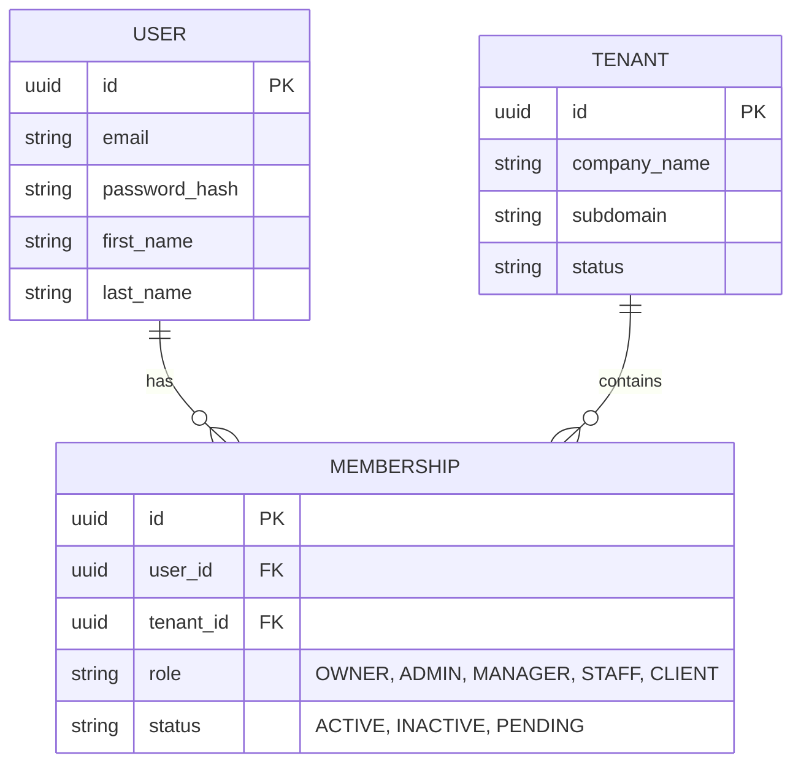
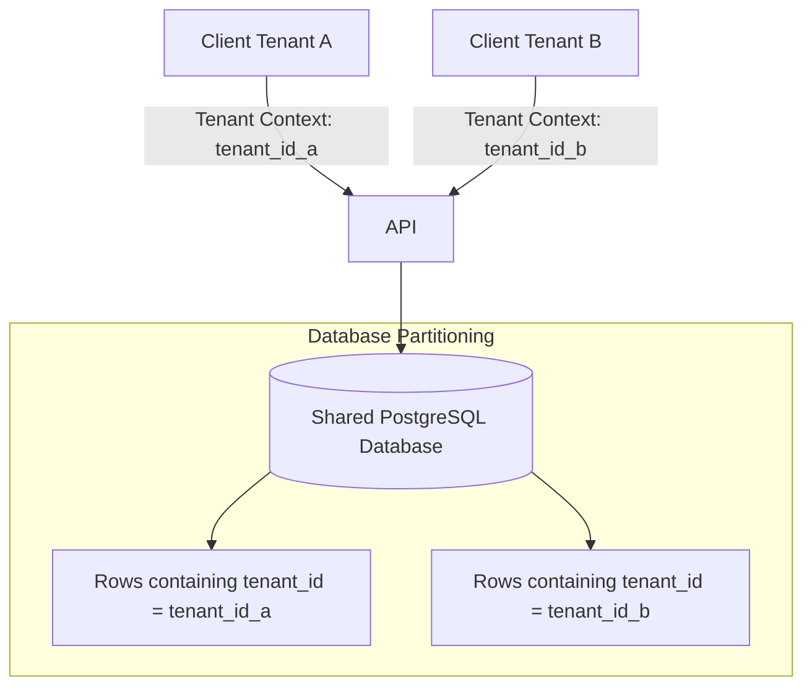
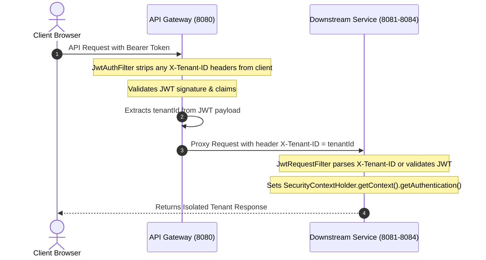
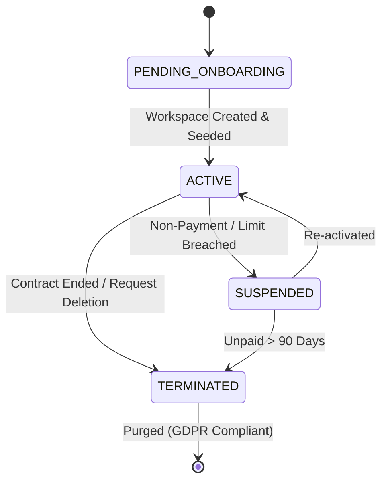

# EventOS Multi-Tenancy & Data Governance Specification

This document defines the multi-tenancy model, isolation mechanisms, and data governance policies for the EventOS platform. It is designed to ensure strict tenant boundaries, data privacy compliance, and scalable lifecycle operations.

---

## 1. Multi-Tenant Membership Model

EventOS implements a **Workspace Membership Model** where users and tenants are decoupled. A single user profile can belong to multiple tenants, holding specific roles and statuses within each membership.



### Roles and Permissions Matrix

| Role | Scope | Key Permissions |
|---|---|---|
| **OWNER** | Workspace Creator | Full control, billing, subscription upgrades, delete workspace |
| **ADMIN** | Workspace Admin | Manage team, adjust pricing rules, delete templates, export data |
| **MANAGER** | Workspace Manager | Manage leads, approve quotes, schedule bookings, edit timelines |
| **STAFF** | Workspace Employee | View leads, log activities, update event tasks |
| **CLIENT** | Guest Access (Client Portal) | View timelines, approve/reject assigned quotes, view gallery |

---

## 2. Tenant Isolation Rules

EventOS uses a **Logical Isolation Pattern (Shared Database, Shared Schema)** to maintain performance, simplicity of schema migrations, and resource efficiency.



### Hardening Standards
1. **Tenant ID Column Constraint**: Every table containing tenant-specific data (leads, events, bookings, quotes, galleries, invoices) must declare a non-nullable `tenant_id UUID` column.
2. **PostgreSQL Row Level Security (RLS)** (Future Enhancement): Ensure database connections verify the tenant ID on every execute request.
3. **Hibernate Filters**: Entity mapping leverages Hibernate's `@FilterDef` and `@Filter(name = "tenantFilter", condition = "tenant_id = :tenantId")` to append the condition dynamically to all SELECT queries.

---

## 3. Cross-Service Tenant Propagation

To ensure stateless execution, the tenant context is derived securely from the authenticated token and passed downstream.



- **Gateway Header Stripping**: [JwtAuthFilter.java](file:///d:/EventOs/backend/api-gateway/src/main/java/com/eventos/gateway/config/JwtAuthFilter.java#L41-L49) strips incoming headers:
  ```java
  headers.remove("X-Tenant-ID");
  headers.remove("X-User-ID");
  ```
- **Context Extraction**: Inside downstream services, the tenant ID is resolved strictly from the verified security principal context (e.g., `UserPrincipal`), throwing a `400 Bad Request` or `401 Unauthorized` response if missing. Fallback IDs (such as `00000000-0000-0000-0000-000000000000`) are strictly forbidden.

---

## 4. Tenant Lifecycle Management



### A. Onboarding Flow
1. **Workspace Register POST**: Triggers [AuthController.register](file:///d:/EventOs/backend/auth-service/src/main/java/com/eventos/auth/controller/AuthController.java#L80-L92) which creates the `Tenant`, the owner `User`, and binds them via a `Membership` (role `OWNER`).
2. **Database Seeding**: Downstream microservices catch tenant onboarding events and seed necessary initial values. For example, `event-service` seeds default pricing tiers (GST, standard decor packages) via [BudgetService.ensurePricingRulesSeeded](file:///d:/EventOs/backend/event-service/src/main/java/com/eventos/event/service/BudgetService.java#L264-L304).

### B. Offboarding & Termination
1. **Workspace Termination**: The tenant state is marked as `TERMINATED`.
2. **Grace Period**: Tenant enters a 30-day read-only recovery window.
3. **Purge Sequence**: Upon day 31, a background task executes the **Hard Deletion Workflow**.

---

## 5. Data Ownership, Retention, & Deletion

### Data Retention Windows

| Data Category | Retention Period (Active) | Retention Period (Terminated) | Deletion Type |
|---|---|---|---|
| **Leads & Pipeline** | Indefinite | 30 Days | Hard Delete |
| **Quotes & Contracts** | Indefinite | 30 Days | Hard Delete |
| **Invoices & Payments** | 7 Years (Compliance) | 7 Years (Compliance Archive) | Anonymized / Locked |
| **Media Galleries** | Indefinite | 30 Days | Physical File Purge (Cloudinary) |
| **Activity/Audit Logs**| 365 Days | 90 Days | Hard Delete |

### GDPR Deletion Workflow (Hard Delete / Purge)
When a tenant executes a "Delete Workspace" request:
1. **Step 1: Soft State Update**: Sets `status = 'TERMINATED'` on the `tenants` table.
2. **Step 2: Microservices Event Broadcast**: Publishes `TenantTerminatedEvent` to RabbitMQ.
3. **Step 3: Downstream Purge**:
   - `gallery-service` deletes all associated albums and assets from Cloudinary.
   - `event-service` deletes bookings, events, and estimates.
   - `crm-service` deletes leads, quotes, and activity logs.
4. **Step 4: Financial Anonymization**: Invoice details are anonymized (buyer name, email, and phone are cleared or hashed) to maintain accounting logs while fully scrubbing personal identifiable information (PII).
5. **Step 5: Tenant Deletion**: The tenant row is removed from the `tenants` table in the database.

---

## 6. Tenant Quotas and Limits

To prevent resource starvation (noisy neighbor issues) and enforce SaaS monetization tier limits, the system enforces the following boundaries:

| Quota Dimension | Free Tier | Growth Tier | Enterprise Tier | Enforcement Location |
|---|---|---|---|---|
| **User Seats** | 3 | 15 | Unlimited | `auth-service` (Membership registration) |
| **Active Leads / Month** | 50 | 500 | Unlimited | `crm-service` (Lead insertion check) |
| **Media Storage** | 2 GB | 20 GB | Unlimited | `gallery-service` (File upload check) |
| **Request Rate Limit** | 5 req/sec | 30 req/sec | 100 req/sec | Nginx / API Gateway Rate Limit Zones |
