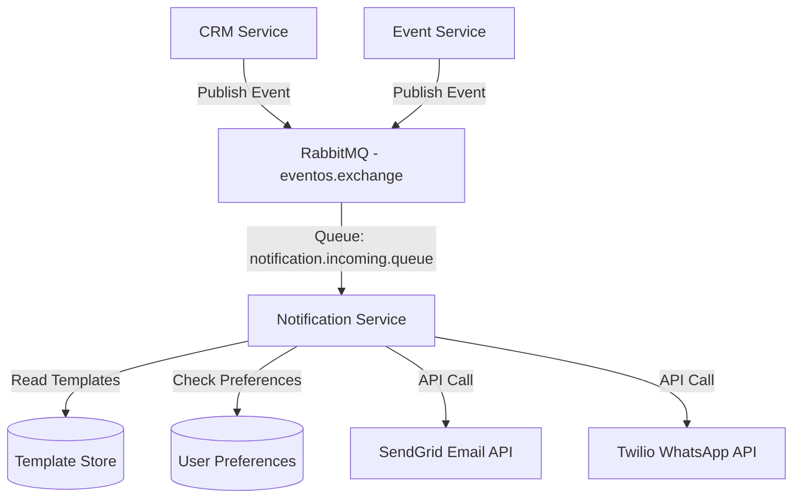
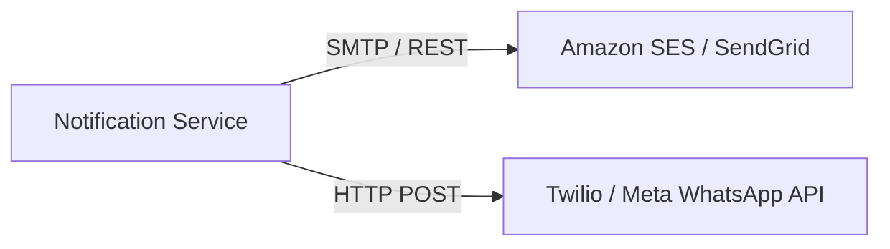
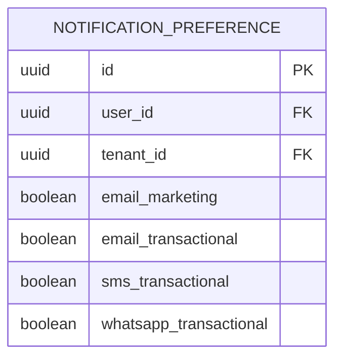
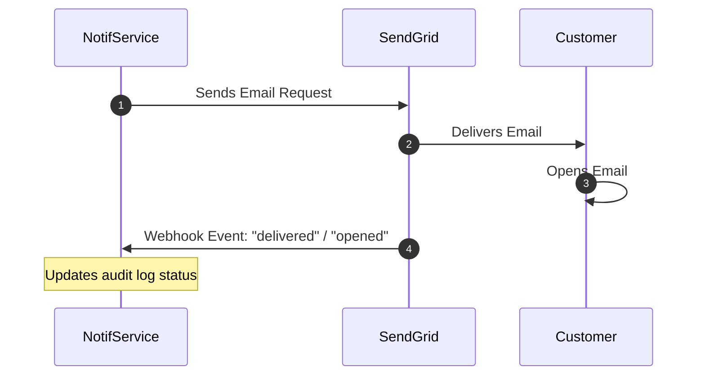

# EventOS Notification Service Architecture Specification

This document details the architectural layout, provider integrations, delivery mechanisms, and data structures for the EventOS notification subsystem.

---

## 1. Architectural Proposal: Dedicated Notification Service

EventOS will extract all communication operations into a **dedicated Notification Service**. Historically, embedding notification logic within domain services (CRM, Event) leads to duplicated templates, credentials, and error-prone retry logic. 



### Advantages of a Dedicated Service
1. **Decoupled Business Logic**: Services like `crm-service` only need to publish events (e.g., `quote.accepted`). They do not need to know how to construct emails, handle templates, or talk to external APIs.
2. **Centralized User Preferences**: Users can manage opt-in/opt-out rules for Email, SMS, and WhatsApp in a single place.
3. **Consolidated Templates**: All templates (HTML emails, SMS texts, WhatsApp variables) are managed and versioned in one database, eliminating duplicate string definitions across microservices.
4. **Resiliency and Fallback**: Enables automatic fallbacks (e.g. if a WhatsApp message delivery fails, fallback to sending an Email).

---

## 2. Provider Integrations

The notification service connects to external communication channels via official SDKs/APIs:



### A. Email Provider (Amazon SES / SendGrid)
* **Connection**: REST API via HTTPS rather than legacy SMTP (provides faster connection times and detailed delivery event webhooks).
* **IP Warm-up & Domain Keys**: Requires DKIM, SPF, and DMARC verification on the tenant's custom sending domains.

### B. WhatsApp Provider (Twilio / Meta Cloud API)
* **Connection**: Meta WhatsApp Business API via Twilio SDK.
* **Template Approval**: Meta requires pre-approved text templates containing indexed placeholders (e.g., `Hello {{1}}, your booking for {{2}} is confirmed.`).

---

## 3. Template Management & Localization

Templates are stored as structured JSON records containing HTML layouts and metadata variables:

```json
{
  "templateId": "quote_approved_notification",
  "category": "TRANSACTIONAL",
  "subjects": {
    "en": "Quote Approved: {{quoteNumber}} - {{companyName}}",
    "hi": "कोट स्वीकृत: {{quoteNumber}} - {{companyName}}"
  },
  "htmlBody": "<html><body>Hello {{clientName}}, your quote {{quoteNumber}} for {{eventName}} has been approved.</body></html>",
  "smsBody": "Hello {{clientName}}, Quote {{quoteNumber}} has been approved. View details on portal.",
  "whatsappTemplateName": "quote_approved_v1"
}
```

---

## 4. User Preferences Schema

To ensure compliance with local anti-spam regulations, users can opt in or out of notification types.



- **Rules**: Transactional communications (like payment receipts or invoice reminders) bypass marketing opt-out settings but honor direct account-level bans.

---

## 5. Delivery Tracking & Webhooks

To track delivery status and open rates, the notification service exposes a public endpoint to process provider webhooks:



- **Supported Webhook Actions**: `sent`, `delivered`, `opened`, `clicked`, `failed`, `bounced`.
- **Handling Bounces**: Hard bounces automatically flag the recipient email as "Undeliverable" in the database to prevent domain reputation damage.

---

## 6. Notification Audit Logs Schema

Every notification trigger writes to the database audit ledger for compliance and dispute resolution.

```sql
CREATE TABLE notification_logs (
    id UUID PRIMARY KEY,
    tenant_id UUID NOT NULL,
    user_id UUID,                     -- Nullable for guest clients
    recipient_address VARCHAR(255) NOT NULL, -- Email address, phone, etc.
    channel VARCHAR(50) NOT NULL,     -- EMAIL, SMS, WHATSAPP
    template_id VARCHAR(100) NOT NULL,
    variables_json JSONB,             -- Values used in template placeholders
    status VARCHAR(50) NOT NULL,      -- ENQUEUED, SENT, DELIVERED, FAILED, BOUNCED
    error_message TEXT,
    created_at TIMESTAMP NOT NULL,
    updated_at TIMESTAMP NOT NULL
);

CREATE INDEX idx_notif_tenant ON notification_logs(tenant_id);
CREATE INDEX idx_notif_recipient ON notification_logs(recipient_address);
```
