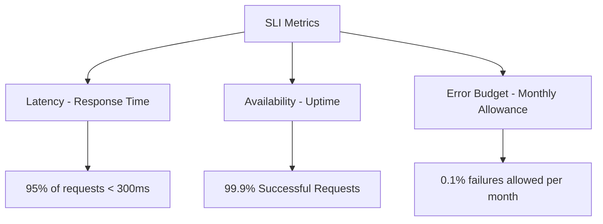
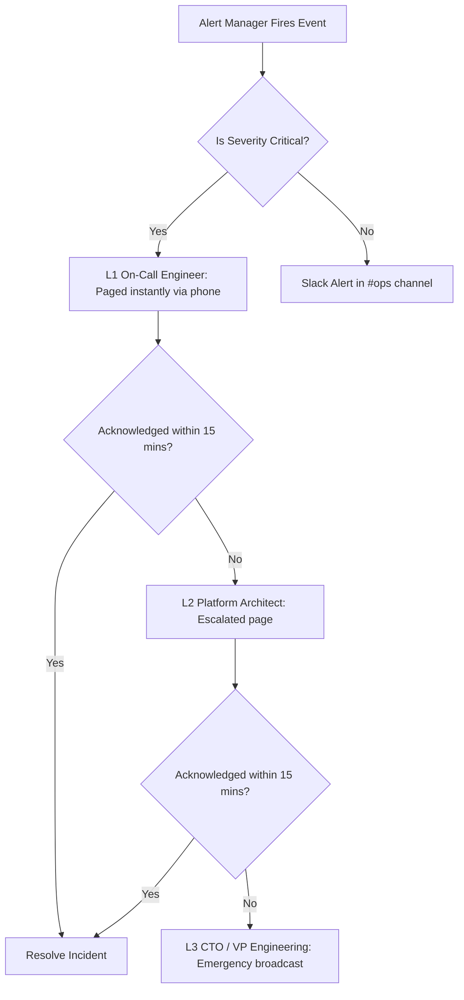

# EventOS Service Level Objectives (SLOs) Specification

This document defines the metrics, targets, error budgets, monitoring rules, and escalation pathways to guarantee the reliability and performance of the EventOS SaaS platform.

---

## 1. Service Level Indicators (SLIs) & Objectives (SLOs)

EventOS tracks performance using standard **Google SRE Service Level Indicators**:



### SLI/SLO Target Matrix

| Service | Target Type | Service Level Indicator (SLI) | Service Level Objective (SLO) | Uptime Target |
|---|---|---|---|---|
| **API Gateway** | Availability | Ratio of HTTP responses returning status `2xx` / `3xx` or `404` / `400` to total requests | **99.95%** | 99.95% |
| **API Gateway** | Latency | 95th percentile (p95) duration of gateway routing lookup | **< 150ms** | - |
| **Auth / CRM / Event** | Availability | Ratio of non-5xx responses to total requests | **99.90%** | 99.9% |
| **Auth / CRM / Event** | Latency | p95 duration of database read/write requests | **< 350ms** | - |
| **Gallery Service** | Availability | Ratio of successful uploads/renders to total media attempts | **99.50%** | 99.5% |
| **Gallery Service** | Latency | p95 duration of image transform processing at CDN | **< 1500ms** | - |

---

## 2. Error Budgets

The **Error Budget** is the maximum allowable unreliability of a service (100% - SLO). For a 99.9% availability SLO, the error budget is **0.1%** of requests per month.

* **Tracking**: Monitored via Prometheus dashboard calculations.
* **Depletion Policy**: 
  - If a service consumes **> 80%** of its monthly error budget in the first 14 days, the development team halts feature releases for that service and focuses exclusively on performance and reliability remediation tasks.
  - If a service consumes **100%** of its error budget, deployment pipelines are automatically locked for new features until the rolling SLO target recovery window is satisfied.

---

## 3. Monitoring Thresholds & Prometheus Alert Rules

All microservices scrape Actuator metrics into Prometheus ([prometheus.yml](file:///d:/EventOs/docker/monitoring/prometheus.yml)). The Prometheus alert manager executes the following evaluation rules:

```yaml
groups:
  - name: eventos-alerts
    rules:
      # 1. High 5xx Error Rates Alert
      - alert: HighHttp5xxErrorRate
        expr: sum(rate(http_server_requests_seconds_count{status=~"5.."}[5m])) / sum(rate(http_server_requests_seconds_count[5m])) * 100 > 1.0
        for: 2m
        labels:
          severity: critical
        annotations:
          summary: "High HTTP 5xx error rate on {{ $labels.application }}"
          description: "Service HTTP 5xx responses exceeded 1% of total traffic for over 2 minutes."

      # 2. Latency Degradation Alert
      - alert: RequestLatencyTargetBreached
        expr: histogram_quantile(0.95, sum(rate(http_server_requests_seconds_bucket[5m])) by (le, application)) > 0.500
        for: 5m
        labels:
          severity: warning
        annotations:
          summary: "95th percentile request latency exceeds 500ms on {{ $labels.application }}"
          description: "Slow queries or resource starvation is causing response degradation."

      # 3. Connection Pool Exhaustion Alert
      - alert: DatabaseConnectionPoolExhausted
        expr: hikaricp_connections_pending{pool="HikariPool-1"} > 5
        for: 1m
        labels:
          severity: critical
        annotations:
          summary: "Database connection pool exhausted on {{ $labels.application }}"
          description: "Pending connections to database are queuing up, check Postgres lock table status."
```

---

## 4. Alert Escalation Pathways

Alerts are sent to PagerDuty or Slack based on severity levels and follow a defined escalation path:



### Escalation SLA Requirements
1. **L1 Acknowledge Window**: 15 minutes.
2. **L1 Resolution Target**: 2 hours for critical severity alerts.
3. **Escalation Path**: L1 On-Call Engineer ➔ L2 Lead Platform Architect ➔ L3 CTO / Engineering Leadership.
4. **Post-Mortem**: Every critical severity SLO breach requires a written Post-Mortem detailing the root cause, timeline, and preventive actions.
