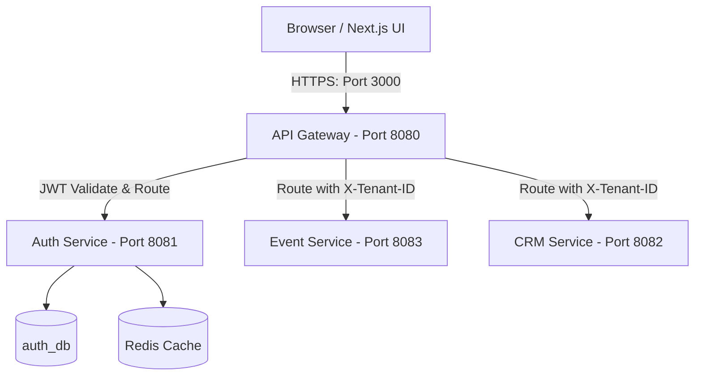
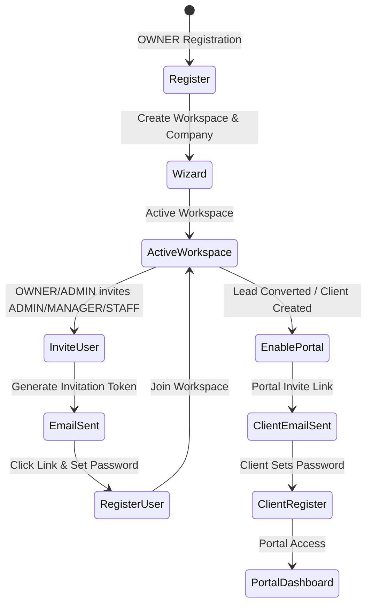
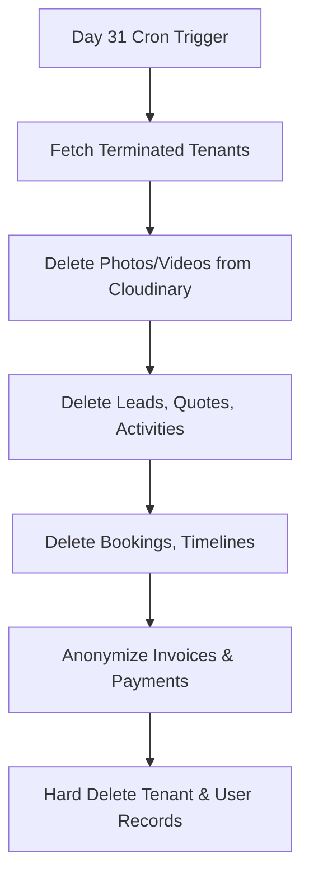
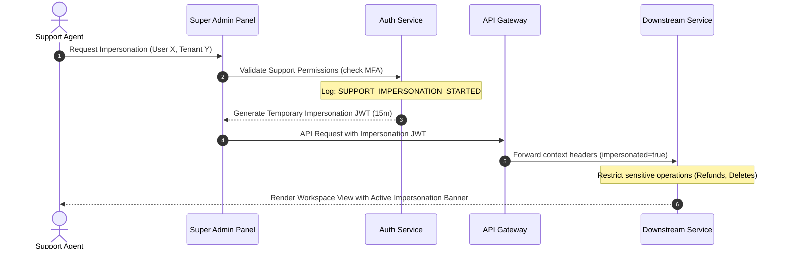
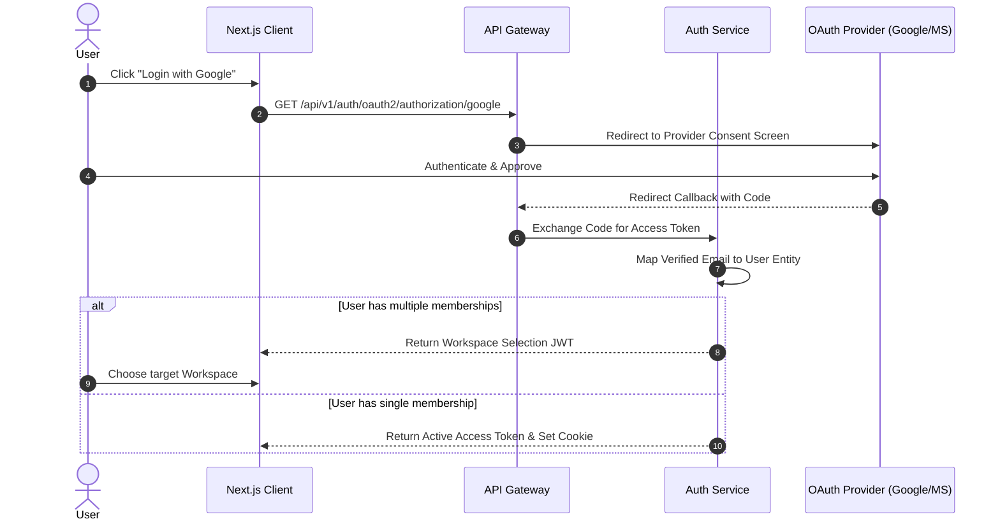
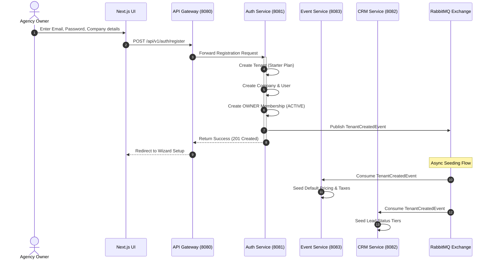
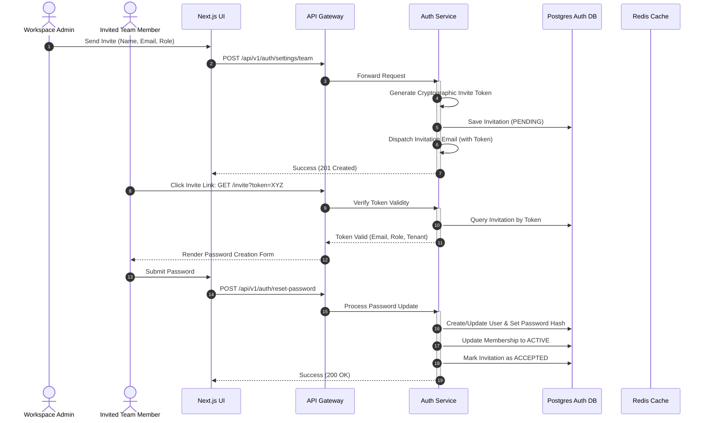

# EventOS User Journey & Identity Management Specification

**Version:** 1.0.0  
**Status:** APPROVED (Implementation Ready)  
**Target Architecture:** Multi-Tenant Spring Boot 3 & Next.js 16 Microservices  

---

## 1. Introduction & Architecture Context

EventOS is a multi-tenant B2B SaaS platform for event management agencies and wedding planners. Security, tenant isolation, and identity control are critical to ensure that data remains strictly partitioned and that roles are audited. 

Identity management is central to the platform. It handles workspace registrations, user onboardings, RBAC enforcement, session sliding windows, audit logs, and support team operations.



---

## 2. Onboarding Flows by Role & Creator Hierarchy

EventOS utilizes a **Workspace Membership Model** where a user is decoupled from a tenant workspace. A single user profile can hold different roles across multiple workspaces.

### Onboarding Journeys



#### A. OWNER (Workspace Creator)
* **Onboarding Route:** Self-registration.
* **Flow:** 
  1. The prospective agency owner visits `https://app.eventos.com/register`.
  2. Submits details: first name, last name, business email, phone, company name, and password.
  3. The backend creates a new `Tenant` (Starter Plan by default), a `Company` profile, a `User` (role: `OWNER`), and a `Membership` record (status: `ACTIVE`).
  4. The user is logged in automatically and redirected to the **Workspace Configuration Wizard** to finalize company branding (colors, timezone, currency, and logo upload).

#### B. ADMIN (Workspace Administrator)
* **Onboarding Route:** Invited by the `OWNER`.
* **Flow:**
  1. The Owner goes to `Settings > Team Management` and clicks **Invite Admin**.
  2. Enters first name, last name, and email address.
  3. The system generates an invitation token, creates a pending `Membership` (status: `PENDING`, role: `ADMIN`), and dispatches an invitation email containing a secure tokenized link.
  4. The invitee clicks the link, enters a password, and clicks **Activate Account**. Their membership state shifts to `ACTIVE`.

#### C. MANAGER (Workspace Manager)
* **Onboarding Route:** Invited by `OWNER` or `ADMIN`.
* **Flow:**
  1. Follows the same email-invite sequence as the Admin, but the membership is bound to the `MANAGER` role.
  2. Upon password completion, the manager gains workspace access with restricted system configuration capabilities.

#### D. CLIENT (Customer Guest Portal)
* **Onboarding Route:** Auto-triggered on CRM conversions, or direct manual addition.
* **Flow:**
  1. When a planner converts a Lead to a confirmed Booking, the client detail is saved. The planner clicks **Enable Portal Access**.
  2. The system checks if a user with that email exists. If not, it creates a `User` in `PENDING` status.
  3. A `Membership` link is established with the role `CLIENT` and status `PENDING`.
  4. The client receives an email: *"Welcome to your Event Portal! Click here to review your event timeline, quotes, and invoices."*
  5. Upon password creation, the client logs directly into the client portal context (`https://app.eventos.com/portal`).

### Creator Hierarchy Matrix

The table below defines which roles have the authorization to create or invite other users within a tenant workspace:

| Initiating Role | Target Role to Create | Allowed? | Constraints / Conditions |
| :--- | :--- | :---: | :--- |
| **OWNER** | OWNER | Yes | Can invite co-owners or transfer ownership. |
| **OWNER** | ADMIN | Yes | Enforces subscription seat limits. |
| **OWNER** | MANAGER | Yes | Enforces subscription seat limits. |
| **OWNER** | CLIENT | Yes | No seat limits apply. |
| **ADMIN** | OWNER | No | Access Denied. Cannot demote or change Owner details. |
| **ADMIN** | ADMIN | Yes | Enforces subscription seat limits. |
| **ADMIN** | MANAGER | Yes | Enforces subscription seat limits. |
| **ADMIN** | CLIENT | Yes | No seat limits apply. |
| **MANAGER** | OWNER / ADMIN / MANAGER | No | Access Denied. |
| **MANAGER** | CLIENT | Yes | No seat limits. Can invite clients for quotes review. |
| **CLIENT** | ANY ROLE | No | Access Denied. |

---

## 3. Invitation-Based Onboarding Flow

To prevent unauthorized registrations and secure workspace invitations, the system enforces a strict invitation-token lifecycle.

```
+--------------------+        +---------------------+        +--------------------+
|  OWNER/ADMIN Action | -----> | Invitation Token    | -----> | Email Dispatcher   |
|  (Invite Team)     |        | (Expires in 48 Hrs) |        | (Secure Link Sent) |
+--------------------+        +---------------------+        +--------------------+
                                                                       |
+--------------------+        +---------------------+        +--------------------+
| Active Workspace   | <----- | Set Password &      | <----- | Click Link         |
| Access Enabled     |        | Accept T&C          |        | (Token Validation) |
+--------------------+        +---------------------+        +--------------------+
```

### Technical Design Rules:
1. **Token Generation:** Cryptographically secure token generated using `java.security.SecureRandom` (32 bytes, URL-safe Base64 encoded).
2. **Database Record:** Stored in the `invitations` table. The token is stored as a SHA-256 hash to protect against database compromise.
3. **Expiration:** Hard limit of 48 hours. The `expires_at` column is checked during verification.
4. **On-boarding Link Construction:**
   `https://app.eventos.com/invite?token=invite_token_raw_value`
5. **State Transition Rules:**
   * If the invitee email *does not* exist in the `users` table:
     * User registration is displayed. After password submission, create `User` (status: `ACTIVE`) and set `Membership` (status: `ACTIVE`). Mark invitation status as `ACCEPTED`.
   * If the invitee email *already exists* (the user is an active member of another tenant):
     * Skip the password setup. Redirect directly to the login page.
     * Upon authentication, establish the new `Membership` (status: `ACTIVE`) and redirect the user to the **Workspace Switcher Dashboard**.

---

## 4. Password Management & Recovery

Security requires strict hashing algorithms and complexity requirements to prevent password cracking.

### A. Password Complexity Policies
* Minimum Length: **10 characters**.
* Must contain at least:
  * 1 uppercase letter (`A-Z`)
  * 1 lowercase letter (`a-z`)
  * 1 numeric digit (`0-9`)
  * 1 special character (e.g., `@`, `#`, `$`, `%`, `^`, `&`, `*`, `!`)
* Cannot be equal to common password lists (e.g., `Password123`, `Admin@123`). Enforced at backend level via a validation regex and password strength checks.

### B. Hashing Standards
* All passwords are encrypted using **bcrypt** with a work cost factor of **12** (managed in `Spring Security`).
* Hashed representation matches: `$2a$12$...`

### C. Forgot Password and Recovery Flow
1. **Request:** User requests password reset via `POST /api/v1/auth/forgot-password` providing their email.
2. **Token Generation:** Generates a secure, short-lived token:
   * Expire Window: **15 minutes**.
   * Single-use only.
   * Stored in Redis with key `reset:token:<token_value>` mapped to the user email.
3. **Email Dispatch:** Email containing the recovery link is dispatched asynchronously via RabbitMQ queue `notification.email`:
   `https://app.eventos.com/reset-password?token=<reset_token>`
4. **Reset Execution:** User submits the new password with the token via `POST /api/v1/auth/reset-password`.
   * Backend checks Redis. If the key exists, it updates the user's password, deletes the Redis key to prevent reuse, and invalidates all current active refresh tokens for the user in the database (forcing logout on all devices).
   * If the user account was locked due to brute-force attempts, resetting the password immediately clears the lockout counter.

---

## 5. Authentication Lifecycle (JWT & Token Rotation)

EventOS uses a stateless **JSON Web Token (JWT)** strategy for authorization and an HTTP-Only **Refresh Token** cookie for session persistence.

```
+--------------+                +---------------+                +------------------+
| Access Token | -------------> | Valid for     | -------------> | Injected in      |
| (Short-Lived)|                | 15 Minutes    |                | Authorization    |
|              |                |               |                | Bearer Header    |
+--------------+                +---------------+                +------------------+
                                                                          
+--------------+                +---------------+                +------------------+
| Refresh Token| -------------> | Valid for     | -------------> | Cookie: HttpOnly |
| (Long-Lived) |                | 7 Days        |                | Secure, SameSite |
|              |                | (Rotated)     |                | Path: /refresh   |
+--------------+                +---------------+                +------------------+
```

### A. Access Token Claims Schema
Access tokens are short-lived JWTs (valid for **15 minutes**).
* **Signing Algorithm:** `RS256` (Asymmetric Private/Public key pair). API Gateway uses the public key for validation, while the Auth Service signs using the private key.
* **Payload Claims Example:**
  ```json
  {
    "iss": "https://auth.eventos.com",
    "sub": "3a0b3951-512c-473d-8d4e-128a11b65e90",
    "email": "lokesh@myevents.com",
    "tenantId": "c4d51bfa-83de-43ff-8898-d14ef5e99876",
    "firstName": "Lokesh",
    "lastName": "Nagrikar",
    "roles": "ADMIN",
    "impersonated": false,
    "exp": 1781682300,
    "iat": 1781681400
  }
  ```

### B. Validation Sequence
1. **Ingress Filtering:** Request reaches Nginx. Standard security checks are completed.
2. **API Gateway Level:**
   * [JwtAuthFilter.java](file:///d:/EventOs/backend/api-gateway/src/main/java/com/eventos/gateway/config/JwtAuthFilter.java) intercepts request.
   * Strips client-provided `X-Tenant-ID`, `X-User-ID`, or `X-User-Roles` headers to prevent header spoofing.
   * Decodes and validates the `Authorization: Bearer <JWT>` header signature.
   * Extracts the `tenantId`, `sub` (User ID), and `roles` claims.
   * Injects downstream context headers:
     * `X-Tenant-ID` = `<claims.tenantId>`
     * `X-User-ID` = `<claims.sub>`
     * `X-User-Roles` = `<claims.roles>`
3. **Microservice Level:**
   * Every downstream microservice uses [JwtRequestFilter](file:///d:/EventOs/backend/event-service/src/main/java/com/eventos/event/config/JwtRequestFilter.java) to double-verify the gateway headers or validate the JWT signature directly, ensuring a zero-trust model.

### C. Refresh Token Strategy (Refresh Token Rotation - RTR)
To mitigate the risk of stolen refresh tokens, EventOS implements Refresh Token Rotation (RTR).
* **Storage:** Refresh tokens (UUID strings) are set as cookies:
  * `HttpOnly`: Access blocked from Javascript, preventing XSS thefts.
  * `Secure`: Cookies are only transmitted over SSL/HTTPS connections.
  * `SameSite=Strict`: Protects against CSRF attacks.
  * `Path=/api/v1/auth/refresh`: Sent only during token renewals.
  * `Max-Age`: **7 days** (`604800` seconds).
* **Rotation Flow:**
  * When a client calls `/api/v1/auth/refresh` with the active refresh token cookie, the Auth service:
    1. Validates the token in the `refresh_tokens` database table.
    2. If valid, generates a **new** Access Token AND a **new** Refresh Token.
    3. Deletes the old Refresh Token from the database.
    4. Sets the new Refresh Token in the response cookie.
* **Replay Attack Detection (Breach Control):**
  * If a deleted/old refresh token is presented to the `/refresh` endpoint, the system flags a breach.
  * Action: The Auth service immediately revokes and deletes **all** active refresh tokens associated with the user's account, invalidating all sessions across all devices. An audit log of severity `CRITICAL` (`REFRESH_TOKEN_REPLAY_ATTACK`) is generated, notifying the user via email.

---

## 6. Session Timeout & Sliding Windows

Session handling must balance user convenience with data security.

### A. Inactive Timeout Thresholds
* **Admin, Owner, Manager Roles:** **2 hours** of inactivity.
* **Client Role:** **30 minutes** of inactivity (due to guest portal sharing nature).

### B. Sliding Session Window
* Every API request checks and updates the `last_active_at` timestamp in the `sessions` table.
* If a session is active and approaches expiration, the silent refresh flow renews the session automatically.
* If no requests are received within the timeout window, the user session expires, and the refresh token is marked as expired.

### C. Silent Refresh Interceptor
* The frontend Axios or Fetch service registers a global response interceptor.
* **Workflow:**
  1. Frontend receives a `401 Unauthorized` response with error code `TOKEN_EXPIRED`.
  2. The interceptor pauses the request queue.
  3. Sends a background request to `POST /api/v1/auth/refresh` (cookie is attached by the browser).
  4. If successful, updates the local access token, and retries the original failed requests.
  5. If the refresh request fails (e.g. refresh token expired or revoked), the queue is cleared, user state is purged from the Zustand store, and the user is redirected to `/login` showing a toast message: *"Session expired due to inactivity. Please login again."*

---

## 7. Role-Based Access Control (RBAC) Matrix

Permissions are granular, checking both the authenticated role and membership active status.

### Modules & Permitted Operations Matrix

| Module | Action | OWNER | ADMIN | MANAGER | STAFF (FUTURE) | CLIENT |
| :--- | :--- | :---: | :---: | :---: | :---: | :---: |
| **CRM Leads** | View Leads list | Yes | Yes | Yes | Yes | No |
| | Create / Convert Leads | Yes | Yes | Yes | Yes | No |
| | Delete Leads | Yes | Yes | No | No | No |
| **Quotes & Proposals**| Create Quote | Yes | Yes | Yes | No | No |
| | Send Quote to Client | Yes | Yes | Yes | No | No |
| | Approve / Reject Quote | Yes | Yes | Yes | No | **Yes (Assigned)** |
| **Bookings & Timeline**| View Event Booking | Yes | Yes | Yes | Yes | **Yes (Assigned)** |
| | Edit Event Timeline | Yes | Yes | Yes | No | No |
| | Confirm Booking | Yes | Yes | Yes | No | No |
| **Invoices & Payments**| View Invoices / Receipts| Yes | Yes | Yes | Yes | **Yes (Assigned)** |
| | Create / Edit Invoice | Yes | Yes | No | No | No |
| | Record Payment Receipt | Yes | Yes | Yes | No | No |
| **Gallery Albums** | Create Album / Upload | Yes | Yes | Yes | Yes | No |
| | Delete Album / Media | Yes | Yes | No | No | No |
| | Access Shared Link | Yes | Yes | Yes | Yes | **Yes (Assigned)** |
| **Settings** | Update Company Settings| Yes | Yes | No | No | No |
| | Manage Team Membership | Yes | Yes | No | No | No |
| | Modify Billing / Plan | Yes | No | No | No | No |
| | Delete Workspace | Yes | No | No | No | No |

---

## 8. Tenant Isolation & Context Propagation

Logical isolation is implemented using a shared-database, shared-schema pattern. Tenant boundaries are strictly verified on every operation.

```
+----------------+       +------------------+       +--------------------+
| Client Request | ----> | API Gateway      | ----> | Microservice Filter|
|                |       | (Striops Header) |       | (Binds Tenant ID)  |
+----------------+       +------------------+       +--------------------+
                                                              |
                                                              v
+----------------+       +------------------+       +--------------------+
| SQL Executed   | <---- | Hibernate Filter | <---- | Security Context   |
| (WHERE tenant) |       | (Injects ID)     |       | (ThreadLocal Host) |
+----------------+       +------------------+       +--------------------+
```

### A. Context Propagation Steps
1. **Gateway Stripping:** Stripping of `X-Tenant-ID` is performed at the edge:
   ```java
   public GatewayFilter filter(ServerWebExchange exchange, GatewayFilterChain chain) {
       ServerHttpRequest request = exchange.getRequest().mutate()
           .headers(httpHeaders -> {
               httpHeaders.remove("X-Tenant-ID");
               httpHeaders.remove("X-User-ID");
               httpHeaders.remove("X-User-Roles");
           }).build();
       return chain.filter(exchange.mutate().request(request).build());
   }
   ```
2. **Context Resolution:** Downstream services extract the `X-Tenant-ID` header injected by the API gateway filter and set the ThreadLocal security context:
   ```java
   public class TenantContext {
       private static final ThreadLocal<UUID> currentTenant = new ThreadLocal<>();
       
       public static void setCurrentTenant(UUID tenantId) {
           currentTenant.set(tenantId);
       }
       public static UUID getCurrentTenant() {
           return currentTenant.get();
       }
       public static void clear() {
           currentTenant.remove();
       }
   }
   ```
3. **Database Query Filtering:** Every JPA repository uses Hibernate `@FilterDef` to automatically append `tenant_id` conditions to SELECT/UPDATE queries:
   ```java
   @Entity
   @Table(name = "leads")
   @FilterDef(name = "tenantFilter", parameters = @ParamDef(name = "tenantId", type = UUID.class))
   @Filter(name = "tenantFilter", condition = "tenant_id = :tenantId")
   public class Lead { ... }
   ```
4. **RabbitMQ Event Header Propagation:**
   When publishing asynchronous events, the publishing service serializes `tenantId` into the message header attributes. The consumer service reads the header and initializes `TenantContext` before running any local repository queries.

---

## 9. First-Login Experience

For new workspace owners, the first-login wizard sets the workspace profile parameters:

1. **Welcome Screen:** Framer Motion animation welcoming the Owner to EventOS.
2. **Step 1: Company Profile (Mandatory):**
   * Fields: Business Name, Official Email, Phone, Currency, Timezone, and Tax identification number (e.g., GSTIN).
3. **Step 2: Brand Configuration (Optional):**
   * Upload logo (direct to Cloudinary using secure signed upload preset).
   * Selection of primary and secondary branding colors (applies to proposal outputs and client portal layout themes).
4. **Step 3: Initial Seeding:**
   * Backend automatically seeds default pricing rules, event type templates (e.g., Corporate, Wedding, Concert), and email invitation configurations.
5. **Team Invite Prompt:** Option to invite their first team members by entering email addresses.

---

## 10. Account Deactivation, Deletion, & GDPR Purge

Policies are enforced for offboardings, GDPR compliance, and non-payment cases.

### A. Deactivation Rules
* **Trigger:** An `OWNER` or `ADMIN` changes a team member's membership status to `INACTIVE`.
* **Execution:**
  1. The membership status is set to `INACTIVE` in the database.
  2. The Auth service invalidates all active session entries and refresh tokens for that user.
  3. Any subsequent token exchange or API request from that member's access token is rejected with `403 Forbidden` (`MEMBERSHIP_INACTIVE`).

### B. Deletion Grace Period
* When an Owner clicks **Delete Workspace**:
  1. Tenant state updates to `TERMINATED`.
  2. Disables login access for all workspace users.
  3. Starts a **30-day read-only recovery window**. The Owner can restore the workspace via support during this time.

### C. GDPR Compliant Purge Workflow
Upon day 31, an automated cron service triggers the **Hard Deletion Purge Workflow**:



1. **Physical Asset Removal:** Calls the Cloudinary API to delete all files stored under the tenant folder path (`/eventos/tenants/{tenant_id}/*`).
2. **Transactional Purge:** Executes hard deletes on leads, quotes, event details, timelines, and tasks.
3. **Financial Compliance & Anonymization:**
   * Invoices cannot be hard-deleted due to local auditing laws (e.g. tax reporting).
   * **Action:** The system retains the invoice rows but scrubs all PII. The customer name, email, phone, and address are replaced with a cryptographic hash or the text `"ANONYMIZED_GDPR"`.
4. **Workspace Deletion:** The Tenant, Company, and associated Membership rows are removed from the database.

---

## 11. Audit Logging & Compliance Security

Operational events must write append-only logs for SOC2 compliance.

### A. Audit Schema Fields
Every log record is logged to the `audit_logs` table:
* `id` UUID (Primary Key)
* `timestamp` TIMESTAMP WITH TIME ZONE (Auto-generated)
* `tenant_id` UUID (Identifies the workspace)
* `user_id` UUID (Nullable for unauthenticated failed attempts)
* `user_email` VARCHAR(255)
* `user_ip` VARCHAR(45) (IPv4/IPv6 support)
* `user_agent` VARCHAR(512)
* `action` VARCHAR(100) (e.g. `LOGIN_SUCCESS`, `QUOTE_APPROVED`, `TEAM_INVITED`, `WORKSPACE_DELETION`)
* `resource_type` VARCHAR(100) (e.g. `Quote`, `Invoice`, `Membership`)
* `resource_id` VARCHAR(100)
* `status` VARCHAR(20) (`SUCCESS`, `FAILURE`, `DENIED`)
* `old_values` JSONB (Null for creates)
* `new_values` JSONB (Null for deletions)

### B. Critical Event Alarm Matrix
Certain logged events trigger notifications to Slack or an external monitoring tool (like CloudWatch/PagerDuty):

| Event Code | Alarm Condition | Severity | Action |
| :--- | :--- | :---: | :--- |
| `AUTH_UNAUTHORIZED` | User tries to access cross-tenant ID | CRITICAL | Immediate PagerDuty alert. Flag IP address for inspection. |
| `WORKSPACE_DELETED` | Owner requests workspace termination | WARNING | Send warning email to Owner. Notify support team dashboard. |
| `MEMBER_ROLE_MUTATION`| Change of membership roles | INFO | Audit trail logged. |
| `LOGS_EXPORTED` | Export of workspace activity logs | WARNING | Sent security notice to Owner email. |

---

## 12. Support Staff Impersonation Architecture

To assist clients with issues, support teams must be able to log in to workspaces without sharing passwords.



### Impersonation Safeguards:
1. **Access Policy:** Only support agents with the global role `SUPPORT_ADMIN` (defined in a separate management workspace) can request impersonation.
2. **MFA Requirement:** Support agents must have verified multi-factor authentication active on their accounts.
3. **Token Constraints:**
   * Short Expiration: **15 minutes max**.
   * Impersonation Claim: Injects `"impersonated": true` and `"impersonator_id": "<support_agent_id>"` claims into the JWT payload.
4. **Action Logging:**
   * Downstream services inspect the `"impersonated"` claim.
   * Every write action taken is logged to the tenant's audit trail:  
     `SUPPORT_IMPERSONATION: [Agent Name] updated Quote #1043`
5. **UI Indicator:** The frontend displays a persistent red banner at the top of the interface:  
   `"Impersonation Session Active: Logged in as [User Email]. Click here to end session."`
6. **Financial Operations Block:** Support agents are prevented from processing invoice refunds or deleting workspace configurations.

---

## 13. Multi-Device Login & Session Control

To prevent account-sharing and protect credentials, device logins are tracked.

### A. Subscription Session Rules
* **Free Tier:** 1 concurrent session. If a user logs in on Device B, Device A's session is terminated.
* **Growth Tier:** Up to 3 concurrent active sessions.
* **Enterprise Tier:** Unlimited active sessions.

### B. Session Tracking
Logins populate the `sessions` database table:
```sql
CREATE TABLE sessions (
    id UUID PRIMARY KEY,
    user_id UUID NOT NULL,
    tenant_id UUID NOT NULL,
    refresh_token_id UUID UNIQUE NOT NULL,
    device_model VARCHAR(100),
    os_name VARCHAR(100),
    ip_address VARCHAR(45),
    last_active_at TIMESTAMP WITH TIME ZONE NOT NULL,
    created_at TIMESTAMP WITH TIME ZONE NOT NULL
);
```

### C. Manual Session Revocation
Under `Settings > Security > Active Sessions`, users can view all active devices (including current device indicators) and click **Terminate Session** to revoke the session:
1. The browser sends `DELETE /api/v1/auth/sessions/{session_id}`.
2. The backend deletes the session row and its corresponding `refresh_token` record.
3. The next time the revoked device attempts to silent-refresh, it receives a `401 Unauthorized` response and is redirected to the login screen.

---

## 14. Brute-Force Protection & Lockout Policies

Protections are required to prevent dictionary and brute-force credential attacks.

```
                  +-----------------------+
                  | Login Attempt Failed  |
                  +-----------------------+
                              |
                              v
                  +-----------------------+
                  |  Increment Counter    |
                  |  in Redis (15m TTL)   |
                  +-----------------------+
                              |
            +-----------------+-----------------+
            |                                   |
            v                                   v
  Counter < 5 Attempts                Counter >= 5 Attempts
  [Allow Retry]                       [Lock Email for 15m]
                                      [Send Security Alert]
```

### A. Sliding-Window Rate Limiting
* Nginx/Gateway rate limits requests targeting `/api/v1/auth/login` to **10 attempts per minute per IP address**.
* IPs that exceed this limit are temporarily blocked at the firewall/gateway layer for **30 minutes** (HTTP 429 Too Many Requests).

### B. Account Lockout Policies
* If a login attempt fails, the system increments a failure counter in Redis keyed by the email address: `lockout:count:<email>`.
* **Lockout Threshold:** **5 consecutive failed attempts**.
* **Lockout Period:** **15 minutes**.
* When the limit is reached:
  * Redis sets a key `lockout:status:<email>` with a 15-minute TTL.
  * Any subsequent login attempts during this period are rejected with `423 Locked` (`ACCOUNT_TEMPORARILY_LOCKED`).
  * An automated security notice is sent to the user email with details of the attempts and instructions to reset the password.

### C. CAPTCHA Enforcement
* After **3 failed attempts**, the login form displays a CAPTCHA challenge (reCAPTCHA v3 or Cloudflare Turnstile). Successful challenge verification is required to process the next login request.

---

## 15. Social Login (Google & Microsoft) Integration Roadmap

Social logins simplify client and employee onboarding.



### Implementation Roadmap

#### Phase 1: Identity Provider Configuration
* Setup OAuth2 application accounts in Google Cloud Console and Microsoft Azure Portal.
* Restrict OAuth callback domains to matching production environments (`https://auth.eventos.com/login/oauth2/code/*`).

#### Phase 2: Schema Mapping (Database Layer)
* Create `social_identities` table mapping external provider IDs to the core User record:
  ```sql
  CREATE TABLE social_identities (
      id UUID PRIMARY KEY,
      user_id UUID NOT NULL REFERENCES users(id),
      provider VARCHAR(50) NOT NULL, -- e.g., 'GOOGLE', 'MICROSOFT'
      provider_user_id VARCHAR(255) NOT NULL,
      created_at TIMESTAMP WITH TIME ZONE NOT NULL,
      UNIQUE(provider, provider_user_id)
  );
  ```

#### Phase 3: Registration and Multiple Workspace Selection
* If a user logs in via Social SSO, the system resolves their email address:
  * If the email is registered in `users`, check workspace memberships in the `memberships` table.
  * If the user is linked to multiple workspaces, the API returns a short-lived workspace selection token. The frontend displays the **Workspace Picker** screen.
  * Once a workspace is selected, the server returns the final Access JWT and Refresh Token cookie for that workspace.

---

## 16. Sequence Diagrams

### OWNER Workspace Registration & Seeding Flow



### User Invitation & Activation Flow



---

## 17. Relational Database Schemas (PostgreSQL DDL)

The following schema provides the database structures for the identity management database migrations:

```sql
-- DDL Migration Schema: EventOS Identity Management Core

-- 1. Tenant Table
CREATE TABLE tenants (
    id UUID PRIMARY KEY DEFAULT gen_random_uuid(),
    name VARCHAR(255) NOT NULL,
    subscription_plan VARCHAR(50) NOT NULL DEFAULT 'STARTER',
    subscription_status VARCHAR(50) NOT NULL DEFAULT 'ACTIVE',
    max_users INT NOT NULL DEFAULT 5,
    max_storage BIGINT NOT NULL DEFAULT 5368709120, -- 5GB in bytes
    created_at TIMESTAMP WITH TIME ZONE NOT NULL DEFAULT CURRENT_TIMESTAMP,
    updated_at TIMESTAMP WITH TIME ZONE NOT NULL DEFAULT CURRENT_TIMESTAMP,
    is_deleted BOOLEAN NOT NULL DEFAULT FALSE
);

-- 2. Company Table
CREATE TABLE companies (
    id UUID PRIMARY KEY DEFAULT gen_random_uuid(),
    tenant_id UUID NOT NULL REFERENCES tenants(id) ON DELETE CASCADE,
    name VARCHAR(255) NOT NULL,
    logo_url VARCHAR(512),
    email VARCHAR(255) NOT NULL,
    phone VARCHAR(50),
    website VARCHAR(255),
    address TEXT,
    gst_number VARCHAR(50),
    primary_color VARCHAR(7) DEFAULT '#9333ea',
    secondary_color VARCHAR(7) DEFAULT '#18181b',
    timezone VARCHAR(100) DEFAULT 'Asia/Kolkata',
    currency VARCHAR(10) DEFAULT 'INR',
    created_at TIMESTAMP WITH TIME ZONE NOT NULL DEFAULT CURRENT_TIMESTAMP,
    updated_at TIMESTAMP WITH TIME ZONE NOT NULL DEFAULT CURRENT_TIMESTAMP,
    is_deleted BOOLEAN NOT NULL DEFAULT FALSE
);

-- 3. Users Table
CREATE TABLE users (
    id UUID PRIMARY KEY DEFAULT gen_random_uuid(),
    first_name VARCHAR(100) NOT NULL,
    last_name VARCHAR(100),
    email VARCHAR(255) NOT NULL UNIQUE,
    phone VARCHAR(50),
    password_hash VARCHAR(255) NOT NULL,
    profile_image VARCHAR(512),
    status VARCHAR(50) NOT NULL DEFAULT 'ACTIVE',
    last_login TIMESTAMP WITH TIME ZONE,
    created_at TIMESTAMP WITH TIME ZONE NOT NULL DEFAULT CURRENT_TIMESTAMP,
    updated_at TIMESTAMP WITH TIME ZONE NOT NULL DEFAULT CURRENT_TIMESTAMP,
    is_deleted BOOLEAN NOT NULL DEFAULT FALSE
);

-- 4. Roles Table
CREATE TABLE roles (
    id UUID PRIMARY KEY DEFAULT gen_random_uuid(),
    name VARCHAR(100) NOT NULL UNIQUE,
    description VARCHAR(255),
    permissions_json JSONB,
    created_at TIMESTAMP WITH TIME ZONE NOT NULL DEFAULT CURRENT_TIMESTAMP
);

-- 5. Memberships Table
CREATE TABLE memberships (
    id UUID PRIMARY KEY DEFAULT gen_random_uuid(),
    user_id UUID NOT NULL REFERENCES users(id) ON DELETE CASCADE,
    tenant_id UUID NOT NULL REFERENCES tenants(id) ON DELETE CASCADE,
    company_id UUID NOT NULL REFERENCES companies(id) ON DELETE CASCADE,
    role_id UUID NOT NULL REFERENCES roles(id),
    status VARCHAR(50) NOT NULL DEFAULT 'ACTIVE',
    created_at TIMESTAMP WITH TIME ZONE NOT NULL DEFAULT CURRENT_TIMESTAMP,
    updated_at TIMESTAMP WITH TIME ZONE NOT NULL DEFAULT CURRENT_TIMESTAMP,
    UNIQUE(user_id, tenant_id)
);

-- 6. Refresh Tokens Table
CREATE TABLE refresh_tokens (
    id UUID PRIMARY KEY DEFAULT gen_random_uuid(),
    user_id UUID NOT NULL REFERENCES users(id) ON DELETE CASCADE,
    token VARCHAR(255) NOT NULL UNIQUE,
    tenant_id UUID NOT NULL REFERENCES tenants(id) ON DELETE CASCADE,
    expiry_date TIMESTAMP WITH TIME ZONE NOT NULL,
    created_at TIMESTAMP WITH TIME ZONE NOT NULL DEFAULT CURRENT_TIMESTAMP
);

-- 7. Sessions Table (Session tracking for multi-device limits)
CREATE TABLE sessions (
    id UUID PRIMARY KEY DEFAULT gen_random_uuid(),
    user_id UUID NOT NULL REFERENCES users(id) ON DELETE CASCADE,
    tenant_id UUID NOT NULL REFERENCES tenants(id) ON DELETE CASCADE,
    refresh_token_id UUID UNIQUE NOT NULL REFERENCES refresh_tokens(id) ON DELETE CASCADE,
    device_model VARCHAR(100),
    os_name VARCHAR(100),
    ip_address VARCHAR(45) NOT NULL,
    last_active_at TIMESTAMP WITH TIME ZONE NOT NULL DEFAULT CURRENT_TIMESTAMP,
    created_at TIMESTAMP WITH TIME ZONE NOT NULL DEFAULT CURRENT_TIMESTAMP
);

-- 8. Invitations Table
CREATE TABLE invitations (
    id UUID PRIMARY KEY DEFAULT gen_random_uuid(),
    tenant_id UUID NOT NULL REFERENCES tenants(id) ON DELETE CASCADE,
    email VARCHAR(255) NOT NULL,
    role_id UUID NOT NULL REFERENCES roles(id),
    token_hash VARCHAR(255) NOT NULL UNIQUE,
    status VARCHAR(50) NOT NULL DEFAULT 'PENDING', -- PENDING, ACCEPTED, EXPIRED, REVOKED
    invited_by UUID REFERENCES users(id),
    expires_at TIMESTAMP WITH TIME ZONE NOT NULL,
    created_at TIMESTAMP WITH TIME ZONE NOT NULL DEFAULT CURRENT_TIMESTAMP
);

-- 9. Audit Logs Table (SOC2 Compliant Ledger)
CREATE TABLE audit_logs (
    id UUID PRIMARY KEY DEFAULT gen_random_uuid(),
    timestamp TIMESTAMP WITH TIME ZONE NOT NULL DEFAULT CURRENT_TIMESTAMP,
    tenant_id UUID NOT NULL REFERENCES tenants(id) ON DELETE CASCADE,
    user_id UUID REFERENCES users(id) ON SET NULL,
    user_email VARCHAR(255) NOT NULL,
    user_ip VARCHAR(45) NOT NULL,
    user_agent VARCHAR(512),
    action VARCHAR(100) NOT NULL,
    resource_type VARCHAR(100) NOT NULL,
    resource_id VARCHAR(100),
    status VARCHAR(20) NOT NULL,
    old_values JSONB,
    new_values JSONB
);

-- Indexing Strategy for Identity & Security Performance
CREATE INDEX idx_users_email ON users(email);
CREATE INDEX idx_memberships_tenant ON memberships(tenant_id);
CREATE INDEX idx_refresh_token ON refresh_tokens(token);
CREATE INDEX idx_sessions_user_tenant ON sessions(user_id, tenant_id);
CREATE INDEX idx_invitation_token ON invitations(token_hash);
CREATE INDEX idx_audit_tenant_time ON audit_logs(tenant_id, timestamp DESC);
```

---

## 18. Identity Management REST API Endpoints Registry

All base paths route through the API Gateway context prefix: `/api/v1/auth`.

| HTTP Method | Path | Allowed Roles | Request Payload (Key Fields) | Response Success (200/201) | Response Errors |
| :--- | :--- | :--- | :--- | :--- | :--- |
| **POST** | `/register` | Public | `{ email, password, firstName, lastName, companyName, phone }` | `{ "success": true, "message": "Tenant registered..." }` | `400 EMAIL_ALREADY_EXISTS`, `400 BAD_REQUEST` |
| **POST** | `/login` | Public | `{ email, password, tenantId }` | `{ "success": true, "data": { "accessToken", "userId", "tenantId" } }` (Sets cookie) | `401 INVALID_CREDENTIALS`, `423 ACCOUNT_TEMPORARILY_LOCKED` |
| **POST** | `/refresh` | Public | None (cookie read) | `{ "success": true, "data": { "accessToken" } }` | `401 MISSING_TOKEN`, `401 REPLAY_ATTACK_DETECTED` |
| **POST** | `/logout` | Authenticated | `{ email }` | `{ "success": true, "message": "Logged out" }` | `200 OK` (Failsafe clear cookies anyway) |
| **POST** | `/forgot-password`| Public | `{ email }` | `{ "success": true, "message": "Reset email sent" }` | `404 USER_NOT_FOUND` |
| **POST** | `/reset-password` | Public | `{ token, password }` | `{ "success": true, "message": "Password reset" }` | `400 INVALID_TOKEN`, `400 PASSWORD_WEAK` |
| **GET** | `/settings/team` | `OWNER`, `ADMIN` | None (reads `X-Tenant-ID` header) | `{ "success": true, "data": [ { "userId", "email", "role" } ] }` | `403 FORBIDDEN` |
| **POST** | `/settings/team` | `OWNER`, `ADMIN` | `{ email, firstName, lastName, role }` | `{ "success": true, "data": { "userId", "status": "PENDING" } }` | `400 MEMBER_EXISTS`, `403 FORBIDDEN` |
| **DELETE** | `/settings/team/{id}`| `OWNER`, `ADMIN` | None | `{ "success": true, "message": "Member deactivated" }` | `404 MEMBER_NOT_FOUND` |
| **GET** | `/sessions` | `OWNER`, `ADMIN`, `MANAGER` | None | `{ "success": true, "data": [ { "id", "deviceModel", "ipAddress" } ] }` | `401 UNAUTHORIZED` |
| **DELETE** | `/sessions/{id}` | `OWNER`, `ADMIN`, `MANAGER` | None | `{ "success": true, "message": "Session terminated" }` | `404 SESSION_NOT_FOUND` |
| **POST** | `/impersonate` | `SUPPORT_ADMIN` | `{ userId, tenantId }` | `{ "success": true, "data": { "accessToken" } }` | `403 ACCESS_DENIED` |

---

## 19. Acceptance Criteria & Edge Cases

The QA and engineering teams must validate the following criteria and edge cases before deploying user identity changes:

### A. Core Authentication & Login
* **AC-1:** Verification that the refresh token cookie is flagged with `HttpOnly`, `Secure`, and `SameSite=Strict`.
* **AC-2:** Validation that an active user context is successfully propagated downstream with the `X-Tenant-ID` and `X-User-ID` headers after JWT filter validation.
* **Edge Case - Multiple Memberships:**
  * When a user belongs to Tenant A and Tenant B, verify that logging in without a specified `tenantId` defaults the token context to their primary/active tenant.
  * Verify that calling `/settings/company` triggers the active session's tenant ID, preventing data leakage from other workspaces.

### B. Security & Rate Limiting
* **AC-3:** Five failed login attempts on a single email address must lock the account for 15 minutes.
* **AC-4:** An IP address sending more than 10 login requests in 60 seconds must receive a `429 Too Many Requests` status block.
* **Edge Case - Simultaneous Lockout and Reset:**
  * If a user triggers an account lockout on Email A, and simultaneously initiates a forgot-password reset: verify that resetting the password successfully clears the Redis lockout count, permitting immediate login.

### C. Client Portal Sharing
* **AC-5:** Verify that clients are isolated from administrative API endpoints (`/api/v1/crm/*`, `/api/v1/auth/settings/team`) and receive a `403 Forbidden` response if accessed.
* **Edge Case - Shared Device Quote Approvals:**
  * When a planner is logged in, and a client uses the same computer/browser to approve a quote via the portal: verify that the system enforces the correct active session context. Cross-session contamination is prevented because the access token is managed in-memory and not stored in shared local storage.

---

## 20. Implementation Tasks Registry

Tasks are structured to run concurrently across development streams:

```
Database Migrations
        |
        v
Backend JWT Config & Auth API
        |
        +---------------+---------------+
        |                               |
        v                               v
Frontend Route Middleware     Infrastructure Rate Limiting
```

### Database Development Checklist
- [ ] **DB-01:** Create the SQL migration scripts (`V1.4__identity_management_tables.sql`) including indexes and constraints.
- [ ] **DB-02:** Build the database schema for the `sessions` tracking table.
- [ ] **DB-03:** Set up the `invitations` table with cryptographically hashed token index lookups.
- [ ] **DB-04:** Establish Flyway validation parameters to prevent migration failures on target servers.

### Backend Development Checklist
- [ ] **BE-01:** Refactor `AuthService` to include Refresh Token Rotation (RTR) logic.
- [ ] **BE-02:** Add an IP and User-Agent parser to the login handler to populate the `sessions` table.
- [ ] **BE-03:** Add an automated Spring scheduler task to clean up expired sessions and invitations daily.
- [ ] **BE-04:** Build the support impersonation API (`POST /auth/impersonate`) restricted to user roles containing `SUPPORT_ADMIN`.
- [ ] **BE-05:** Configure Spring Security filters to block write actions (e.g. DELETE/PUT commands) if the JWT contains the `"impersonated": true` claim.

### Frontend Development Checklist
- [ ] **FE-01:** Write Next.js middleware routing rules to intercept and redirect `/portal` routes when client tokens are missing.
- [ ] **FE-02:** Integrate an Axios response interceptor to handle silent token refreshes on `401 Unauthorized` responses.
- [ ] **FE-03:** Build the workspace Owner configuration wizard page using Framer Motion animations.
- [ ] **FE-04:** Add an active sessions management dashboard under user profile settings.
- [ ] **FE-05:** Implement a persistent red header notification banner in the root layout if the user payload contains `impersonated: true`.

### Infrastructure Development Checklist
- [ ] **INF-01:** Add Nginx limit zones targeting the `/api/v1/auth/login` path to limit attempts to 10/min.
- [ ] **INF-02:** Add Prometheus metric scraping hooks to track failed login counts and monitor brute-force indicators.
- [ ] **INF-03:** Configure Alertmanager notifications to alert the operations channel when `CRITICAL` severity logs are posted to `audit_logs`.
